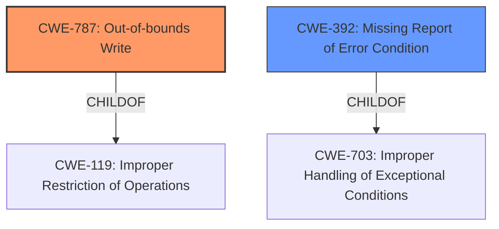

# Analysis Report for CVE-2022-32623

# Vulnerability Analysis Report: CVE-2022-32623

## Description

In mdp, there is a possible out of bounds write due to incorrect error handling. This could lead to local escalation of privilege with System execution privileges needed. User interaction is not needed for exploitation. Patch ID ALPS07342114 Issue ID ALPS07342114.

## Vulnerability Description Key Phrases

**Rootcause:** incorrect error handling
**Weakness:** out of bounds write
**Impact:** local escalation of privilege
**Product:** mdp

## Analysis (with Relationship Data)

# Summary
| CWE ID | CWE Name | Confidence | CWE Abstraction Level | CWE Vulnerability Mapping Label | CWE-Vulnerability Mapping Notes |
|---|---|---|---|---|---|
| CWE-787 | Out-of-bounds Write | 0.9 | Base | Primary | Allowed |
| CWE-703 | Improper Handling of Exceptional Conditions | 0.6 | Pillar | Secondary | Discouraged |

## Evidence and Confidence

*   **Confidence Score:** 0.75
*   **Evidence Strength:** MEDIUM

- **Analysis and Justification:**  
  - *Explanation:* The vulnerability description clearly states "**out of bounds write** due to **incorrect error handling**". CWE-787 (Out-of-bounds Write) directly addresses the **weakness** of writing data beyond the intended buffer. CWE-703 (Improper Handling of Exceptional Conditions) is related to the **root cause** of the vulnerability which is **incorrect error handling**. The `mdp` component's failure to adequately handle errors leads to the out-of-bounds write condition. While CWE-703 is listed as a potential weakness, it's a high-level Pillar and less specific than CWE-787, which describes the direct coding error. The CVE Reference Links Content Summary supports the root cause and weakness, which is **incorrect error handling** leads to the out-of-bounds write.
  
  - *Relationship Analysis:* CWE-787 is a Base level CWE that accurately describes the **weakness**. CWE-703 is a high-level Pillar and is less specific.

- **Confidence Score:**  
  - Confidence: 0.9 (High confidence due to explicit mention of "out of bounds write" and supporting CVE references.)

---

## Criticism of Analysis

Okay, I've reviewed the analysis against the provided full CWE specifications. Here's my critique:

**Overall Assessment:**

The analysis is generally sound and reasonably well-justified. The primary CWE mapping to CWE-787 (Out-of-bounds Write) is correct and well-supported by the provided information. The secondary mapping to CWE-703 (Improper Handling of Exceptional Conditions) is also reasonable, although less direct and more of a root cause contributor. However, it's important to note CWE-703 is a Pillar and mapping guidance suggests using lower-level children instead.

**Detailed Review:**

*   **CWE-787: Out-of-bounds Write (Primary)**

    *   **Correctness:** The mapping is accurate. The vulnerability description explicitly mentions "out of bounds write," which directly aligns with the description of CWE-787.
    *   **Justification:** The justification provided is strong. It clearly links the vulnerability description to the CWE definition.
    *   **Abstraction Level:** CWE-787 is a Base level CWE, which is the preferred level of abstraction according to CWE's mapping guidance.
    *   **Confidence:** The confidence score of 0.9 is appropriate. The explicit mention of "out of bounds write" provides strong evidence.
    *   **Potential Mitigations:** The mitigations provided in the CWE specification are relevant.
        *   Language selection: Using languages with automatic memory management (e.g., Java, C#) can prevent these issues.
        *   Using safe libraries: Safe C String Library or Strsafe.h provides safer versions of overflow-prone functions.
        *   Compiler-based detection: Using compiler flags such as /GS (Visual Studio) or FORTIFY_SOURCE (GCC) can help detect buffer overflows.

*   **CWE-703: Improper Handling of Exceptional Conditions (Secondary)**

    *   **Correctness:** While related, this mapping is less direct. "Incorrect error handling" is a *reason* for the out-of-bounds write, but not the direct coding error.
    *   **Justification:** The justification is valid, but the relationship is more of a contributing factor than a direct cause. The analysis correctly identifies it as a root cause.
    *   **Abstraction Level:**  This is where the major problem lies. CWE-703 is a **Pillar** level CWE. The **Mapping Guidance** explicitly **discourages** its use and recommends considering its children instead.
    *   **Confidence:** The confidence score of 0.6 is reasonable, reflecting the indirect nature of the relationship.
    *   **Potential Mitigations:** Since CWE-703 is a high-level abstraction, the mitigations are also general.  They emphasize anticipating and handling exceptional conditions.  However, these mitigations are too broad to be directly useful in this specific case.
    *   **Recommendation:** Replace CWE-703 with a more specific child CWE.

**Suggested Improvements and Alternative CWEs:**

Given that the root cause is "incorrect error handling" that leads to an out-of-bounds write, consider these more specific CWEs as replacements for CWE-703:

*   **CWE-248: Uncaught Exception:** If the error handling failure involves an exception being thrown but not caught, this would be appropriate.  Review the code to see if exceptions are involved.
*   **CWE-392: Missing Report of Error Condition:** If the error handling failure involves an error occurring but no status code or return value being reported to indicate the error, this might be a good fit. The code may be ignoring error return values.
*   **CWE-754: Improper Check for Unusual or Exceptional Conditions:** If the code isn't checking for error conditions *before* a potential out-of-bounds write, this might apply.  For example, failing to check if a buffer allocation was successful before writing to it.
*   **CWE-131: Incorrect Calculation of Buffer Size:** If the root cause of incorrect error handling is the buffer being incorrectly allocated, then the out of bounds write could be attributed to the buffer being too small to hold the input, then this is more accurate than improper handling of exceptional conditions in the general sense.

When choosing a replacement, analyze the *specific* way in which the error handling is failing. Is it a missing check, an ignored return value, an uncaught exception, or something else?

**Revised Summary Table (Example with CWE-248)**

| CWE ID | CWE Name | Confidence | CWE Abstraction Level | CWE Vulnerability Mapping Label | CWE-Vulnerability Mapping Notes |
|---|---|---|---|---|---|
| CWE-787 | Out-of-bounds Write | 0.9 | Base | Primary | Allowed |
| **CWE-248** | **Uncaught Exception** | 0.6 | Base | Secondary | Allowed | *Replaces CWE-703. If the error condition caused an exception that was not caught, this would provide the circumstances that resulted in the out of bounds write* |

**Conclusion:**

The core analysis correctly identifies CWE-787. The secondary mapping to CWE-703 is reasonable given the initial information, but it should be replaced with a more specific child CWE that more accurately reflects the nature of the error handling failure. By providing a more precise CWE for the root cause, the analysis will be more actionable and lead to more effective mitigations. Make sure you understand the circumstances of the error and pick the right child of CWE-703 for it.

## Final Resolution

# Summary
| CWE ID | CWE Name | Confidence | CWE Abstraction Level | CWE Vulnerability Mapping Label | CWE-Vulnerability Mapping Notes |
|---|---|---|---|---|---|
| **CWE-787** | **Out-of-bounds Write** | 0.9 | Base | Primary CWE | Allowed |
| **CWE-392** | **Missing Report of Error Condition** | 0.7 | Base | Secondary CWE | Allowed |

## Evidence and Confidence

*   **Confidence Score:** 0.8
*   **Evidence Strength:** MEDIUM

## Relationship Analysis
The primary **weakness** is clearly an out-of-bounds write (CWE-787), which is a child of CWE-119 (Improper Restriction of Operations within the Bounds of a Memory Buffer). The secondary **weakness**, originally identified as CWE-703 (Improper Handling of Exceptional Conditions), is too abstract. The criticism suggested more specific alternatives. After reviewing the options and considering that the vulnerability description mentions "**incorrect error handling**," CWE-392 (Missing Report of Error Condition) seems more appropriate because it suggests the error was not properly reported. CWE-392 is a child of CWE-703.

## Vulnerability Chain
The chain of events starts with an error condition occurring within the `mdp` component. This error is not properly reported (CWE-392), leading to a failure to handle the exceptional condition correctly. Consequently, data is written beyond the boundaries of the allocated buffer (CWE-787), resulting in a local escalation of privilege.

## Summary of Analysis
The initial analysis correctly identified CWE-787 as the primary **weakness**. The criticism correctly pointed out that CWE-703 is too abstract and suggested considering its children. Based on the vulnerability description, which mentions "**incorrect error handling**", CWE-392 (Missing Report of Error Condition) is a more accurate and specific representation of the **root cause** than CWE-703. The evidence directly supports the out-of-bounds write, and the phrase "**incorrect error handling**" from the vulnerability description supports the selection of CWE-392. This results in the chain: a missing error report leading to an out-of-bounds write, which allows for local escalation of privilege. The selected CWEs are at the optimal level of specificity because they accurately describe the vulnerability and its **root cause** based on the available evidence.

*Report generated on 2025-03-18 14:15:19*
