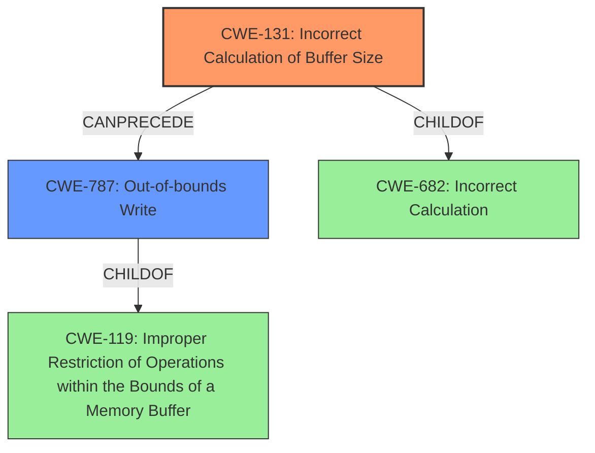

# Final Resolution for CVE-2022-32624

# Summary
| CWE ID | CWE Name | Confidence | CWE Abstraction Level | CWE Vulnerability Mapping Label | CWE-Vulnerability Mapping Notes |
|---|---|---|---|---|---|
| CWE-131 | Incorrect Calculation of Buffer Size | 0.95 | Base | Primary | The **incorrect calculation of buffer size** is the root cause of the vulnerability. This directly leads to an out-of-bounds write. |
| CWE-787 | Out-of-bounds Write | 0.85 | Base | Secondary | The **out of bounds write** is a direct consequence of the incorrect buffer size calculation, representing the immediate impact of the weakness. |

## Evidence and Confidence

*   **Confidence Score:** 0.92
*   **Evidence Strength:** HIGH

## Relationship Analysis
The primary relationship is that CWE-131 (**Incorrect Calculation of Buffer Size**) can directly lead to CWE-787 (**Out-of-bounds Write**). CWE-787 is a child of CWE-119 (**Improper Restriction of Operations within the Bounds of a Memory Buffer**), indicating that an out-of-bounds write is a specific type of buffer issue. The analysis correctly favors the more specific CWEs (131 and 787) over the more general CWE-119. Also, while CWE-682 (**Incorrect Calculation**) is a parent of CWE-131, it is at the Pillar level, which is too abstract.

## Vulnerability Chain
The vulnerability chain starts with CWE-131 (**Incorrect Calculation of Buffer Size**), which leads directly to CWE-787 (**Out-of-bounds Write**). The **incorrect calculation** results in writing data beyond the allocated buffer's boundaries. This can lead to local escalation of privilege.

## Summary of Analysis
The initial analysis and criticism were both strong and accurate. The vulnerability description clearly indicates that the root cause is an **incorrect calculation of the buffer size**, which directly maps to CWE-131. The consequence of this **incorrect calculation** is an **out-of-bounds write**, which aligns with CWE-787.

The relationship analysis confirms that CWE-131 can lead to CWE-787. While other CWEs like CWE-119, CWE-190, CWE-191, and CWE-682 might be relevant, CWE-131 and CWE-787 provide the most specific and accurate classification based on the available evidence. Specifically, "In throttling, there is a possible out of bounds write due to an incorrect calculation of buffer size." The analysis correctly identifies and discards CWE-120 because the issue is not a simple buffer copy without size checking but rather an **incorrect** size calculation.

The selected CWEs are at the optimal level of specificity because they directly address the root cause and consequence described in the vulnerability.