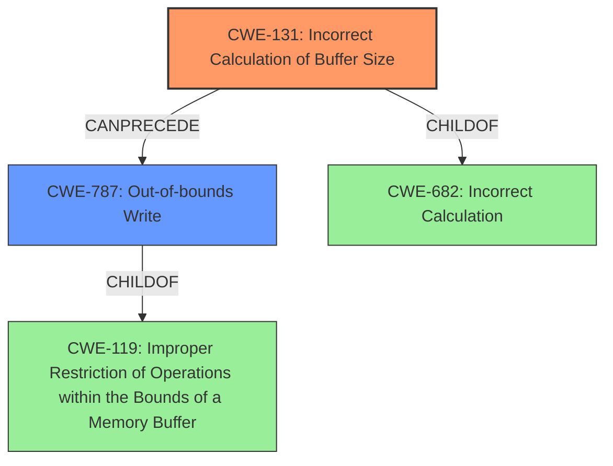

# Final Resolution for CVE-2022-32630

# Summary
| CWE ID | CWE Name | Confidence | CWE Abstraction Level | CWE Vulnerability Mapping Label | CWE-Vulnerability Mapping Notes |
|---|---|---|---|---|---|
| CWE-131 | Incorrect Calculation of Buffer Size | 0.90 | Base | Primary | The **root cause** is an **incorrect buffer size** calculation. |
| CWE-787 | Out-of-bounds Write | 0.85 | Base | Secondary | The **incorrect buffer size** calculation leads to an **out-of-bounds write**. |

## Evidence and Confidence

*   **Confidence Score:** 0.90
*   **Evidence Strength:** HIGH

## Relationship Analysis
The primary weakness is CWE-131 (**Incorrect Calculation of Buffer Size**) which directly leads to CWE-787 (**Out-of-bounds Write**). CWE-131 is a **root cause** that **CanPrecede** CWE-787. While CWE-787 is a child of CWE-119 (**Improper Restriction of Operations within the Bounds of a Memory Buffer**), CWE-787 is a more specific classification. We acknowledge that the specific type of error in the calculation for CWE-131 is not detailed, which relates it to the broader CWE-682 (**Incorrect Calculation**).

## Vulnerability Chain
The vulnerability chain starts with an **incorrect calculation of the buffer size** (CWE-131). This leads to the allocation of a buffer that is either too small or has incorrect boundaries. Subsequently, when data is written to this buffer, it overflows, resulting in an **out-of-bounds write** (CWE-787).

## Summary of Analysis
The initial analysis correctly identified CWE-131 and CWE-787 as the primary and secondary CWEs, respectively. The vulnerability description explicitly states "an **incorrect calculation of buffer size**" and "possible **out of bounds write**".

The criticism highlighted the lack of specificity regarding the calculation error in CWE-131. We agree with this point, and have reduced the confidence score to 0.90 to reflect this uncertainty. We also considered CWE-682 (**Incorrect Calculation**) as a broader categorization for CWE-131, as the specific type of calculation error is unknown.

The relationship analysis clarifies that CWE-131 **CanPrecede** CWE-787, and while CWE-787 is a child of CWE-119, CWE-787 is a more specific classification. We have also acknowledged that CWE-190 (**Integer Overflow or Wraparound**) and CWE-191 (**Integer Underflow**) could potentially be related to the **incorrect buffer size** calculation, but they are not the primary candidates because the vulnerability description focuses on the **incorrect calculation** itself, rather than a specific overflow or underflow. The Retriever Results support the choice of CWE-131 and CWE-787, but the final decision is based on the explicit statements in the vulnerability description. We avoided CWE-119 directly because CWE-787 is a more specific classification. The selected CWEs are at the optimal level of specificity because they directly reflect the cause and effect described in the vulnerability.