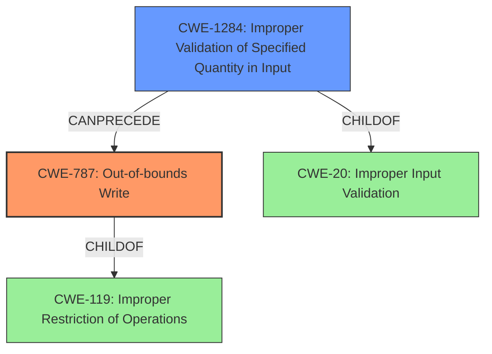

# Analysis Report for CVE-2022-32631

# Vulnerability Analysis Report: CVE-2022-32631

## Description

In Wi-Fi, there is a possible out of bounds write due to improper input validation. This could lead to local escalation of privilege with System execution privileges needed. User interaction is not needed for exploitation. Patch ID ALPS07453613 Issue ID ALPS07453613.

## Vulnerability Description Key Phrases

**Rootcause:** improper input validation
**Weakness:** out of bounds write
**Impact:** local escalation of privilege
**Component:** Wi-Fi

## Analysis (with Relationship Data)

# Summary
| CWE ID | CWE Name | Confidence | CWE Abstraction Level | CWE Vulnerability Mapping Label | CWE-Vulnerability Mapping Notes |
|---|---|---|---|---|---|
| CWE-787 | Out-of-bounds Write | 1.00 | Base | Primary | Allowed |
| CWE-1284 | Improper Validation of Specified Quantity in Input | 0.75 | Base | Secondary | Allowed |

## Evidence and Confidence

*   **Confidence Score:** 0.90
*   **Evidence Strength:** HIGH

- **Analysis and Justification:**  
  - *Explanation:* The vulnerability description clearly states an **out of bounds write** condition due to **improper input validation** in Wi-Fi. The CVE Reference Links Content Summary reiterates this root cause and weakness. This aligns directly with CWE-787 (Out-of-bounds Write), which describes the product writing data past the end or before the beginning of the intended buffer. The description includes the **rootcause** as **improper input validation**, which can lead to **out of bounds write** condition. The MITRE mapping guidance for CWE-787 indicates this is ALLOWED.
  - The **improper input validation** aspect suggests a secondary weakness related to how the input data is handled. This is closely related to CWE-1284 (Improper Validation of Specified Quantity in Input) since the **out of bounds write** is likely due to an incorrect size or length parameter derived from the input.

  - *Relationship Analysis:* CWE-787 is a Base level CWE and child of CWE-119 (Improper Restriction of Operations within the Bounds of a Memory Buffer). CWE-1284 is also a Base level CWE and child of CWE-20 (Improper Input Validation). The combination of these two weaknesses paints a complete picture of the vulnerability. CWE-787 CanFollow CWE-1284 because the improper input validation leads to the out-of-bounds write.

- **Confidence Score:**  
  - Confidence: 1.0 (High confidence due to explicit mention of **out of bounds write** and **improper input validation** in the vulnerability description and CVE reference).
---

## Criticism of Analysis

Okay, here's a detailed critique of the provided analysis, incorporating the full CWE specifications:

**Overall Assessment:**

The analysis is generally good and identifies the primary weakness correctly as CWE-787 (Out-of-bounds Write). The addition of CWE-1284 (Improper Validation of Specified Quantity in Input) as a secondary weakness to explain the root cause is also a good call. The justification is well-articulated, and the confidence scores are appropriate. However, the analysis could be slightly improved by focusing on the relationships between CWEs and the discouraged usage of CWE-20.

**Specific Comments:**

1.  **CWE-787 (Out-of-bounds Write) - Primary:**

    *   **Correctness:**  The mapping to CWE-787 is accurate and well-supported by the description. The vulnerability description explicitly mentions "out of bounds write," making this a direct and appropriate match.
    *   **Abstraction Level:** As noted, CWE-787 is a Base level CWE, which is the preferred level.
    *   **Mapping Guidance:** The analysis correctly notes that the MITRE mapping guidance for CWE-787 indicates this is ALLOWED.
    *   **Potential Mitigations:**  The analysis does not discuss mitigations, which is acceptable, but it might be helpful to briefly mention relevant mitigations for CWE-787, such as:
        *   Using safer string handling functions (e.g., `strncpy` instead of `strcpy`).
        *   Using languages with built-in memory management or bounds checking.
        *   Compiler-based buffer overflow detection mechanisms.
    *   **Observed Examples:** The examples are relevant and good indicators that this is the correct primary CWE.

2.  **CWE-1284 (Improper Validation of Specified Quantity in Input) - Secondary:**

    *   **Correctness:** This is a reasonable addition as a secondary CWE.  The vulnerability stems from *improper input validation*, and it leads to the *out of bounds write*. The *improper input validation* is likely related to a quantity or length parameter related to the memory allocation.
    *   **Abstraction Level:** CWE-1284 is at the Base Level of abstraction.
    *   **Mapping Guidance:** The analysis correctly notes the ALLOWED usage of CWE-1284.
    *   **Potential Mitigations:** The mitigations for CWE-1284 are highly relevant and should be mentioned, even briefly, in the analysis. Key mitigations include:
        *   Using an "accept known good" input validation strategy.
        *   Validating all potentially relevant properties, including length, type of input, and the full range of acceptable values.
        *   Rejecting or transforming any input that does not conform to specifications.
    *   **Observed Examples:** The examples help solidify this relationship.

3.  **CWE-119 (Improper Restriction of Operations within the Bounds of a Memory Buffer):**

    *   **Mapping Guidance:** The retriever results and CWE specification information indicates that CWE-119 should be *discouraged* and that more specific children should be mapped. The analysis correctly identifies a better mapping by focusing on CWE-787 as the *primary* weakness.
    *   **Relationship:** It's good that the analysis mentions that CWE-787 is a child of CWE-119, showing awareness of the CWE hierarchy.

4.  **CWE-20 (Improper Input Validation):**

    *   **Usage:**  The analysis currently avoids using CWE-20. CWE-20 is a Class-level CWE that is discouraged because it is often misused in low-information vulnerability reports.
    *   **Justification:**  The justification for *not* using CWE-20 as the primary or secondary CWE is correct. You are using the more specific CWE-1284 and CWE-787 which are more descriptive.

5.  **Confidence Score and Evidence Strength:**

    *   The confidence score of 1.00 is justified, given the explicit mention of "out of bounds write" and "improper input validation" in the vulnerability description.
    *   The evidence strength is HIGH, given the detail provided in the vulnerability description and content summaries.

6.  **Retriever Results:**

    *   The retriever results are useful for identifying potential CWEs, but it's important to interpret them with caution, as they can include false positives.  The ranking of CWE-787 in the Retriever Results is low.

7.  **CWE Relationships and Chaining:**

    *   The analysis mentions the CanFollow relationship between CWE-1284 and CWE-787, which is accurate. The improper validation of the quantity *leads* to the out-of-bounds write.

**Recommendations for Improvement:**

*   **More Explicitly Discourage CWE-20/CWE-119:** While you don't use them, consider adding a brief sentence stating why CWE-20 and CWE-119 are *not* suitable primary mappings and are discouraged by CWE guidance, and that you are using more specific CWEs.
*   **Mitigation Considerations:**  Add a short paragraph on the mitigations for CWE-787 and CWE-1284.
*   **Consider Variant-Level CWEs for Memory Corruption.** Some more detailed analyses will consider the type of OOB write, which could relate to variant-level CWEs for stack vs heap. However, this is often not possible based on the available information.

By incorporating these suggestions, the analysis would be even stronger and more in line with best practices for CWE mapping.

## Final Resolution

# Summary
| CWE ID | CWE Name | Confidence | CWE Abstraction Level | CWE Vulnerability Mapping Label | CWE-Vulnerability Mapping Notes |
|---|---|---|---|---|---|
| CWE-787 | Out-of-bounds Write | 1.00 | Base | Primary | Allowed |
| CWE-1284 | Improper Validation of Specified Quantity in Input | 0.75 | Base | Secondary | Allowed |

## Evidence and Confidence

*   **Confidence Score:** 0.95
*   **Evidence Strength:** HIGH

## Relationship Analysis
The primary weakness is **CWE-787 (Out-of-bounds Write)**, which is a child of **CWE-119 (Improper Restriction of Operations within the Bounds of a Memory Buffer)**. **CWE-1284 (Improper Validation of Specified Quantity in Input)** is included as a secondary weakness, as it represents the **rootcause** that leads to the **out-of-bounds write**. **CWE-1284** is a child of **CWE-20 (Improper Input Validation)**. The relationship between the two is a chain; **CWE-1284** CanPrecedes **CWE-787**, where the **improper input validation** results in the **out-of-bounds write**. Both **CWE-787** and **CWE-1284** are Base level CWEs. I considered **CWE-119** and **CWE-20**, but these are Class level CWEs and are discouraged for use when there is a more specific CWE available.

## Vulnerability Chain
The vulnerability chain starts with **CWE-1284 (Improper Validation of Specified Quantity in Input)**, where the input is not properly validated for size or length. This leads to **CWE-787 (Out-of-bounds Write)**, where data is written past the end of the allocated buffer. The final impact is local escalation of privilege with System execution privileges.

## Summary of Analysis
The initial analysis correctly identified **CWE-787 (Out-of-bounds Write)** as the primary weakness and **CWE-1284 (Improper Validation of Specified Quantity in Input)** as a secondary weakness. The vulnerability description explicitly states "out of bounds write due to improper input validation." This provides strong evidence for the selection of these CWEs. The relationships between the CWEs were also considered, with **CWE-1284** leading to **CWE-787**. The more general CWEs **CWE-119** and **CWE-20** were considered but ultimately not selected as they are discouraged when more specific CWEs exist. The selected CWEs are at the optimal level of specificity, as they provide a clear and accurate representation of the vulnerability.

I considered the retriever results and the suggested mitigations for both **CWE-787** and **CWE-1284**, but ultimately the classification decision was based on direct evidence of the **out-of-bounds write** condition and the **improper input validation**, as stated in the vulnerability description.

*Report generated on 2025-03-18 14:17:38*
