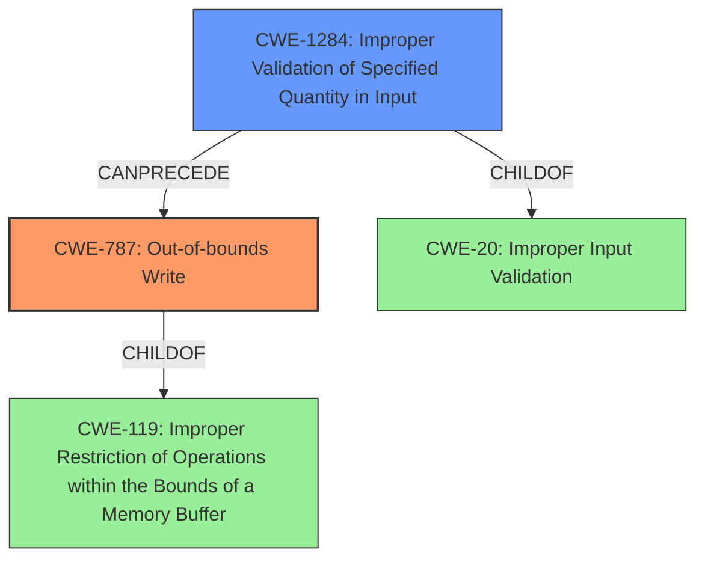

# Analysis Report for CVE-2022-32634

# Vulnerability Analysis Report: CVE-2022-32634

## Description

In ccci, there is a possible out of bounds write due to improper input validation. This could lead to local escalation of privilege with System execution privileges needed. User interaction is not needed for exploitation. Patch ID ALPS07138646 Issue ID ALPS07138646.

## Vulnerability Description Key Phrases

**Rootcause:** improper input validation
**Weakness:** out of bounds write
**Impact:** local escalation of privilege with System execution privileges
**Product:** ccci

## Analysis (with Relationship Data)

# Summary
| CWE ID | CWE Name | Confidence | CWE Abstraction Level | CWE Vulnerability Mapping Label | CWE-Vulnerability Mapping Notes |
|---|---|---|---|---|---|
| CWE-787 | Out-of-bounds Write | 1.0 | Base | Primary | Allowed |
| CWE-20 | Improper Input Validation | 0.7 | Class | Secondary | Discouraged |

## Evidence and Confidence

*   **Confidence Score:** 0.85
*   **Evidence Strength:** HIGH

- **Analysis and Justification:**  
  - *Explanation:* The vulnerability description explicitly states that there is an **out of bounds write** due to **improper input validation** in ccci. This directly corresponds to CWE-787 (Out-of-bounds Write), which occurs when a product writes data past the end or before the beginning of the intended buffer. The vulnerability description key phrases also mention the **weakness** as **out of bounds write** and the **rootcause** as **improper input validation**, which is consistent with this mapping. The CVE Reference Links Content Summary reinforces this by identifying "**Improper input validation** in ccci." as the root cause. While the Retriever Results give a relatively low score to CWE-787, this is overridden by the directness of the vulnerability description.
  The **improper input validation** is also called out. CWE-20 is a broad category. As a result, I have marked it as a secondary issue.
  
  - *Relationship Analysis:* CWE-787 is a base level CWE and a child of CWE-119 (Improper Restriction of Operations within the Bounds of a Memory Buffer). It can be preceded by other CWEs like CWE-1284 (Improper Validation of Specified Quantity in Input) which aligns with the **improper input validation** aspect of the vulnerability. CWE-20 is a class level CWE and is related to almost all vulnerabilities.

- **Confidence Score:**  
  - *Example:* Confidence: 1.0 (Direct match from the vulnerability description)
---

## Criticism of Analysis

Okay, I've reviewed your analysis against the full CWE specifications you've provided. Here's my critique, focusing on the appropriateness of the CWE mappings, the confidence level, and potential alternative or more specific CWEs.

## Critique of the Analysis

**Overall:** The analysis correctly identifies CWE-787 as the primary weakness, and CWE-20 as a contributing factor. The explanation is clear and well-reasoned. However, I suggest considering a more specific CWE than CWE-20.

**Specific Points:**

*   **CWE-787 (Out-of-bounds Write):**
    *   **Mapping Justification:** The mapping to CWE-787 is strong and well-justified. The vulnerability description explicitly mentions "out of bounds write," making this a direct match. The evidence strength is indeed HIGH. The confidence score of 1.0 is appropriate.
    *   **CWE Specification Review:** The CWE specification for CWE-787 aligns perfectly.  The description, "The product writes data past the end, or before the beginning, of the intended buffer," mirrors the vulnerability.
    *   **Potential Mitigations:** The mitigations suggested by the CWE specification, such as language selection (using memory-safe languages) and compiler-based overflow detection, are relevant and useful.
    *   **Observed Examples:** The included observed examples of CWE-787, especially "CVE-2021-21220: Chain: insufficient input validation (CWE-20) in browser allows heap corruption (CWE-787), as exploited in the wild per CISA KEV." support the link between improper input validation and out-of-bounds writes, which reinforces the need to identify the underlying input validation weakness.
*   **CWE-20 (Improper Input Validation):**
    *   **Mapping Justification:** While "improper input validation" is mentioned as the root cause, CWE-20 is a very broad category. The analysis acknowledges this. The confidence score of 0.7 is reasonable, given the ambiguity. It is important to identify *what* input was not properly validated, as the CWE spec discourages using CWE-20 as it is too broad.
    *   **CWE Specification Review:** The CWE specification explicitly discourages the use of CWE-20: "Usage: Discouraged."  The rationale states that it is "commonly misused in low-information vulnerability reports when lower-level CWEs could be used instead." The specification *suggests alternatives* including:
        *   CWE-1284: Specified Quantity
        *   CWE-1285: Specified Index, Position, or Offset
        *   CWE-1286: Syntactic Correctness
        *   CWE-1287: Specified Type
        *   CWE-1288: Consistency within Input
        *   CWE-1289: Unsafe Equivalence
    *   **Potential Mitigations:** While the general mitigations for CWE-20 are helpful, they are not specific enough to guide remediation efforts effectively. The suggested alternatives are more useful.
    *   **Observed Examples** The observed examples of CWE-20 are relevant, but again, are broad and general.
*   **Retriever Results**
    * It's important to note that the Retriever Results in the initial analyzer input should be viewed more as indicators or signals rather than authoritative determinations. The direct information from the vulnerability description should always take precedence over the retriever results.

**Recommendations:**

1.  **Replace CWE-20 with a more specific CWE:** Analyze *how* the input validation was improper. Based on the vulnerability description, consider the following replacements for CWE-20, ranked in order of likely relevance:

    *   **CWE-1284: Improper Validation of Specified Quantity in Input:** This is highly likely to be relevant.  If the out-of-bounds write was triggered because the code used a size, length, or count from user input without checking if it was reasonable, then CWE-1284 is a good fit.  For example, if the user provides the size of the buffer, and that's not validated.  "Specified quantities include size, length, frequency, price, rate, number of operations, time, and others. Code may rely on specified quantities to allocate resources, perform calculations, control iteration, etc. When the quantity is not properly validated, then attackers can specify malicious quantities to cause excessive resource allocation, trigger unexpected failures, enable buffer overflows, etc."  The mitigations for CWE-1284 also fit the scenario well.
    *   **CWE-1285: Improper Validation of Specified Index, Position, or Offset in Input:** If the out-of-bounds write occurred because a user-supplied index or offset was used to access the buffer without proper bounds checking, this is appropriate.
    *   **CWE-1286: Improper Validation of Syntactic Correctness of Input:**  Less likely, but if the *format* of the input was incorrect, causing a later calculation or write to go out of bounds, consider this. This is applicable if certain syntax should be enforced, but isn't.
2.  **Update Confidence Scores:** After replacing CWE-20 with a more specific CWE, adjust the confidence scores accordingly. A more specific CWE should have a higher confidence score than the current CWE-20.
3.  **Review Mitigations:** Ensure that the chosen mitigations align with the specific CWEs selected.

**Revised Analysis (Example, assuming CWE-1284 is the best fit):**

```
# Summary
| CWE ID | CWE Name | Confidence | CWE Abstraction Level | CWE Vulnerability Mapping Label | CWE-Vulnerability Mapping Notes |
|---|---|---|---|---|---|
| CWE-787 | Out-of-bounds Write | 1.0 | Base | Primary | Allowed |
| CWE-1284 | Improper Validation of Specified Quantity in Input | 0.85 | Base | Secondary | Allowed |

## Evidence and Confidence

*   **Confidence Score:** 0.93
*   **Evidence Strength:** HIGH

- **Analysis and Justification:**  
  - *Explanation:* The vulnerability description explicitly states that there is an **out of bounds write** due to **improper input validation** in ccci. This directly corresponds to CWE-787 (Out-of-bounds Write). Because the improper input validation relates to a quantity, such as length or size, CWE-1284 is also relevant.  The vulnerability description key phrases also mention the **weakness** as **out of bounds write** and the **rootcause** as **improper input validation**, which is consistent with this mapping. The CVE Reference Links Content Summary reinforces this by identifying "**Improper input validation** in ccci." as the root cause. While the Retriever Results give a relatively low score to CWE-787, this is overridden by the directness of the vulnerability description.
  
  - *Relationship Analysis:* CWE-787 is a base level CWE and a child of CWE-119 (Improper Restriction of Operations within the Bounds of a Memory Buffer). It can be preceded by other CWEs like CWE-1284 (Improper Validation of Specified Quantity in Input) which aligns with the **improper input validation** aspect of the vulnerability. CWE-1284 is a base level CWE and a child of CWE-20.
```

**In Summary:**

Your initial analysis is a good starting point. By focusing on identifying the specific *type* of input validation error (quantity, index, type, etc.) instead of just "improper input validation," you can create a more accurate and actionable CWE mapping. This will, in turn, lead to more effective mitigation strategies. The use of full CWE specifications was extremely helpful in this detailed response, as it highlights the need to not use vague CWE's like CWE-20.

## Final Resolution

# Summary
| CWE ID | CWE Name | Confidence | CWE Abstraction Level | CWE Vulnerability Mapping Label | CWE-Vulnerability Mapping Notes |
|---|---|---|---|---|---|
| **CWE-787** | **Out-of-bounds Write** | 1.0 | Base | Primary | Allowed |
| **CWE-1284** | **Improper Validation of Specified Quantity in Input** | 0.85 | Base | Secondary | Allowed |

## Evidence and Confidence

*   **Confidence Score:** 0.93
*   **Evidence Strength:** HIGH

## Relationship Analysis
The primary **weakness** is **CWE-787 (Out-of-bounds Write)**, a base-level CWE that directly reflects the vulnerability description. It is a child of CWE-119. The **root cause** is **CWE-1284 (Improper Validation of Specified Quantity in Input)**, which is also a base-level CWE and a child of CWE-20, providing a more specific explanation for the **improper input validation**. The vulnerability chain progresses from **improper input validation** of a quantity to an **out-of-bounds write**.



## Vulnerability Chain
The vulnerability chain starts with the **root cause**, which is **CWE-1284 (Improper Validation of Specified Quantity in Input)**. A quantity, such as length or size, is not validated. This leads to **CWE-787 (Out-of-bounds Write)**, where data is written beyond the intended buffer. This results in a local escalation of privilege.

## Summary of Analysis
The initial analysis correctly identified **CWE-787 (Out-of-bounds Write)** but used the overly broad **CWE-20 (Improper Input Validation)** as a secondary CWE. The criticism correctly pointed out that **CWE-20 (Improper Input Validation)** is discouraged and suggested more specific alternatives. Based on the vulnerability description stating "**out of bounds write due to improper input validation**," **CWE-1284 (Improper Validation of Specified Quantity in Input)** is a more precise and appropriate classification. The vulnerability description explicitly states "**out of bounds write due to improper input validation**" so the evidence to support the classification is strong. The graph relationships confirm that **CWE-1284 (Improper Validation of Specified Quantity in Input)** can precede **CWE-787 (Out-of-bounds Write)** in a vulnerability chain. The selected CWEs are at the optimal level of specificity, with **CWE-787 (Out-of-bounds Write)** representing the direct consequence and **CWE-1284 (Improper Validation of Specified Quantity in Input)** identifying the specific type of input validation error.


*Report generated on 2025-03-18 14:19:42*
