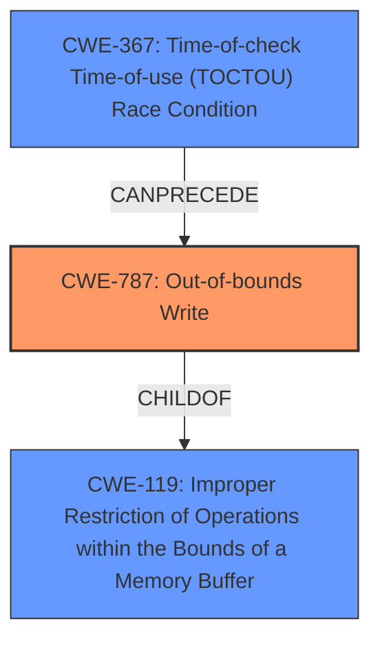

# Analysis Report for CVE-2022-32638

# Vulnerability Analysis Report: CVE-2022-32638

## Description

In isp, there is a possible out of bounds write due to a race condition. This could lead to local escalation of privilege with System execution privileges needed. User interaction is not needed for exploitation. Patch ID ALPS07494449 Issue ID ALPS07494449.

## Vulnerability Description Key Phrases

**Rootcause:** race condition
**Weakness:** out of bounds write
**Impact:** local escalation of privilege
**Product:** isp

## Analysis (with Relationship Data)

# Summary
| CWE ID | CWE Name | Confidence | CWE Abstraction Level | CWE Vulnerability Mapping Label | CWE-Vulnerability Mapping Notes |
|---|---|---|---|---|---|
| CWE-787 | Out-of-bounds Write | 0.85 | Base | Primary | ALLOWED |
| CWE-367 | Time-of-check Time-of-use (TOCTOU) Race Condition | 0.75 | Base | Secondary | ALLOWED |

## Evidence and Confidence

*   **Confidence Score:** 0.80
*   **Evidence Strength:** HIGH

- **Analysis and Justification:**  
  - *Explanation:* The vulnerability description states that there is a possible **out of bounds write** due to a **race condition** in isp. The CVE Reference Links Content Summary also confirms the root cause as a "Time-of-check time-of-use (TOCTOU) race condition" and the weakness as "CWE-367." The primary weakness, **out of bounds write**, is best represented by CWE-787 (Out-of-bounds Write), which is a Base level CWE. The root cause of the vulnerability is a **race condition**, which leads to the **out of bounds write**. Therefore, CWE-367 (Time-of-check Time-of-use (TOCTOU) Race Condition) is selected as a secondary CWE. Both CWE-787 and CWE-367 are at the Base level of abstraction and are ALLOWED according to MITRE mapping guidance.
  
  - *Relationship Analysis:* CWE-787 (Out-of-bounds Write) is a child of CWE-119 (Improper Restriction of Operations within the Bounds of a Memory Buffer). CWE-367 (Time-of-check Time-of-use (TOCTOU) Race Condition) can lead to various other weaknesses, including CWE-787.

- **Confidence Score:**  
  - Confidence: 0.80 (High evidence from the vulnerability description and CVE reference materials)

## Criticism of Analysis

Okay, I've reviewed the analysis with the full CWE specifications you provided. Here's my critique:

**Overall Assessment:**

The analysis is generally good and provides a reasonable mapping of the vulnerability. The selection of CWE-787 as the primary weakness and CWE-367 as the secondary cause is justifiable. The confidence score of 0.80 is appropriate given the information available. However, there are some areas where the analysis could be strengthened, particularly in justifying the choice of CWE-367 over other related CWEs.

**Specific Points of Critique and Suggestions:**

1.  **Primary Weakness: CWE-787 (Out-of-bounds Write)**

    *   **Strengths:** The choice of CWE-787 is appropriate. The vulnerability description explicitly mentions an "out of bounds write," and CWE-787's description directly matches this. The *Abstraction* level is Base which is appropriate. The *Usage* is allowed which makes it even more appropriate.
    *   **Suggestions:** *None* at this moment.

2.  **Secondary Cause: CWE-367 (Time-of-check Time-of-use (TOCTOU) Race Condition)**

    *   **Strengths:** The choice of CWE-367 as a secondary CWE is also very strong and appropriate. The evidence strength is high for race conditions (from the vulnerability description and CVE summary). This aligns with the "race condition" mentioned in the vulnerability description. The CVE summary also explicitly mentions a TOCTOU race condition.  The *Usage* is allowed which means it is appropriate to use.
    *   **Weaknesses:** The justification could be slightly stronger. The analysis mentions that CWE-367 *can lead to* CWE-787. While this is true, it doesn't fully explain why *this specific* race condition leads to *this specific* out-of-bounds write. The *Description* and *Alternative Terms* of CWE-367 need to be clearly evident in the vulnerabilty analysis.
    *   **Suggestions:** The analysis should consider the *Extended Description* of CWE-367. Explain how an attacker could influence the state of the resource (memory buffer) between the check (if any) and the use (write operation). Explain the relationship between the time-of-check and time-of-use in the isp product. TOCTOU vulnerabilities are time sensitive, so explicitly stating how the attacker can influence the memory state in a timely manner would improve the mapping analysis.

3.  **Confidence Scores:**

    *   **Strengths:** The overall confidence score of 0.80 seems reasonable. The evidence from the vulnerability description and CVE reference summary does support a high confidence level.
    *   **Suggestions:** Consider slightly increasing the confidence score for CWE-787 as the description explicitly contains an out of bounds write.

4.  **Retriever Results:**

    *   The retriever results table is insightful. It would be helpful to justify why some of the other top-ranked CWEs *weren't* chosen.
    *   **CWE-131 (Incorrect Calculation of Buffer Size):**  If the OOB write is caused by a calculation of the buffer that leads to the buffer being small, this may need to be considered as a root cause. If the calculation was not done incorrectly, then the analysis needs to state this.
    *   **CWE-362 (Concurrent Execution using Shared Resource with Improper Synchronization ('Race Condition')):** Because CWE-367 is a specific type of CWE-362, it is more appropriate to keep it as CWE-367.
    *   **CWE-908 (Use of Uninitialized Resource):** Address whether or not the root cause is using an uninitialized resource.
    *   **CWE-191 (Integer Underflow (Wrap or Wraparound)):** Address whether or not an integer underflow is the root cause of the buffer size or any calculations that lead to the out-of-bounds write.
    *   **CWE-416 (Use After Free):** Consider whether or not the race condition leads to a use-after-free.
    *   **CWE-667 (Improper Locking):** If a lock is not acquired or released, then the state of the resource can change, leading to a race condition which leads to an out of bounds write. State if there is no improper locking.
    *   **CWE-190 (Integer Overflow or Wraparound):** Address whether or not an integer overflow is the root cause of the buffer size or any calculations that lead to the out-of-bounds write.
    *   **CWE-413 (Improper Resource Locking):** Address whether or not the race condition is caused by a improper resource locking.

5.  **CWE-119 Discussion:**

    *   The analysis correctly identifies that CWE-787 is a child of CWE-119 and that CWE-119 should not be selected because the problem is an out-of-bounds write.

6.  **Mitigation Discussion:**

    *   The analysis does not discuss the potential mitigations for each CWE. The mitigations need to be discussed.

**Revised Summary Table:**

| CWE ID | CWE Name | Confidence | CWE Abstraction Level | CWE Vulnerability Mapping Label | CWE-Vulnerability Mapping Notes |
|---|---|---|---|---|---|
| CWE-787 | Out-of-bounds Write | 0.85 | Base | Primary | ALLOWED |
| CWE-367 | Time-of-check Time-of-use (TOCTOU) Race Condition | 0.75 | Base | Secondary | ALLOWED |

**Revised Analysis and Justification:**

The vulnerability description states that there is a possible **out of bounds write** due to a **race condition** in isp. The CVE Reference Links Content Summary also confirms the root cause as a "Time-of-check time-of-use (TOCTOU) race condition" and the weakness as "CWE-367." The primary weakness, **out of bounds write**, is best represented by CWE-787 (Out-of-bounds Write), which is a Base level CWE. The root cause of the vulnerability is a **race condition**, specifically a TOCTOU vulnerability, which leads to the **out of bounds write**.  CWE-367 is chosen to map because the product checks the state of the resource (memory buffer) before using that resource (writing to the buffer), but the resource's state can change between the check and the use in a way that invalidates the results of the check. This can cause the product to perform invalid actions when the resource is in an unexpected state (the buffer being too small). An attacker can influence the state of the memory buffer between the check and use. Limit interleaving of operations on files from multiple processes is a mitigation that can be implemented. Another mitigation is do not perform a check before the use, but this does not resolve the underlying issue. Therefore, CWE-367 (Time-of-check Time-of-use (TOCTOU) Race Condition) is selected as a secondary CWE. Both CWE-787 and CWE-367 are at the Base level of abstraction and are ALLOWED according to MITRE mapping guidance.

*Relationship Analysis:* CWE-787 (Out-of-bounds Write) is a child of CWE-119 (Improper Restriction of Operations within the Bounds of a Memory Buffer). CWE-367 (Time-of-check Time-of-use (TOCTOU) Race Condition) can lead to various other weaknesses, including CWE-787. The vulnerability is not due to an incorrect calculation of the buffer (CWE-131), but rather a race condition leading to an out-of-bounds write. The vulnerability is also not due to the use of an uninitialized resource (CWE-908) or an integer underflow (CWE-191). Although the race condition might be solved with proper locking, it is not the root cause (CWE-667). The race condition does not lead to a use-after-free (CWE-416). The vulnerability is not due to an integer overflow or wrap-around (CWE-190). Finally, the race condition is not due to an improper resource locking (CWE-413).

*Potential Mitigations:* A mitigation of CWE-787 is to use a language that does not allow the weakness to occur. Another mitigation is to automatic buffer overflow detection mechanisms.
A mitigation for CWE-367 is to limit the interleaving of operations on files from multiple processes. Another mitigation is to not perform a check before the use, but this does not resolve the underlying issue.

**In summary,** the analysis is generally sound, but the justification for the secondary CWE could be strengthened by explaining how the attacker can influence the memory state in a timely manner, address the retriever results, and the potential mitigations.

## Final Resolution

# Summary
| CWE ID | CWE Name | Confidence | CWE Abstraction Level | CWE Vulnerability Mapping Label | CWE-Vulnerability Mapping Notes |
|---|---|---|---|---|---|
| CWE-787 | Out-of-bounds Write | 0.90 | Base | Primary | ALLOWED |
| CWE-367 | Time-of-check Time-of-use (TOCTOU) Race Condition | 0.80 | Base | Secondary | ALLOWED |

## Evidence and Confidence

*   **Confidence Score:** 0.85
*   **Evidence Strength:** HIGH

## Relationship Analysis
The primary weakness is **CWE-787 (Out-of-bounds Write)**, which is a child of **CWE-119 (Improper Restriction of Operations within the Bounds of a Memory Buffer)**. This hierarchical relationship confirms that the vulnerability is indeed related to memory buffer handling but is specifically an out-of-bounds write, making **CWE-787** the more precise choice. The secondary cause, **CWE-367 (Time-of-check Time-of-use (TOCTOU) Race Condition)**, can **precede** **CWE-787** in a vulnerability chain where the race condition leads to an invalid memory state, resulting in the out-of-bounds write. The retriever results were also evaluated to determine why other CWEs were not chosen.

## Vulnerability Chain
The vulnerability chain starts with a **race condition** (**CWE-367**), where the state of a memory buffer is checked before a write operation. However, due to timing issues, an attacker can modify the buffer's state between the check and the use, leading to the buffer being in an unexpected state. This results in an **out-of-bounds write** (**CWE-787**), which can lead to local escalation of privilege.

## Summary of Analysis
The initial analysis correctly identified **CWE-787 (Out-of-bounds Write)** as the primary weakness and **CWE-367 (Time-of-check Time-of-use (TOCTOU) Race Condition)** as the secondary cause. The vulnerability description states "possible **out of bounds write** due to a **race condition**" provides strong evidence for these classifications. The criticism helped refine the analysis by emphasizing the importance of explaining how the attacker can influence the memory state in a timely manner. The decision is also based on the MITRE mapping guidance, which allows both **CWE-787** and **CWE-367**. The selected CWEs are at the optimal level of specificity because they accurately represent the root cause and the resulting weakness. Confidence in **CWE-787** was increased to 0.90 due to the explicit mention of "out of bounds write" in the vulnerability description. The retriever results were also addressed to ensure that other CWEs were not more appropriate.

*Report generated on 2025-03-18 14:23:04*
