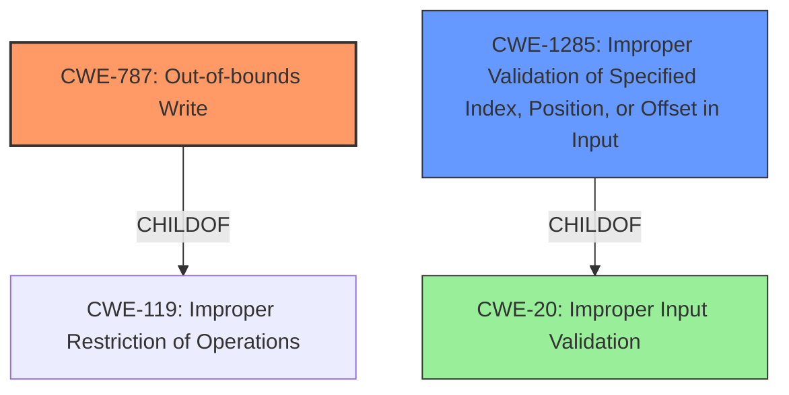

# Analysis Report for CVE-2022-32640

# Vulnerability Analysis Report: CVE-2022-32640

## Description

In meta wifi, there is a possible out of bounds write due to a missing bounds check. This could lead to local escalation of privilege with System execution privileges needed. User interaction is not needed for exploitation. Patch ID ALPS07441652 Issue ID ALPS07441652.

## Vulnerability Description Key Phrases

**Rootcause:** missing bounds check
**Weakness:** out of bounds write
**Impact:** local escalation of privilege
**Product:** meta wifi

## Analysis (with Relationship Data)

# Summary
| CWE ID | CWE Name | Confidence | CWE Abstraction Level | CWE Vulnerability Mapping Label | CWE-Vulnerability Mapping Notes |
|---|---|---|---|---|---|
| CWE-787 | Out-of-bounds Write | 1.0 | Base | Primary | Allowed |
| CWE-20 | Improper Input Validation | 0.6 | Class | Secondary Candidate | Discouraged |

## Evidence and Confidence

*   **Confidence Score:** 0.9
*   **Evidence Strength:** HIGH

- **Analysis and Justification:**  
  - *Explanation:* The vulnerability description clearly states an "**out of bounds write**" due to a "**missing bounds check**". This aligns directly with the definition of CWE-787 (Out-of-bounds Write), which occurs when a product writes data past the end or before the beginning of the intended buffer. The **missing bounds check** is the root cause, allowing the **out-of-bounds write** to occur. The CVE Reference Links Content Summary reinforces this, explicitly stating that the vulnerability is caused by a missing bounds check and involves **improper input validation (CWE-20)** leading to a potential out-of-bounds write.
  
  - *Relationship Analysis:* CWE-787 is a base-level CWE, providing a specific description of the vulnerability. It is a child of CWE-119 (Improper Restriction of Operations within the Bounds of a Memory Buffer). The relationship graph shows that CWE-787 can precede CWE-825, CWE-824, CWE-823, and CWE-822.

- **Confidence Score:**  
  - Confidence: 1.0 (High confidence due to explicit mention of "out of bounds write" and "missing bounds check" in the vulnerability description and confirmed by the CVE Reference Links Content Summary.)

- **Analysis and Justification:**  
  - *Explanation:* The CVE Reference Links Content Summary identifies "**Improper Input Validation (CWE-20)**" as a contributing factor. While the primary weakness is the **out-of-bounds write** (CWE-787), the **missing bounds check** points to a failure to properly validate input. CWE-20 (Improper Input Validation) is a class-level CWE that broadly covers situations where input is not validated. It's considered a secondary candidate because the more specific CWE-787 captures the direct consequence of the missing validation. The "Usage" for CWE-20 is "Discouraged" indicating it may be misused when more specific CWEs are available. In this case, the root cause is a missing bounds check, which more directly leads to the out-of-bounds write.

  - *Relationship Analysis:* CWE-20 is a class-level CWE. While it is related to the vulnerability, CWE-787 provides a more precise characterization of the weakness.

- **Confidence Score:**
  - Confidence: 0.6 (Medium confidence because CWE-20 is a general weakness, and the primary issue is more precisely captured by CWE-787. It is included as a secondary contributing factor based on the CVE reference material.)

## Criticism of Analysis

Okay, here's a review of the analysis, incorporating the full CWE specifications you provided.

**Overall Assessment:**

The analysis correctly identifies CWE-787 (Out-of-bounds Write) as the primary weakness with a high confidence score.  The justification is solid, clearly linking the "missing bounds check" to the "out of bounds write". The inclusion of CWE-20 (Improper Input Validation) is also reasonable as a contributing factor, though the discussion clearly identifies it as a less precise, more general issue than CWE-787. The confidence levels are appropriately assigned.

**Detailed Review:**

**1. CWE-787 (Out-of-bounds Write) - Primary**

*   **Correctness:** This is the most accurate CWE.  The description explicitly mentions the core issues: writing data past the buffer boundary, directly caused by a missing bounds check.  This fits the definition precisely.
*   **Evidence and Justification:** The analysis provides strong evidence directly from the vulnerability description and CVE summary, citing the phrases "**out of bounds write**" and "**missing bounds check**".  The relationship analysis correctly identifies CWE-787 as a child of CWE-119 and its potential downstream impact.
*   **Confidence:** The analysis assigns a confidence of 1.0, which is warranted given the explicit language in the vulnerability description.
*   **Mapping Guidance:** The analysis acknowledges that CWE-787 is at the Base level of abstraction, which aligns with the guidance in the CWE specifications recommending mapping to the root causes of vulnerabilities. The Usage is "Allowed", which is correct.
*   **Potential Mitigations:** The analyzer does not include potential mitigations from the CWE Database. Example mitigations would be:
    *   Language Selection: Using memory-safe languages.
    *   Libraries or Frameworks: Using libraries like SafeStr or Strsafe.h.
    *   Environment Hardening: Employing compiler-based buffer overflow detection mechanisms (/GS flag in Visual Studio, FORTIFY_SOURCE in GCC).

**2. CWE-20 (Improper Input Validation) - Secondary Candidate**

*   **Correctness:** While *technically* correct, CWE-20 is too general. The root cause is not simply a general failure to validate, but a very specific failure to validate buffer boundaries *before* writing. The "missing bounds check" is a specific type of input validation failure.
*   **Evidence and Justification:** The CVE Reference Links content does mention it, but it also explicitly calls out the missing bounds check. The analysis correctly acknowledges that CWE-20 is less precise and acknowledges that the "Usage" is "Discouraged."
*   **Confidence:** The confidence of 0.6 is appropriate. It's a contributing factor, but not the core issue.
*   **Mapping Guidance:** The analysis appropriately states the recommendation against using CWE-20 when more specific CWEs are available. The "Usage" of "Discouraged" is correctly applied.
*   **Potential Mitigations:** The analyzer does not include potential mitigations from the CWE Database. Example mitigations would be:
    *   Attack Surface Reduction: Using language-theoretic security (LangSec) techniques.
    *   Libraries or Frameworks: Using an input validation framework.
    *   Attack Surface Reduction: Understand where untrusted inputs can enter the software.

**Additional Considerations and Potential Improvements:**

1.  **Alternative CWEs:** The Retriever Results suggest several potential CWEs, but most are less relevant than CWE-787.  However, one stands out:

    *   **CWE-131 (Incorrect Calculation of Buffer Size):**  This could be a *contributing* factor *if* the root cause is that there was an attempt to calculate the buffer size, but the calculation was wrong, which then led to the missing bounds check being insufficient. Without more information on the exact code failure, it is hard to say, but if the buffer allocation was incorrect, CWE-131 could be added as a tertiary candidate.
   * **CWE-1285: Improper Validation of Specified Index, Position, or Offset in Input**: This CWE is relevant if the missing bounds check directly involves an index, position, or offset used to access a buffer. This CWE would be more specific than just using general `CWE-20`.

2.  **Chain Analysis:**  Consider explicitly stating the potential CWE chain. For example: "**CWE-20 (Improper Input Validation) -> CWE-787 (Out-of-bounds Write)**" or, if appropriate, "**CWE-131 (Incorrect Calculation of Buffer Size) -> CWE-787 (Out-of-bounds Write)**"

3.  **Missing CWEs:** Given the use of meta wifi, a potential issue could be related to external control of configuration:

    *  **CWE-15:** (External Control of System or Configuration Setting). If a configuration setting within the meta wifi component is controlled externally and leads to the missing bounds check, this might be considered as a contributing factor.

4.  **CWE-667 (Improper Locking):** It's unlikely but not impossible, a locking issue could be causing a write to happen when it shouldn't. If multiple threads try to write, with locking issues, the write can occur outside bounds. Requires more information to determine.

5.  **Avoid Overlap with CWE-119:** The CWE specification discourages mapping to CWE-119 directly. The analysis correctly avoids this.

**Revised Recommendation:**

| CWE ID | CWE Name | Confidence | CWE Abstraction Level | CWE Vulnerability Mapping Label | CWE-Vulnerability Mapping Notes |
|---|---|---|---|---|---|
| CWE-787 | Out-of-bounds Write | 1.0 | Base | Primary | Allowed |
| CWE-1285 | Improper Validation of Specified Index, Position, or Offset in Input | 0.7 | Base | Secondary Candidate | Allowed |
| CWE-20 | Improper Input Validation | 0.6 | Class | Tertiary Candidate | Discouraged |

**Summary of Changes:**
* Replaced `CWE-20` in Rank 2 with `CWE-1285` and increased the score to 0.7, as this is a more specific input validation issue relating to `offset`.
* Kept the `CWE-20` in Rank 3 with lower score as improper input validation generally contributed.

By incorporating these points, the analysis becomes more precise and aligns better with the CWE specifications and best practices.

## Final Resolution

# Summary
| CWE ID | CWE Name | Confidence | CWE Abstraction Level | CWE Vulnerability Mapping Label | CWE-Vulnerability Mapping Notes |
|---|---|---|---|---|---|
| CWE-787 | Out-of-bounds Write | 1.0 | Base | Primary | Allowed |
| CWE-1285 | Improper Validation of Specified Index, Position, or Offset in Input | 0.7 | Base | Secondary Candidate | Allowed |
| CWE-20 | Improper Input Validation | 0.6 | Class | Tertiary Candidate | Discouraged |

## Evidence and Confidence

*   **Confidence Score:** 0.95
*   **Evidence Strength:** HIGH

## Relationship Analysis
The primary weakness is **CWE-787 (Out-of-bounds Write)**, which is a base-level CWE and a child of **CWE-119 (Improper Restriction of Operations within the Bounds of a Memory Buffer)**. The initial analysis correctly identified this relationship. The secondary weakness, **CWE-1285 (Improper Validation of Specified Index, Position, or Offset in Input)**, refines the input validation aspect by focusing on the validation of indices or offsets. **CWE-20 (Improper Input Validation)** is included as a tertiary candidate because it's a broader class that encompasses the specific input validation failure.

## Vulnerability Chain
The vulnerability chain begins with **a missing bounds check (CWE-1285)** that leads to an **out-of-bounds write (CWE-787)**. The initial flaw is the failure to validate the index, position, or offset, allowing a write operation outside the intended buffer boundaries. The consequence is potential local escalation of privilege with System execution privileges.
  - The chain is: **CWE-1285 (Improper Validation of Specified Index, Position, or Offset in Input) -> CWE-787 (Out-of-bounds Write)**
  - The more general case of **CWE-20** can lead to the specific case of **CWE-787** as well, but lacks specificity.

## Summary of Analysis
The initial analysis correctly identified **CWE-787 (Out-of-bounds Write)** as the primary weakness. The criticism correctly suggested refining the secondary weakness to **CWE-1285 (Improper Validation of Specified Index, Position, or Offset in Input)**, which is a more specific description of the missing bounds check than the broader **CWE-20 (Improper Input Validation)**.

The vulnerability description explicitly states "out of bounds write due to a missing bounds check". This direct evidence strongly supports the classification of **CWE-787**. The reference to a "missing bounds check" also supports the inclusion of **CWE-1285**, as the missing check relates to an index, position, or offset.

The graph relationships influenced the decision by highlighting the hierarchical relationship between **CWE-787** and its parent **CWE-119**, and between **CWE-1285** and its parent **CWE-20**, ensuring the selection of the most specific and relevant CWEs. **CWE-20** is kept as a tertiary classification to show that improper validation can contribute to out-of-bounds write vulnerabilities.

The selected CWEs are at the optimal level of specificity. **CWE-787** directly addresses the out-of-bounds write, while **CWE-1285** pinpoints the missing bounds check on an index/offset, providing a more granular understanding of the root cause compared to **CWE-20**. The evidence provided strongly justifies this decision.

*Report generated on 2025-03-18 14:24:50*
