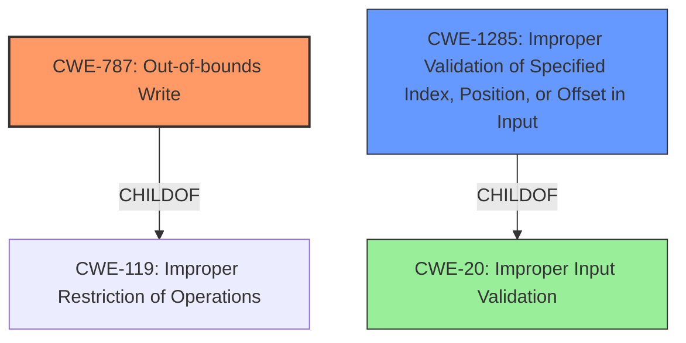

# Final Resolution for CVE-2022-32640

# Summary
| CWE ID | CWE Name | Confidence | CWE Abstraction Level | CWE Vulnerability Mapping Label | CWE-Vulnerability Mapping Notes |
|---|---|---|---|---|---|
| CWE-787 | Out-of-bounds Write | 1.0 | Base | Primary | Allowed |
| CWE-1285 | Improper Validation of Specified Index, Position, or Offset in Input | 0.7 | Base | Secondary Candidate | Allowed |
| CWE-20 | Improper Input Validation | 0.6 | Class | Tertiary Candidate | Discouraged |

## Evidence and Confidence

*   **Confidence Score:** 0.95
*   **Evidence Strength:** HIGH

## Relationship Analysis
The primary weakness is **CWE-787 (Out-of-bounds Write)**, which is a base-level CWE and a child of **CWE-119 (Improper Restriction of Operations within the Bounds of a Memory Buffer)**. The initial analysis correctly identified this relationship. The secondary weakness, **CWE-1285 (Improper Validation of Specified Index, Position, or Offset in Input)**, refines the input validation aspect by focusing on the validation of indices or offsets. **CWE-20 (Improper Input Validation)** is included as a tertiary candidate because it's a broader class that encompasses the specific input validation failure.

## Vulnerability Chain
The vulnerability chain begins with **a missing bounds check (CWE-1285)** that leads to an **out-of-bounds write (CWE-787)**. The initial flaw is the failure to validate the index, position, or offset, allowing a write operation outside the intended buffer boundaries. The consequence is potential local escalation of privilege with System execution privileges.
  - The chain is: **CWE-1285 (Improper Validation of Specified Index, Position, or Offset in Input) -> CWE-787 (Out-of-bounds Write)**
  - The more general case of **CWE-20** can lead to the specific case of **CWE-787** as well, but lacks specificity.

## Summary of Analysis
The initial analysis correctly identified **CWE-787 (Out-of-bounds Write)** as the primary weakness. The criticism correctly suggested refining the secondary weakness to **CWE-1285 (Improper Validation of Specified Index, Position, or Offset in Input)**, which is a more specific description of the missing bounds check than the broader **CWE-20 (Improper Input Validation)**.

The vulnerability description explicitly states "out of bounds write due to a missing bounds check". This direct evidence strongly supports the classification of **CWE-787**. The reference to a "missing bounds check" also supports the inclusion of **CWE-1285**, as the missing check relates to an index, position, or offset.

The graph relationships influenced the decision by highlighting the hierarchical relationship between **CWE-787** and its parent **CWE-119**, and between **CWE-1285** and its parent **CWE-20**, ensuring the selection of the most specific and relevant CWEs. **CWE-20** is kept as a tertiary classification to show that improper validation can contribute to out-of-bounds write vulnerabilities.

The selected CWEs are at the optimal level of specificity. **CWE-787** directly addresses the out-of-bounds write, while **CWE-1285** pinpoints the missing bounds check on an index/offset, providing a more granular understanding of the root cause compared to **CWE-20**. The evidence provided strongly justifies this decision.