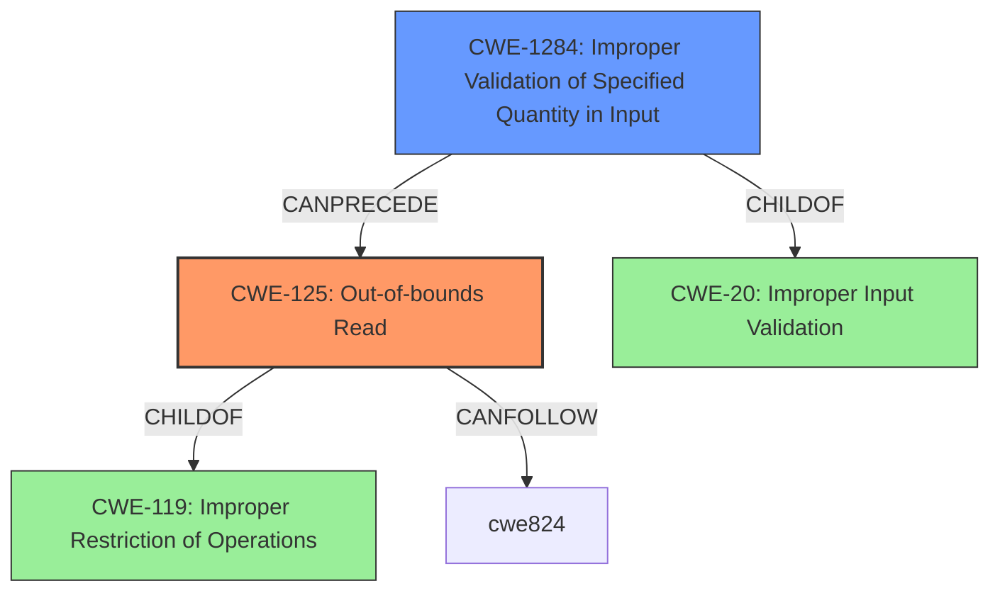

# Final Resolution for CVE-2022-32641

# Summary
| CWE ID | CWE Name | Confidence | CWE Abstraction Level | CWE Vulnerability Mapping Label | CWE-Vulnerability Mapping Notes |
|---|---|---|---|---|---|
| CWE-125 | Out-of-bounds Read | 1.0 | Base | Primary | Allowed |
| CWE-1284 | Improper Validation of Specified Quantity in Input | 0.7 | Base | Secondary Candidate | Allowed |

## Evidence and Confidence

*   **Confidence Score:** 0.9
*   **Evidence Strength:** HIGH

## Relationship Analysis
The primary relationship impacting the decision is the child-of relationship between CWE-125 (Out-of-bounds Read) and CWE-119 (Improper Restriction of Operations within the Bounds of a Memory Buffer). This confirms that CWE-125 is a valid, more specific type of buffer access issue. Additionally, CWE-1284 (Improper Validation of Specified Quantity in Input) is considered as a secondary CWE because the vulnerability description mentions a "missing bounds check," indicating a failure to validate the size or length of the input. CWE-1284 is a child of CWE-20.

## Vulnerability Chain
The vulnerability chain starts with a **missing bounds check** (CWE-1284), which leads to an **out-of-bounds read** (CWE-125).
  - The initial flaw is the lack of proper validation of the input size.
  - This leads to reading memory outside the allocated buffer.
  - The consequence is a possible local escalation of privilege.

## Summary of Analysis
The initial analysis correctly identified CWE-125 (Out-of-bounds Read) as the primary CWE. The vulnerability description explicitly mentions an "**out of bounds read**" due to a "**missing bounds check**." This aligns with the CWE-125 description: "The product reads data past the end, or before the beginning, of the intended buffer."

The criticism suggested replacing the secondary CWE, CWE-20 (Improper Input Validation), with a more specific child. Based on the retriever results and the "missing bounds check" in the description, CWE-1284 (Improper Validation of Specified Quantity in Input) is selected as the secondary CWE. This is because CWE-1284 directly addresses the failure to validate the quantity (size/length) of the input, which caused the **out-of-bounds read**.

The decision to use CWE-125 and CWE-1284 is based on the provided evidence and the CWE relationships. CWE-125 accurately describes the impact (out-of-bounds read), while CWE-1284 identifies the **root cause** (missing bounds check, leading to improper quantity validation). The selected CWEs are at the optimal level of specificity because they directly relate to the vulnerability and its cause.