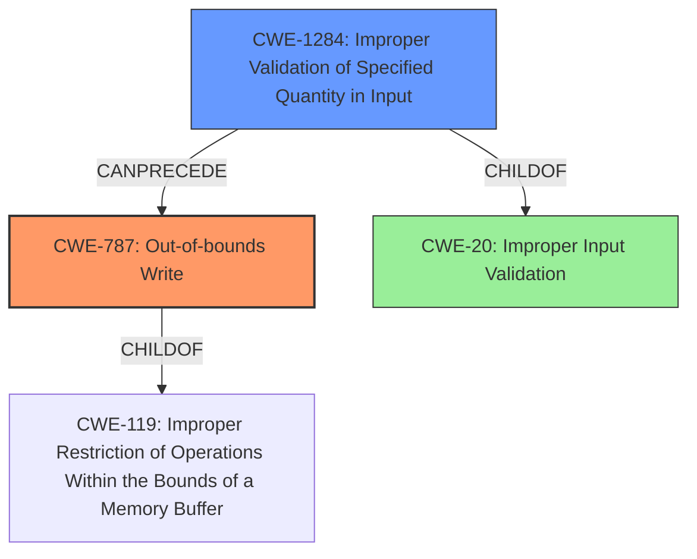

# Analysis Report for CVE-2022-32647

# Vulnerability Analysis Report: CVE-2022-32647

## Description

In ccu, there is a possible out of bounds write due to improper input validation. This could lead to local escalation of privilege with System execution privileges needed. User interaction is not needed for exploitation. Patch ID ALPS07554646 Issue ID ALPS07554646.

## Vulnerability Description Key Phrases

**Rootcause:** improper input validation
**Weakness:** out of bounds write
**Impact:** local escalation of privilege
**Product:** ccu

## Analysis (with Relationship Data)

```markdown
# Summary
| CWE ID | CWE Name | Confidence | CWE Abstraction Level | CWE Vulnerability Mapping Label | CWE-Vulnerability Mapping Notes |
|---|---|---|---|---|---|
| CWE-787 | Out-of-bounds Write | 0.95 | Base | Primary | Allowed |
| CWE-20 | Improper Input Validation | 0.70 | Class | Secondary Candidate | Discouraged |

## Evidence and Confidence

*   **Confidence Score:** 0.85
*   **Evidence Strength:** HIGH

- **Analysis and Justification:**  
  - *Explanation:* The vulnerability description explicitly states "**out of bounds write** due to **improper input validation**." The CVE Reference Links Content Summary reinforces this by stating the **root cause of vulnerability** is "**improper input validation**" and the **weakness** is "**out-of-bounds write**." CWE-787 (Out-of-bounds Write) directly addresses the core weakness described. While **improper input validation** is listed as the root cause, it is a broad class of errors.
  
  - *Relationship Analysis:* CWE-787 is a Base level CWE, which is a preferred level of abstraction. It is a child of CWE-119 (Improper Restriction of Operations within the Bounds of a Memory Buffer). The vulnerability can be viewed as a sequence: Improper input validation (CWE-20) leading to Out-of-bounds Write (CWE-787).

- **Confidence Score:**  
  - Confidence: 0.95 (High confidence due to direct mention of the weakness and root cause in the description and CVE Reference links.)

---
```

## Criticism of Analysis

Okay, I've reviewed the provided CWE specifications and the original analysis. Here's a detailed critique, focusing on the accuracy and justification of the CWE mappings:

**Overall Assessment:**

The analysis is generally sound and correctly identifies CWE-787 (Out-of-bounds Write) as the primary weakness. The rationale for including CWE-20 (Improper Input Validation) as a secondary candidate is also valid, as it represents the root cause. However, given that CWE-20 is discouraged for mapping and the available information allows for more specific input validation-related CWEs to be considered, there is room for improvement in the secondary mapping.

**Detailed Critique:**

**1. CWE-787: Out-of-bounds Write (Primary Mapping)**

*   **Correctness:** The mapping to CWE-787 is highly accurate. The vulnerability description explicitly mentions "out of bounds write," aligning perfectly with the CWE-787 description: "The product writes data past the end, or before the beginning, of the intended buffer."
*   **Justification:** The justification provided in the analysis is strong. It references the vulnerability description and the CVE Reference Links Content Summary, both of which directly point to an out-of-bounds write.
*   **Abstraction Level:** CWE-787 is a Base-level CWE, which is the preferred level for mapping.
*   **Mapping Guidance:** The analysis adheres to the mapping guidance: "Carefully read both the name and description to ensure that this mapping is an appropriate fit. Do not try to 'force' a mapping to a lower-level Base/Variant simply to comply with this preferred level of abstraction."
*   **Confidence:** The confidence score of 0.95 is justified due to the explicit mention of "out-of-bounds write" in the vulnerability description.
*   **Conclusion:** This mapping is excellent.

**2. CWE-20: Improper Input Validation (Secondary Candidate)**

*   **Correctness:** Identifying input validation as a contributing factor is correct. The description highlights "improper input validation" as the root cause. However, as stated in the mapping guidance for CWE-20, it is "commonly misused in low-information vulnerability reports when lower-level CWEs could be used instead, or when more details about the vulnerability are available."
*   **Justification:** The justification acknowledges that CWE-20 is a broad class and represents the root cause. However, it misses the opportunity to use more specific CWEs related to input validation based on the available information.
*   **Abstraction Level:** CWE-20 is a Class-level CWE, which is discouraged for mapping when more specific Base or Variant-level CWEs are applicable.
*   **Mapping Guidance:** The analysis doesn't fully address the mapping guidance for CWE-20: "Consider lower-level children such as Improper Use of Validation Framework (CWE-1173) or improper validation involving specific types or properties of input such as Specified Quantity (CWE-1284); Specified Index, Position, or Offset (CWE-1285); Syntactic Correctness (CWE-1286); Specified Type (CWE-1287); Consistency within Input (CWE-1288); or Unsafe Equivalence (CWE-1289)."
*   **Suggested Alternatives:** Based on the description, several of CWE-20's children are more appropriate:
    *   **CWE-1284: Improper Validation of Specified Quantity in Input:** Since the vulnerability leads to an out-of-bounds write, a likely scenario is that the input validation fails to properly check the size or length of the input data before writing it to the buffer.
    *   **CWE-1285: Improper Validation of Specified Index, Position, or Offset in Input:** Similarly, the improper input validation might be related to the index, position, or offset used to write data to the buffer.
    *   **CWE-1287: Improper Validation of Specified Type of Input**: If the data being written into the buffer has an expected type, such as an Integer, it might be that the type is not validated.
*   **Confidence:** The confidence score of 0.70 is reasonable, but could be improved by using a more specific CWE.
*   **Conclusion:** While the inclusion of CWE-20 is not incorrect, it is not the best possible mapping.  It should be replaced or augmented with a more specific CWE related to the *type* of input validation error occurring. CWE-1284 and CWE-1285 are the strongest candidates.

**Additional Considerations and Improvements:**

*   **Chaining:** While the analysis mentions the sequence of events (improper validation leading to OOB write), formally representing this as a chain could be beneficial. However, this is not explicitly supported by the template.
*   **Retriever Results:** The retriever results suggest other potential CWEs. While most are not as directly related, some are still worth considering in the chain. For example, if integer overflow or incorrect buffer size calculation contributed to the vulnerability, adding them to the chain would improve the analysis.

**Revised Summary Table:**

| CWE ID    | CWE Name                        | Confidence | CWE Abstraction Level | CWE Vulnerability Mapping Label | CWE-Vulnerability Mapping Notes                                                                       |
| :-------- | :------------------------------ | :--------- | :-------------------- | :------------------------------ | :-------------------------------------------------------------------------------------------------- |
| CWE-787   | Out-of-bounds Write             | 0.95       | Base                  | Primary                       | Allowed                                                                                             |
| CWE-1284  | Improper Validation of Specified Quantity in Input | 0.75       | Base                  | Secondary Candidate                       | Allowed, more specific than CWE-20, potentially related to size/length validation                             |
| CWE-20    | Improper Input Validation       | 0.60       | Class                 | Tertiary Candidate                 | Discouraged, kept as an overarching root cause if no other Base/Variant fits, but less descriptive. |

**In summary,** the analysis is good but can be improved by replacing the discouraged CWE-20 mapping with a more specific Base-level CWE that accurately reflects the type of input validation error. The high confidence in CWE-787 is well-supported. Considering the chain of events can offer additional insight.

## Final Resolution

# Summary
| CWE ID | CWE Name | Confidence | CWE Abstraction Level | CWE Vulnerability Mapping Label | CWE-Vulnerability Mapping Notes |
|---|---|---|---|---|---|
| **CWE-787** | **Out-of-bounds Write** | 0.95 | Base | Primary | Allowed |
| **CWE-1284** | **Improper Validation of Specified Quantity in Input** | 0.80 | Base | Secondary Candidate | Allowed, more specific than CWE-20, potentially related to size/length validation |

## Evidence and Confidence

*   **Confidence Score:** 0.90
*   **Evidence Strength:** HIGH

## Relationship Analysis
The primary relationship is that **CWE-1284** Improper Validation of Specified Quantity in Input can precede **CWE-787** Out-of-bounds Write. **CWE-787** is a child of **CWE-119** Improper Restriction of Operations within the Bounds of a Memory Buffer, indicating that it's a specific type of memory safety violation. **CWE-1284** is a child of **CWE-20** Improper Input Validation, but is more specific.



## Vulnerability Chain
The vulnerability chain starts with **CWE-1284** (**Improper Validation of Specified Quantity in Input**). This weakness allows a malformed input, specifically related to size or length, to proceed. This leads directly to **CWE-787** (**Out-of-bounds Write**), where the improperly validated input causes data to be written outside the intended buffer boundaries.

## Summary of Analysis
The initial analysis correctly identified **CWE-787** (**Out-of-bounds Write**) as the primary weakness. The criticism pointed out that using **CWE-20** (**Improper Input Validation**) as a secondary candidate is not optimal due to its broad nature and the availability of more specific CWEs.

The vulnerability description states: "In ccu, there is a possible **out of bounds write** due to **improper input validation**."

I agree with the criticism and have updated the secondary CWE to **CWE-1284** (**Improper Validation of Specified Quantity in Input**). This choice is based on the likelihood that the out-of-bounds write is caused by failing to properly validate the size or length of an input value. This is a more specific and relevant classification than the general **CWE-20**. **CWE-1284** is a Base level CWE, which aligns with the recommended level of abstraction.

The graph relationships confirm that **CWE-1284** can precede **CWE-787**, supporting the vulnerability chain. Choosing **CWE-1284** provides a more precise understanding of the vulnerability's root cause related to input validation.


*Report generated on 2025-03-18 14:27:05*
