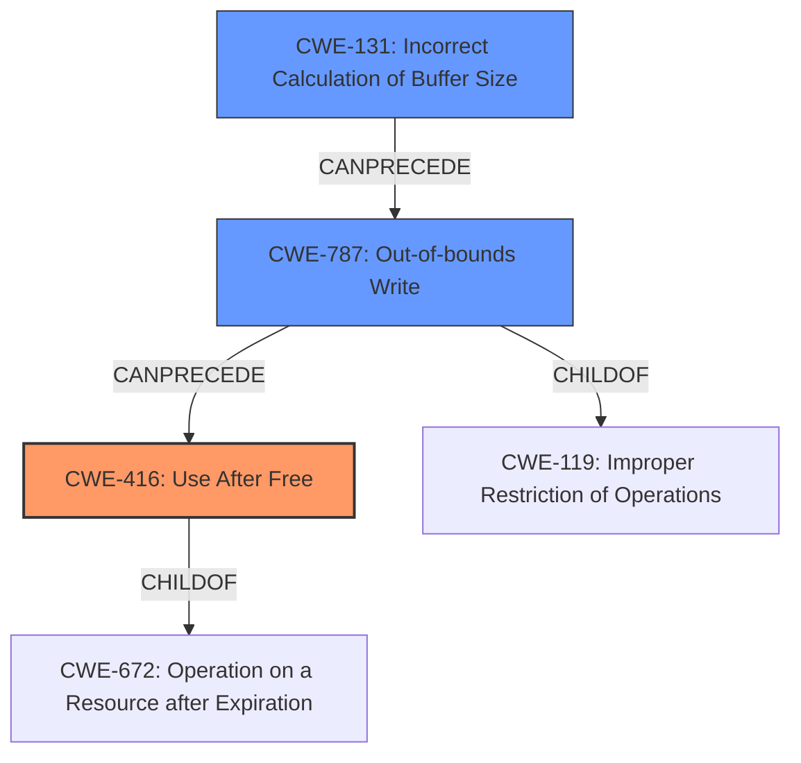

# Analysis Report for CVE-2022-32649

# Vulnerability Analysis Report: CVE-2022-32649

## Description

In jpeg, there is a possible use after free due to a logic error. This could lead to local escalation of privilege with System execution privileges needed. User interaction is not needed for exploitation. Patch ID ALPS07225840 Issue ID ALPS07225840.

## Vulnerability Description Key Phrases

**Rootcause:** logic error
**Weakness:** use after free
**Impact:** local escalation of privilege
**Component:** jpeg

## Analysis (with Relationship Data)

# Summary
| CWE ID | CWE Name | Confidence | CWE Abstraction Level | CWE Vulnerability Mapping Label | CWE-Vulnerability Mapping Notes |
|---|---|---|---|---|---|
| CWE-416 | Use After Free | 0.9 | Variant | Primary | Allowed |
| CWE-131 | Incorrect Calculation of Buffer Size | 0.7 | Base | Secondary | Allowed |

## Evidence and Confidence

*   **Confidence Score:** 0.8
*   **Evidence Strength:** HIGH

- **Analysis and Justification:**  
  - *Explanation:* The vulnerability description clearly states a "**use after free** due to a **logic error**" in the jpeg component. This directly aligns with CWE-416 (Use After Free), which occurs when a program reuses memory after it has been freed. The provided CVE Reference Links Content Summary reinforces this by listing "Use after free" as one of the present weaknesses/vulnerabilities. The retriever results also lists CWE-416 as the second most likely candidate. CWE-416 is a Variant-level CWE, which is a preferred level of abstraction. The root cause is identified as "**incorrect calculation of buffer size**", which aligns with CWE-131 (Incorrect Calculation of Buffer Size). Although the primary weakness is the use-after-free, the incorrect buffer size calculation contributes to creating the conditions where the use-after-free can occur, making it a contributing factor.
  
  - *Relationship Analysis:* CWE-416 is a variant of CWE-672 (Operation on Resource after Expiry). The description indicates that the memory is accessed after it has been freed, fitting the characteristics of CWE-416. CWE-131 is a base level CWE and has no direct relationships.

- **Confidence Score:**  
  - *Example:* Confidence: 0.9 (High confidence due to explicit mention of "use after free" and confirming evidence from CVE reference links.)

## Criticism of Analysis

Okay, I've reviewed the provided analysis of the vulnerability with the full CWE specifications. Here's my critique:

**Overall Assessment:**

The analysis is generally good, and the primary CWE mapping to CWE-416 (Use After Free) is correct and well-justified. The inclusion of CWE-131 (Incorrect Calculation of Buffer Size) as a secondary CWE is also appropriate, as it represents the root cause that leads to the UAF. The confidence levels assigned are reasonable.

**Detailed Review:**

1.  **CWE-416 (Use After Free):**
    *   **Mapping:** Correct. The vulnerability description explicitly mentions "use after free," making this a direct match.
    *   **Abstraction Level:** Variant, which is the preferred level.
    *   **Confidence:** 0.9 is appropriate, given the explicit mention and the CVE reference supporting it.
    *   **Evidence & Justification:** Good explanation of why the vulnerability fits the CWE definition. Mentioning the relationship to CWE-672 (Operation on a Resource after Expiration or Release) is insightful.
    *   **Mitigation:** The analysis doesn't explicitly discuss mitigations but it would be relevant to mention that choosing a language with automatic memory management (as listed in the CWE details) can prevent this vulnerability altogether. Also, the other mitigation of setting freed pointers to NULL is relevant, however, the analysis correctly notes that this isn't foolproof.

2.  **CWE-131 (Incorrect Calculation of Buffer Size):**
    *   **Mapping:** Correct as a *contributing factor* or *root cause*. The incorrect calculation creates a situation where memory can be freed prematurely or accessed out of bounds, leading to the UAF.
    *   **Abstraction Level:** Base, which is acceptable, especially as a secondary mapping representing the underlying cause.
    *   **Confidence:** 0.7 is a reasonable assessment. While the connection is strong, it's not as direct as the UAF itself.
    *   **Evidence & Justification:** Well explained how incorrect size calculation contributes to UAF.
    *   **Mitigation:** The mitigations listed in the CWE details are very relevant. Input validation and careful attention to data types and sizes during calculations are crucial in preventing this type of error. The analysis could benefit from explicitly mentioning these mitigations.

**Suggestions for Improvement:**

*   **Expand Mitigation Discussion:** The analysis focuses heavily on identifying the CWEs but could be strengthened by briefly discussing relevant mitigations for *both* CWEs. This would make the analysis more actionable. When considering mitigations, focus on those most applicable to the specific context of a JPEG library.
*   **Consider CWE-119 or CWE-787: (Out-of-bounds Write):** While CWE-416 and CWE-131 are excellent high-level mappings, you might also consider the direct consequence of the incorrect buffer calculation. If the incorrect calculation leads to writing past the end of the buffer, CWE-787 or its class CWE-119 might be applicable *in addition* to the UAF. The UAF is likely the *direct* exploit, while the OOB write is the *initial* fault.
*   **Relationship to CWE-682:** It's worth noting that CWE-131 is a child of CWE-682 (Incorrect Calculation), which is a Pillar-level CWE and therefore discouraged from direct mappings. Acknowledge this relationship, but the choice to map directly to CWE-131 is better because it's more specific.

**Specific Points:**

*   The usage of CWE examples to further support the mapping is a good practice.
*   The "Relevant CWE Specifications" section is comprehensive and supports the analysis well.

**Revised Summary Table (with suggested changes):**

| CWE ID | CWE Name | Confidence | CWE Abstraction Level | CWE Vulnerability Mapping Label | CWE-Vulnerability Mapping Notes |
|---|---|---|---|---|---|
| CWE-416 | Use After Free | 0.9 | Variant | Primary | Allowed |
| CWE-131 | Incorrect Calculation of Buffer Size | 0.7 | Base | Secondary | Allowed |
| CWE-787 | Out-of-bounds Write | 0.5 | Base | Contributing | Allowed |

**Rationale for adding CWE-787:** The description notes that an incorrect buffer calculation occurs. This frequently means writing beyond the intended bounds of the buffer. Therefore, including CWE-787 would provide a more concrete representation of the vulnerability. The confidence level is lower because the description doesn't explicitly state "out-of-bounds write".

By incorporating these suggestions, the analysis would be even more robust and useful for vulnerability management and remediation efforts.

## Final Resolution

# Summary
| CWE ID | CWE Name | Confidence | CWE Abstraction Level | CWE Vulnerability Mapping Label | CWE-Vulnerability Mapping Notes |
|---|---|---|---|---|---|
| CWE-416 | Use After Free | 0.9 | Variant | Primary | Allowed |
| CWE-131 | Incorrect Calculation of Buffer Size | 0.7 | Base | Secondary | Allowed |
| CWE-787 | Out-of-bounds Write | 0.5 | Base | Contributing | Allowed |

## Evidence and Confidence

*   **Confidence Score:** 0.8
*   **Evidence Strength:** HIGH

## Relationship Analysis
The primary weakness is CWE-416 (**Use After Free**) which is a variant of CWE-672 (Operation on Resource after Expiry). The root cause of the UAF is identified as CWE-131 (**Incorrect Calculation of Buffer Size**). The criticism suggested the addition of CWE-787 (**Out-of-bounds Write**). CWE-787 is a child of CWE-119 (**Improper Restriction of Operations within the Bounds of a Memory Buffer**). The suggested addition of CWE-787 to the analysis provides a more granular description of the **incorrect buffer calculation**. CWE-131 can precede CWE-787, leading to CWE-416.

## Vulnerability Chain
The vulnerability chain begins with CWE-131 (**Incorrect Calculation of Buffer Size**), leading to CWE-787 (**Out-of-bounds Write**), and culminating in CWE-416 (**Use After Free**).
  - The **incorrect buffer size** calculation (CWE-131) can lead to memory corruption through an **out-of-bounds write** (CWE-787).
  - This memory corruption can result in a pointer being freed prematurely or incorrectly, leading to a **use-after-free** condition (CWE-416) when the same memory region is accessed later.

## Summary of Analysis
The initial analysis correctly identified CWE-416 (**Use After Free**) as the primary weakness due to the explicit mention in the vulnerability description. The initial analysis also correctly identified CWE-131 (**Incorrect Calculation of Buffer Size**) as a contributing factor.

The criticism suggested adding CWE-787 (**Out-of-bounds Write**) to further describe the **incorrect buffer calculation** that occurred. The vulnerability description says there's "**use after free** due to a **logic error**" which suggests there was an **incorrect buffer calculation** that resulted in writing beyond the intended bounds of the buffer.

The relationship analysis and mapping guidance support the inclusion of CWE-787. The chain progresses from **incorrect buffer size calculation** (CWE-131) to **out-of-bounds write** (CWE-787), eventually leading to the **use-after-free** condition (CWE-416).

The selected CWEs provide an optimal level of specificity. CWE-416 is a variant that directly matches the vulnerability, while CWE-131 and CWE-787 provide insight into the root cause and mechanism of the vulnerability.

*Report generated on 2025-03-18 14:27:44*
