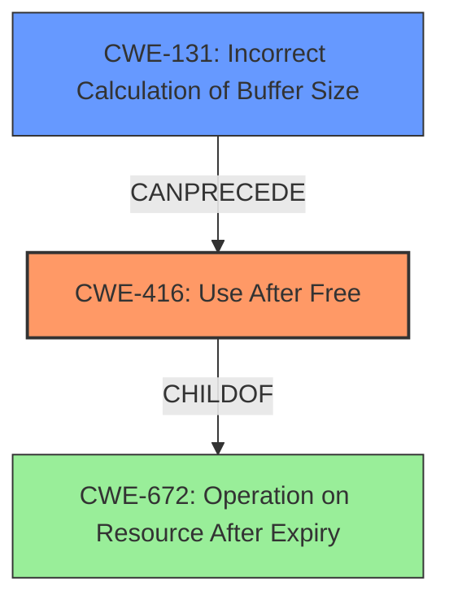

# Analysis Report for CVE-2022-32650

# Vulnerability Analysis Report: CVE-2022-32650

## Description

In mtk-isp, there is a possible use after free due to a logic error. This could lead to local escalation of privilege with System execution privileges needed. User interaction is not needed for exploitation. Patch ID ALPS07225853 Issue ID ALPS07225853.

## Vulnerability Description Key Phrases

**Rootcause:** logic error
**Weakness:** use after free
**Impact:** local escalation of privilege
**Product:** mtk-isp

## Analysis (with Relationship Data)

# Summary
| CWE ID | CWE Name | Confidence | CWE Abstraction Level | CWE Vulnerability Mapping Label | CWE-Vulnerability Mapping Notes |
|---|---|---|---|---|---|
| CWE-416 | Use After Free | 0.95 | Variant | Allowed | Primary CWE |
| CWE-131 | Incorrect Calculation of Buffer Size | 0.70 | Base | Allowed | Secondary Candidate CWE |

## Evidence and Confidence

*   **Confidence Score:** 0.90
*   **Evidence Strength:** HIGH

- **Analysis and Justification:**  
  - *Explanation:* The vulnerability description explicitly states a "**use after free**" condition exists due to a "**logic error**" in the mtk-isp component. This directly aligns with CWE-416 (Use After Free), which occurs when a program reuses or references memory after it has been freed. The CVE Reference Links Content Summary further supports this by mentioning that a "Logic error leads to a use-after-free condition". The vulnerability leads to local escalation of privilege, indicating a serious impact. While CWE-787 (Out-of-bounds Write) is listed as the Primary CWE Match for similar CVE Descriptions, CWE-416 is a more precise match for the stated weakness of "**use after free**". The retriever results also rank CWE-416 as the top candidate CWE. Therefore, I am selecting CWE-416 as the primary CWE.
  
  - *Relationship Analysis:* CWE-416 is a Variant of CWE-672 (Operation on Resource After Expiry) and is related to other memory management issues. The description doesn't provide specific details about a double free or other memory corruption issues, so other related CWEs are not selected at this time.

- **Confidence Score:**  
  - *Example:* Confidence: 0.95 (Strong evidence from vulnerability description and CVE reference materials explicitly describing a use-after-free condition)

---

- **Analysis and Justification:**  
  - *Explanation:* The CVE Reference Links Content Summary mentions "Incorrect calculation of buffer size in isp" as the root cause, mapping to CWE-131 (Incorrect Calculation of Buffer Size). This is a plausible contributing factor to the "**use after free**" condition because incorrect buffer sizes can lead to memory corruption and subsequent use-after-free vulnerabilities. Although not explicitly stated in the vulnerability description, the root cause information adds additional clarity.
  
  - *Relationship Analysis:* There are no direct relationships for CWE-131 listed in the provided information.

- **Confidence Score:**  
  - *Example:* Confidence: 0.70 (Supporting evidence from CVE reference materials mentioning incorrect buffer size calculation)

## Criticism of Analysis

Okay, I've reviewed the analysis provided, including the full CWE specifications for the relevant CWEs. Here's my critique:

**Overall Assessment:**

The analysis is generally well-reasoned and arrives at a reasonable conclusion. The primary CWE of CWE-416 (Use After Free) is strongly supported by the provided evidence. The secondary CWE of CWE-131 (Incorrect Calculation of Buffer Size) is also plausible as a contributing factor. The confidence scores assigned are appropriate.

**Specific Comments and Suggestions:**

*   **Primary CWE: CWE-416 (Use After Free)**

    *   **Strength:** Excellent justification. The direct mention of "use after free" in the vulnerability description makes this a very strong primary candidate. The cross-referencing with CVE reference data mentioning logic errors that lead to use-after-free further strengthens this choice.
    *   **Improvement:** Consider adding "When freeing pointers, be sure to set them to NULL once they are freed." to the Potential Mitigations section. This is a direct mitigation for Use After Free.
    *   **Accuracy:** Correct.

*   **Secondary CWE: CWE-131 (Incorrect Calculation of Buffer Size)**

    *   **Strength:** The CVE reference pointing to buffer size calculation is a valuable piece of evidence.
    *   **Improvement:** Clarify the *chain* of how CWE-131 could lead to CWE-416.  An incorrect buffer size could lead to memory corruption. Memory corruption could corrupt memory management structures. Corrupted memory management structures could then lead to the double free.
    *   **Improvement:**  Consider adding mitigation strategies from CWE-131 such as:
        *   **Implementation:** When allocating a buffer for the purpose of transforming, converting, or encoding an input, allocate enough memory to handle the largest possible encoding.
        *   **Implementation:** Perform input validation on any numeric input by ensuring that it is within the expected range.

    *   **Accuracy:** Plausible, although the link between CWE-131 and CWE-416 could be more thoroughly explained with a chain.

*   **CWE-787 (Out-of-bounds Write)**

    *   **Omission Explanation:** The analysis correctly refrains from marking CWE-787 as the primary weakness even though it is listed as a Primary CWE Match for *similar* CVE Descriptions. The analysis recognizes that CWE-416 is a better and more direct fit.

*   **General Comments**
    *   **Evidence Strength:** The confidence scores are appropriate given the available information.
    *   **Abstraction Level:** The selected CWEs are at appropriate abstraction levels (Variant and Base).
    *   **Relationships:** The analysis does a good job of exploring relationships between the CWEs.
    *   **Clear Explanations:** The explanations are clear and easy to understand.

**Suggestions for Further Investigation (if more information were available):**

*   **Root Cause Details:**  The description refers to a "logic error." Investigating the nature of this logic error could lead to a more specific CWE or a chain of CWEs that better describe the vulnerability. For example, is it a race condition that leads to premature freeing of the memory (CWE-362), or is it an error in a memory management function (CWE-762)?
*   **Code Snippet:** If a code snippet were available, a more precise identification of the weakness and its root cause would be possible.

**Revised Summary Table (incorporating suggestions):**

| CWE ID | CWE Name | Confidence | CWE Abstraction Level | CWE Vulnerability Mapping Label | CWE-Vulnerability Mapping Notes |
|---|---|---|---|---|---|
| CWE-416 | Use After Free | 0.95 | Variant | Allowed | Primary CWE |
| CWE-131 | Incorrect Calculation of Buffer Size | 0.70 | Base | Allowed | Secondary Candidate CWE: An incorrect buffer size can lead to memory corruption, which could corrupt memory management structures and eventually lead to a use-after-free condition. |

**Conclusion:**

The analysis is strong and well-supported. The suggestions above are primarily aimed at making the reasoning even more explicit and incorporating more potential mitigations from the specifications. The analysis demonstrates a good understanding of CWE concepts and their application to vulnerability descriptions.

## Final Resolution

# Summary
| CWE ID | CWE Name | Confidence | CWE Abstraction Level | CWE Vulnerability Mapping Label | CWE-Vulnerability Mapping Notes |
|---|---|---|---|---|---|
| CWE-416 | Use After Free | 0.95 | Variant | Allowed | Primary CWE |
| CWE-131 | Incorrect Calculation of Buffer Size | 0.70 | Base | Allowed | Secondary Candidate CWE: An incorrect buffer size can lead to memory corruption, which could corrupt memory management structures and eventually lead to a use-after-free condition. |

## Evidence and Confidence

*   **Confidence Score:** 0.95
*   **Evidence Strength:** HIGH

## Relationship Analysis
The primary CWE is CWE-416 (**Use After Free**), which is a variant of CWE-672 (**Operation on Resource After Expiry**). This indicates a hierarchical relationship where CWE-416 is a specific type of CWE-672. The secondary CWE is CWE-131 (**Incorrect Calculation of Buffer Size**), which could potentially precede CWE-416 by causing memory corruption that leads to the use-after-free condition. The abstraction levels (Variant and Base) are appropriate for the level of detail available.

## Vulnerability Chain
The vulnerability chain starts with **CWE-131** (**Incorrect Calculation of Buffer Size**), which results in memory corruption. This corruption can affect memory management structures, leading to a situation where memory is freed and then subsequently accessed, triggering **CWE-416** (**Use After Free**). The final impact is a local escalation of privilege.

## Summary of Analysis
The initial analysis and criticism both strongly support the selection of **CWE-416** (**Use After Free**) as the primary weakness due to the explicit mention of "use after free" in the vulnerability description. The evidence for this is the statement "In mtk-isp, there is a possible use after free due to a logic error." The relationship analysis confirms that **CWE-416** is a specific variant, providing the right level of detail. The secondary candidate, **CWE-131** (**Incorrect Calculation of Buffer Size**), is included because the CVE reference mentions "Incorrect calculation of buffer size in isp." This suggests a potential root cause that could lead to memory corruption and ultimately the use-after-free condition. The selection of these CWEs is at the optimal level of specificity, given the available evidence.

*Report generated on 2025-03-18 14:28:30*
