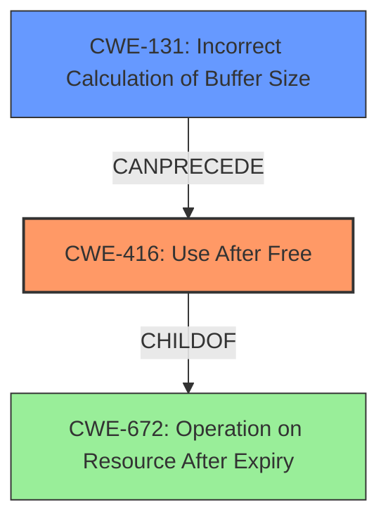

# Final Resolution for CVE-2022-32650

# Summary
| CWE ID | CWE Name | Confidence | CWE Abstraction Level | CWE Vulnerability Mapping Label | CWE-Vulnerability Mapping Notes |
|---|---|---|---|---|---|
| CWE-416 | Use After Free | 0.95 | Variant | Allowed | Primary CWE |
| CWE-131 | Incorrect Calculation of Buffer Size | 0.70 | Base | Allowed | Secondary Candidate CWE: An incorrect buffer size can lead to memory corruption, which could corrupt memory management structures and eventually lead to a use-after-free condition. |

## Evidence and Confidence

*   **Confidence Score:** 0.95
*   **Evidence Strength:** HIGH

## Relationship Analysis
The primary CWE is CWE-416 (**Use After Free**), which is a variant of CWE-672 (**Operation on Resource After Expiry**). This indicates a hierarchical relationship where CWE-416 is a specific type of CWE-672. The secondary CWE is CWE-131 (**Incorrect Calculation of Buffer Size**), which could potentially precede CWE-416 by causing memory corruption that leads to the use-after-free condition. The abstraction levels (Variant and Base) are appropriate for the level of detail available.

## Vulnerability Chain
The vulnerability chain starts with **CWE-131** (**Incorrect Calculation of Buffer Size**), which results in memory corruption. This corruption can affect memory management structures, leading to a situation where memory is freed and then subsequently accessed, triggering **CWE-416** (**Use After Free**). The final impact is a local escalation of privilege.

## Summary of Analysis
The initial analysis and criticism both strongly support the selection of **CWE-416** (**Use After Free**) as the primary weakness due to the explicit mention of "use after free" in the vulnerability description. The evidence for this is the statement "In mtk-isp, there is a possible use after free due to a logic error." The relationship analysis confirms that **CWE-416** is a specific variant, providing the right level of detail. The secondary candidate, **CWE-131** (**Incorrect Calculation of Buffer Size**), is included because the CVE reference mentions "Incorrect calculation of buffer size in isp." This suggests a potential root cause that could lead to memory corruption and ultimately the use-after-free condition. The selection of these CWEs is at the optimal level of specificity, given the available evidence.