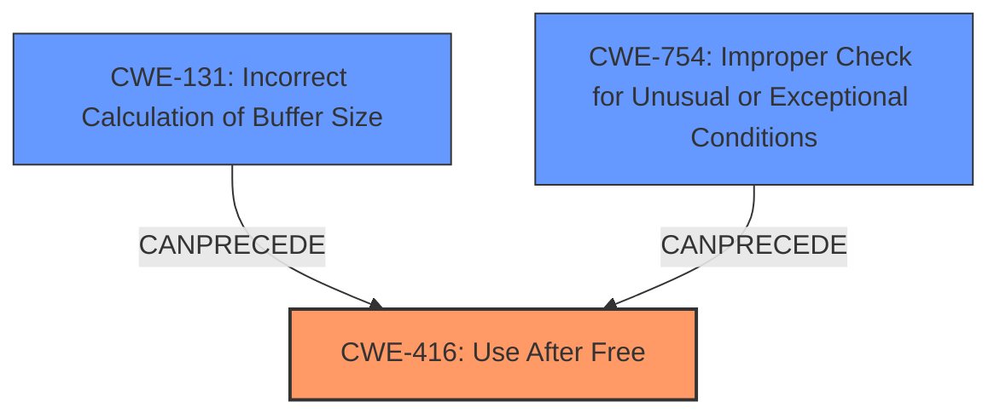

# Final Resolution for CVE-2022-32651

# Summary
| CWE ID | CWE Name | Confidence | CWE Abstraction Level | CWE Vulnerability Mapping Label | CWE-Vulnerability Mapping Notes |
|---|---|---|---|---|---|
| **CWE-416** | **Use After Free** | 0.95 | Variant | Allowed | **Primary CWE**. Explicitly stated in description and confirmed by CVE Reference. |
| **CWE-131** | **Incorrect Calculation of Buffer Size** | 0.70 | Base | Allowed | Secondary Candidate. **Root cause** contributing to the **Use-After-Free**. |
| **CWE-754** | **Improper Check for Unusual or Exceptional Conditions** | 0.30 | Class | Allowed-with-Review | Contributing Factor. A missing check for the validity of the pointer before freeing could have prevented the vulnerability. |

## Evidence and Confidence

*   **Confidence Score:** 0.92
*   **Evidence Strength:** HIGH

## Relationship Analysis
The analysis highlights the relationships between the selected CWEs, forming a chain of weaknesses. **CWE-131 (Incorrect Calculation of Buffer Size)** can lead to memory corruption, eventually triggering **CWE-416 (Use After Free)**. **CWE-754 (Improper Check for Unusual or Exceptional Conditions)** is included as a possible contributing factor, as a check for a valid pointer before freeing could have prevented the vulnerability.

## Vulnerability Chain
The vulnerability chain starts with **CWE-131 (Incorrect Calculation of Buffer Size)**, which leads to memory mismanagement. This can then result in **CWE-416 (Use After Free)** when the incorrectly sized buffer is freed and subsequently accessed. The potential contributing factor **CWE-754 (Improper Check for Unusual or Exceptional Conditions)** highlights the absence of a validation check before freeing the memory.

## Summary of Analysis
The initial analysis correctly identified **CWE-416 (Use After Free)** as the primary weakness, supported by the explicit mention in the vulnerability description: "In mtk-aie, there is a possible **use after free** due to a **logic error**." The root cause is an "**incorrect calculation of buffer size** leading to a use-after-free vulnerability." This is solid evidence for **CWE-131 (Incorrect Calculation of Buffer Size)**.

The criticism's suggestion to consider **CWE-754 (Improper Check for Unusual or Exceptional Conditions)** is valuable. Although not explicitly mentioned, the absence of a check before freeing the memory could have prevented the issue.

The selected CWEs are at the optimal level of specificity. **CWE-416 (Use After Free)** is a Variant, providing a more precise description than its parent class. **CWE-131 (Incorrect Calculation of Buffer Size)** is a Base CWE, offering a good level of detail for the root cause. **CWE-754 (Improper Check for Unusual or Exceptional Conditions)** is a Class CWE, but represents a reasonable contributing factor due to the lack of validation before freeing.