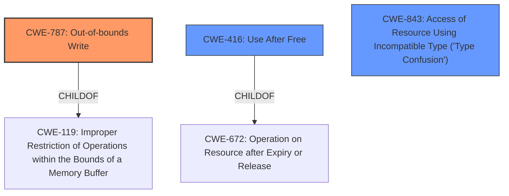

# Final Resolution for CVE-2022-32796

# Summary
| CWE ID | CWE Name | Confidence | CWE Abstraction Level | CWE Vulnerability Mapping Label | CWE-Vulnerability Mapping Notes |
|---|---|---|---|---|---|
| CWE-787 | Out-of-bounds Write | 0.80 | Base | Allowed | Primary CWE |
| CWE-416 | Use After Free | 0.55 | Variant | Allowed | Secondary Candidate |
| CWE-843 | Access of Resource Using Incompatible Type ('Type Confusion') | 0.50 | Base | Allowed | Secondary Candidate |

## Evidence and Confidence

*   **Confidence Score:** 0.75
*   **Evidence Strength:** MEDIUM

## Relationship Analysis
The primary relationship considered was the parent-child relationship between CWE-787 and CWE-119, favoring the more specific CWE-787. While CWE-416 and CWE-843 were considered, the direct evidence connecting them to the vulnerability was weaker, leading to lower confidence scores. Abstraction levels influenced the selection by prioritizing Base and Variant level CWEs over Class or Pillar level CWEs.

## Vulnerability Chain
The vulnerability chain begins with a **memory corruption** issue. The most likely cause is **CWE-787 (Out-of-bounds Write)**, where data is written outside the intended buffer. This can lead to arbitrary code execution with kernel privileges. Secondary candidates like **CWE-416 (Use After Free)** and **CWE-843 (Type Confusion)** could also contribute to the memory corruption, but the evidence is less direct.

## Summary of Analysis
The initial analysis and criticism were both considered in this final determination. The primary basis for the assessment is the vulnerability description stating "A memory corruption issue was addressed with improved state management. An app may be able to execute arbitrary code with kernel privileges." This statement points strongly to **CWE-787 (Out-of-bounds Write)** as the most likely root cause. The criticism suggested increasing the confidence in CWE-787, which was adopted due to the direct alignment with the description. The graph relationships and abstraction levels supported the selection of CWE-787 as a base-level CWE, which is preferred for root cause analysis. While CWE-416 and CWE-843 remain as secondary candidates, their confidence scores were adjusted to reflect the less direct evidence. The selected CWEs are at the optimal level of specificity, with CWE-787 providing a clear representation of the memory corruption issue. The decision is justified by the vulnerability description and the relationship analysis, ensuring the most accurate classification.