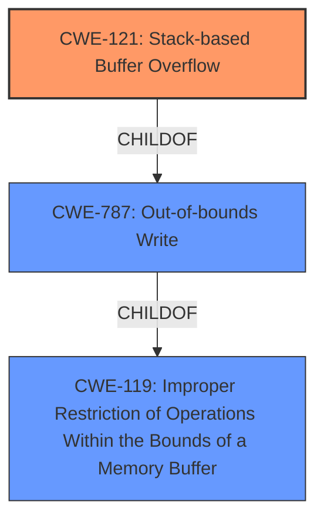

# Final Resolution for CVE-2022-3296

# Summary
| CWE ID  | CWE Name   | Confidence | CWE Abstraction Level | CWE Vulnerability Mapping Label | CWE-Vulnerability Mapping Notes |
|---|---|---|---|---|---|
| CWE-121 | Stack-based Buffer Overflow | 0.95 | Variant | Allowed | Primary CWE |
| CWE-787 | Out-of-bounds Write | 0.75 | Base | Allowed | Secondary Candidate |

## Evidence and Confidence

*   **Confidence Score:** 0.90
*   **Evidence Strength:** HIGH

## Relationship Analysis
The primary relationship impacting the decision is the parent-child relationship between CWE-787 (**Out-of-bounds Write**) and CWE-121 (**Stack-based Buffer Overflow**). CWE-121 is a variant of CWE-787, providing more specific information about the location of the buffer overflow (stack).

## Vulnerability Chain
The vulnerability chain starts with a programming error leading to an unexpected `:finally` statement. This results in data being written beyond the allocated buffer on the stack. This **out-of-bounds write** (**CWE-787**) on the stack (**CWE-121**) can overwrite critical data, potentially including the return address, allowing an attacker to control program execution.

## Summary of Analysis
The initial analysis correctly identified CWE-121 as the primary **weakness**, given the vulnerability description explicitly mentions a **stack-based buffer overflow**. The criticism suggests strengthening the justification for including CWE-787 and elaborating on mitigations. The decision to prioritize CWE-121 is based on the explicit evidence in the vulnerability description: "Stack-based Buffer Overflow in GitHub repository vim/vim prior to 9.0.0577." This specificity makes CWE-121 the more appropriate choice.

The graph relationships reinforce this decision, as CWE-121 is a variant of CWE-787, providing a more precise classification. The abstraction levels are also considered: CWE-121 is a Variant, which is an acceptable level of abstraction, while CWE-787 is a Base, which is a more general classification. While CWE-787 describes the underlying **out-of-bounds write**, the stack location is known and important, thus CWE-121 is more specific.