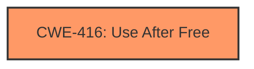

# Analysis Report for CVE-2022-3304

# Vulnerability Analysis Report: CVE-2022-3304

## Description

Use after free in CSS in Google Chrome prior to 106.0.5249.62 allowed a remote attacker to potentially exploit heap corruption via a crafted HTML page. (Chromium security severity High)

## Vulnerability Description Key Phrases

**Rootcause:** use after free
**Weakness:** heap corruption
**Vector:** crafted HTML page
**Attacker:** remote attacker
**Product:** Google Chrome
**Version:** prior to 106.0.5249.62
**Component:** CSS

## Analysis (with Relationship Data)

# Summary
| CWE ID | CWE Name | Confidence | CWE Abstraction Level | CWE Vulnerability Mapping Label | CWE-Vulnerability Mapping Notes |
|---|---|---|---|---|---|
| CWE-416 | Use After Free | 1.0 | Variant | Allowed | Primary CWE |

## Evidence and Confidence

*   **Confidence Score:** 1.0
*   **Evidence Strength:** HIGH

- **Analysis and Justification:**  
  - *Explanation:* The vulnerability description explicitly states "**use after free**" in CSS leading to potential **heap corruption**. This directly aligns with CWE-416 (Use After Free), which describes the condition where a product reuses or references memory after it has been freed. The provided CVE Reference Links Content Summary reinforces this by stating the root cause as "Use-after-free in CSS" and the weakness as "Use-after-free". The impact is potential **heap corruption**, further validating CWE-416 as the correct mapping. The MITRE mapping guidance for CWE-416 indicates that its usage is ALLOWED, and it's at the Variant level of abstraction, which is preferred.

  - *Relationship Analysis:* While other CWEs like CWE-122 (Heap-based Buffer Overflow) and CWE-415 (Double Free) might seem related due to the **heap corruption** aspect, the explicit mention of "use after free" makes CWE-416 the most specific and accurate choice. No direct relationships of CWE-416 are mentioned, so none are being evaluated here.

- **Confidence Score:**  
  - Confidence: 1.0 (Explicit evidence from the vulnerability description and CVE reference materials)

## Criticism of Analysis

Okay, I've reviewed the provided analysis with the full CWE specifications. Here's a breakdown of my critique, focusing on the accuracy of the CWE mapping and considering alternative CWEs:

**Overall Assessment:**

The primary CWE mapping to **CWE-416 (Use After Free)** is accurate and well-justified. The analysis provides strong evidence for this mapping, and the confidence score of 1.0 is appropriate. The justification clearly explains the direct relationship between the vulnerability description (explicitly mentioning "use after free") and the CWE definition.

**Detailed Review:**

*   **CWE-416 (Use After Free): Correctness and Justification**
    *   The analysis correctly identifies CWE-416 as the primary weakness. The explanation is clear and based on the vulnerability description and the root cause information from the CVE summary.
    *   The Variant level of abstraction is correct. The rationale provided ("This CWE entry is at the Variant level of abstraction, which is a preferred level of abstraction for mapping to the root causes of vulnerabilities.") is standard and appropriate.
    *   The analysis correctly notes that CWE-416 usage is "Allowed" according to CWE mapping guidance.
    *   The evidence strength is High, and the confidence score of 1.0 is fitting.

*   **Consideration of Alternative CWEs:**
    *   **CWE-122 (Heap-based Buffer Overflow):** The analysis correctly acknowledges the potential relevance of CWE-122 due to the mention of "heap corruption." However, it rightly prioritizes CWE-416 because the vulnerability is explicitly described as a use-after-free, which is a more specific characterization of the root cause. The analysis clearly explains why CWE-416 is more specific.
    *   **CWE-415 (Double Free):** While double-free can lead to heap corruption, it is distinct from Use-After-Free. Double Free involves freeing the same memory twice, while UAF involves using memory after it has already been freed. The UAF description fits the report much better.
    *   **CWE-843 (Access of Resource Using Incompatible Type ('Type Confusion')):** This is less likely than the others, as Type Confusion vulnerabilities happen when a resource is allocated as one type, and accessed with another. There is no information that points toward this specific vulnerability, so excluding it is reasonable.
    *   **CWE-362 (Concurrent Execution using Shared Resource with Improper Synchronization ('Race Condition')):** While the provided examples for CWE-416 show that it can be chained with race conditions, there is no evidence in the provided report to suggest that concurrency plays a part in the vulnerability. Therefore, it is correct to exclude this.

**Minor Recommendations:**

*   While the analysis mentions potential impacts (arbitrary code execution, denial of service, or information disclosure), it could be improved by briefly mentioning *how* a use-after-free in CSS could lead to these impacts. For example: "By corrupting the heap with a UAF, an attacker could potentially overwrite function pointers or other critical data structures used by the rendering engine, leading to arbitrary code execution." This adds more weight to the "heap corruption" aspect.

**Conclusion:**

The analysis is well-reasoned and accurate. The choice of CWE-416 as the primary weakness is strongly supported by the available information. The analysis also demonstrates a good understanding of related CWEs and explains why they are not the most appropriate choice in this particular case. The level of confidence assigned (1.0) is justified.

## Final Resolution

# Summary
| CWE ID | CWE Name | Confidence | CWE Abstraction Level | CWE Vulnerability Mapping Label | CWE-Vulnerability Mapping Notes |
|---|---|---|---|---|---|
| CWE-416 | Use After Free | 1.0 | Variant | Allowed | Primary CWE |

## Evidence and Confidence

*   **Confidence Score:** 1.0
*   **Evidence Strength:** HIGH

## Relationship Analysis
The primary CWE mapping is **CWE-416 (Use After Free)**, a variant-level CWE. While other CWEs like **CWE-122 (Heap-based Buffer Overflow)**, **CWE-415 (Double Free)**, **CWE-843 (Access of Resource Using Incompatible Type ('Type Confusion'))**, and **CWE-362 (Concurrent Execution using Shared Resource with Improper Synchronization ('Race Condition'))** were considered, the vulnerability description explicitly states "use after free," making **CWE-416** the most specific and accurate choice. There are no direct relationships of **CWE-416** mentioned in the provided information, so none are being visually represented in the graph.

## Vulnerability Chain
The vulnerability chain starts with a use-after-free condition in CSS, leading to potential heap corruption. The sequence is:
1.  **ROOTCAUSE**: **CWE-416 (Use After Free)** - Memory is accessed after it has been freed.
2.  **IMPACT**: Heap corruption.
3.  **CONSEQUENCE**: Potential for arbitrary code execution, denial of service, or information disclosure, as heap corruption could overwrite function pointers or critical data structures.

## Summary of Analysis
The initial analysis and the criticism both agree on the primary **WEAKNESS** being **CWE-416 (Use After Free)**. The vulnerability description explicitly mentions "use after free," which directly aligns with the definition of **CWE-416**.

Evidence from the vulnerability description: "Use after free in CSS in Google Chrome prior to 106.0.5249.62 allowed a remote attacker to potentially exploit heap corruption via a crafted HTML page."

The graph relationships did not significantly influence the decision, as no direct relationships were provided for **CWE-416**. However, the analysis correctly considered and ruled out other potential CWEs based on the specific details of the vulnerability description.

The selected **CWE-416** is at the optimal level of specificity because it directly reflects the stated **ROOTCAUSE** of the vulnerability.

*Report generated on 2025-03-18 14:35:46*
