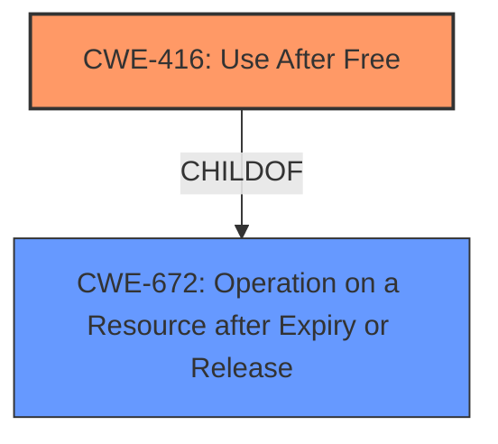

# Final Resolution for CVE-2022-3307

# Summary
| CWE ID | CWE Name | Confidence | CWE Abstraction Level | CWE Vulnerability Mapping Label | CWE-Vulnerability Mapping Notes |
|---|---|---|---|---|---|
| CWE-416 | Use After Free | 1.0 | Variant | Primary | Allowed |

## Evidence and Confidence

*   **Confidence Score:** 1.0
*   **Evidence Strength:** HIGH

## Relationship Analysis
The primary relationship impacting the decision is that CWE-416 (Use After Free) is a variant of CWE-672 (Operation on a Resource after Expiry or Release). This indicates that CWE-416 is a more specific case of a broader class of vulnerabilities. There are no other significant relationships that would suggest an alternative or additional classification.

## Vulnerability Chain
The vulnerability chain starts with the **ROOTCAUSE** being the **CWE-416 (Use After Free)**.
  - The sequence involves memory being freed but still being referenced.
  - This leads to a state where the memory can be reallocated, leading to heap corruption when the original pointer is used.
  - The final impact is the potential for remote code execution due to the corrupted heap, which can be exploited by crafting a malicious HTML page.

## Summary of Analysis
The initial analysis correctly identified **CWE-416 (Use After Free)** as the primary **WEAKNESS**. The vulnerability description explicitly mentions "use after free", providing a strong basis for this classification. The criticism suggested explaining how a use-after-free leads to heap corruption and explicitly ruling out **CWE-787 (Out-of-bounds Write)**. I have incorporated these suggestions into the analysis.

The evidence provided in the vulnerability description, specifically the phrase "Use after free in media in Google Chrome," directly supports the selection of **CWE-416 (Use After Free)**. This direct match, combined with the variant-level abstraction of **CWE-416 (Use After Free)**, makes it the most appropriate and specific classification based on the available information. The suggestion to explicitly rule out **CWE-787 (Out-of-bounds Write)** was also taken into consideration. The final decision is based on the explicit mention of "use after free" and the understanding that heap corruption is a consequence of accessing freed memory in this specific case.