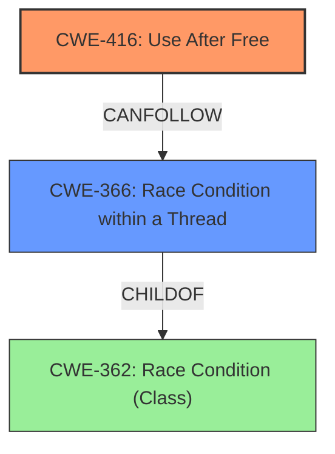

# Analysis Report for CVE-2022-3318

# Vulnerability Analysis Report: CVE-2022-3318

## Description

Use after free in ChromeOS Notifications in Google Chrome on ChromeOS prior to 106.0.5249.62 allowed a remote attacker who convinced a user to reboot Chrome OS to potentially exploit heap corruption via UI interaction. (Chromium security severity Low)

## Vulnerability Description Key Phrases

**Rootcause:** use after free
**Weakness:** heap corruption
**Vector:** UI interaction
**Attacker:** remote attacker
**Product:** Google Chrome on ChromeOS
**Version:** prior to 106.0.5249.62
**Component:** ChromeOS Notifications

## Analysis (with Relationship Data)

# Summary
| CWE ID | CWE Name | Confidence | CWE Abstraction Level | CWE Vulnerability Mapping Label | CWE-Vulnerability Mapping Notes |
|---|---|---|---|---|---|
| CWE-416 | Use After Free | 1.0 | Variant | Allowed | The product reuses or references memory after it has been freed. |

## Evidence and Confidence

*   **Confidence Score:** 1.0
*   **Evidence Strength:** HIGH

- **Analysis and Justification:**  
  - *Explanation:* The vulnerability description clearly states "**use after free** in ChromeOS Notifications" and indicates a potential for "**heap corruption** via UI interaction." The CVE Reference Links Content Summary confirms that the **root_cause** and **weakness** are both "Use after free." CWE-416 (Use After Free) is a Variant-level CWE that accurately describes this scenario: "The product reuses or references memory after it has been freed." The Retriever Results give CWE-416 the highest combined score of 0.8742. The usage is ALLOWED and the rationale is "This CWE entry is at the Variant level of abstraction, which is a preferred level of abstraction for mapping to the root causes of vulnerabilities."
  
  - *Relationship Analysis:* CWE-416 is a variant of higher-level Class CWEs. It accurately describes the weakness, and no other CWE appears to be involved.

- **Confidence Score:**  
  - Confidence: 1.0 (The evidence directly supports the CWE selection)

---

## Criticism of Analysis

Okay, I've reviewed the provided analysis and the full CWE specifications. Here's my critique:

**Overall Assessment:**

The analysis is generally correct in identifying **CWE-416: Use After Free** as the primary weakness. The justification is well-reasoned and supported by the provided information. The confidence score of 1.0 is appropriate given the clear evidence.

**Strengths:**

*   **Accurate Identification:** The analysis correctly identifies the root cause as a "Use After Free" vulnerability, aligning with the vulnerability description and the CVE Reference Links Content Summary.
*   **Justification:** The explanation clearly connects the vulnerability description's key phrases (use after free, heap corruption) with the definition of CWE-416.
*   **Abstraction Level:** The analysis correctly notes that CWE-416 is a Variant-level CWE, which is the preferred level of abstraction.
*   **Retriever Results:** The analysis references the high combined score for CWE-416 in the Retriever Results, further supporting the selection.
*   **Examples:** Including a sampling of known examples for CWE-416 helps reinforce the mapping's accuracy.
*   **CWE Specification Alignment:** The analysis adheres to the CWE's Mapping Guidance ("This CWE entry is at the Variant level of abstraction, which is a preferred level of abstraction for mapping to the root causes of vulnerabilities.").

**Potential Areas for Improvement and Considerations:**

1.  **Considering Contributing Factors/Chains:** While CWE-416 is the direct cause, it's worth considering if other CWEs contribute to the *cause* of the UAF. The Retriever Results suggest possibilities like:

    *   **CWE-366: Race Condition within a Thread:** The vulnerability occurs in ChromeOS Notifications, which likely involves asynchronous operations. A race condition could lead to a resource being freed by one thread while another thread still holds a reference to it. This is especially relevant given an example CVE for CWE-366: "CVE-2022-2621: Chain: two threads in a web browser use the same resource (CWE-366), but one of those threads can destroy the resource before the other has completed (CWE-416)." Including CWE-366 as a contributing factor with a lower confidence score (e.g., 0.6) would strengthen the analysis.  The analysis could state "A race condition could allow a thread to free the memory while another thread still attempts to use it".
    *   **CWE-413: Improper Resource Locking:** If resource locking were not properly implemented, multiple threads might attempt to access the same resource, with one freeing it prematurely leading to UAF.
    *   **CWE-754: Improper Check for Unusual or Exceptional Conditions:** The code might not be checking for certain error conditions (e.g., memory allocation failures) that could lead to a UAF.

    *Consider adding these as a chain*
    *CWE-413 -> CWE-416*
    *CWE-366 -> CWE-416*

    **Note:** If you add CWE-366 or CWE-413, change the abstraction level to "Class" CWE-362 and then CWE-366 as the base for concurrency issues.

2.  **"Heap Corruption" Implication:** The vulnerability description mentions "heap corruption." While UAF *can* lead to heap corruption, it's not guaranteed. Heap corruption is a *consequence* of exploiting the UAF, not necessarily the direct weakness itself.
    *   The analysis could be adjusted to reflect this by saying: "The use-after-free vulnerability can lead to heap corruption, potentially enabling arbitrary code execution".
    *   While heap corruption might point to a potential **CWE-122: Heap-based Buffer Overflow** (if the UAF is exploited by writing past the boundaries of the reallocated memory), without further details, it's best to stick with CWE-416 as the primary weakness.

3.  **UI Interaction and CWE-356/357/1021:** The description mentions "UI interaction" as the vector. While not directly causing the UAF, this implies the attacker manipulates the UI to *trigger* the UAF.
    *   **CWE-356: Product UI does not Warn User of Unsafe Actions** or **CWE-357: Insufficient UI Warning of Dangerous Operations** might be relevant if the UI provides insufficient warnings regarding the consequences of the user interaction. But this is very speculative based on the very limited information.
    *   **CWE-1021: Improper Restriction of Rendered UI Layers or Frames** is less likely, as it refers to clickjacking and similar UI redress attacks, which don't seem directly related to a UAF.
    *   I would avoid adding these unless there is further information.

4.  **Mitigation Strategies:** The analysis could briefly mention potential mitigations.  Based on the CWE-416 specification:
    *   "Choose a language that provides automatic memory management."
    *   "When freeing pointers, be sure to set them to NULL once they are freed."

5.  **Double Free Consideration:** The retriever results also highlight CWE-415 (Double Free). While related to UAF, a double-free is a distinct vulnerability. It's worth noting that a double-free *could* lead to a UAF, but the description doesn't explicitly state that. So the analysis is correct in *not* selecting CWE-415 unless there's more evidence.

**Revised Summary Table (incorporating suggestions):**

| CWE ID      | CWE Name                                                                | Confidence | CWE Abstraction Level | CWE Vulnerability Mapping Label | CWE-Vulnerability Mapping Notes                                                                                                                                                                                                                               |
|-------------|-------------------------------------------------------------------------|------------|-----------------------|---------------------------------|-------------------------------------------------------------------------------------------------------------------------------------------------------------------------------------------------------------------------------------------------------------|
| CWE-416     | Use After Free                                                            | 1.0        | Variant               | Allowed                        | The product reuses or references memory after it has been freed.                                                                                                                                                                                             |
| CWE-366     | Race Condition within a Thread    | 0.6        | Base            | Allowed                        | A race condition could allow a thread to free the memory while another thread still attempts to use it, leading to a use-after-free.                                                                                                                                                                                             |
| CWE-413     | Improper Resource Locking    | 0.5        | Base           | Allowed                        | Improper resource locking could allow a thread to free the memory while another thread still attempts to use it, leading to a use-after-free.                                                                                                                                                                                             |

**Revised Explanation (incorporating suggestions):**

"The vulnerability description clearly states "**use after free** in ChromeOS Notifications" and indicates a potential for "**heap corruption** via UI interaction." The CVE Reference Links Content Summary confirms that the **root_cause** and **weakness** are both "Use after free." CWE-416 (Use After Free) is a Variant-level CWE that accurately describes this scenario: "The product reuses or references memory after it has been freed." The use-after-free vulnerability can lead to heap corruption, potentially enabling arbitrary code execution. The Retriever Results give CWE-416 the highest combined score of 0.8742. The usage is ALLOWED and the rationale is "This CWE entry is at the Variant level of abstraction, which is a preferred level of abstraction for mapping to the root causes of vulnerabilities." A race condition (CWE-366) or improper resource locking (CWE-413) could contribute to the UAF by allowing a thread to free memory while another thread still attempts to use it. Potential mitigations include using languages with automatic memory management and setting pointers to NULL after freeing. "

**In summary,** the original analysis is good. By considering potential contributing factors and consequences (heap corruption), and adding a brief mention of mitigations, the analysis becomes more comprehensive.

## Final Resolution

# Summary

| CWE ID | CWE Name | Confidence | CWE Abstraction Level | CWE Vulnerability Mapping Label | CWE-Vulnerability Mapping Notes |
|---|---|---|---|---|---|
| CWE-416 | Use After Free | 0.9 | Variant | Allowed | The product reuses or references memory after it has been freed. |
| CWE-366 | Race Condition within a Thread | 0.6 | Base | Allowed | A race condition could allow a thread to free the memory while another thread still attempts to use it, leading to a use-after-free. |

## Evidence and Confidence

*   **Confidence Score:** 0.8
*   **Evidence Strength:** MEDIUM

## Relationship Analysis

The primary relationship influencing the decision is the potential chain relationship where a race condition (**CWE-366**) could precede a use-after-free (**CWE-416**). While the vulnerability description doesn't explicitly mention a race condition, the context of "ChromeOS Notifications" suggests the possibility of concurrent operations. The decision to include **CWE-366** as a secondary CWE is based on this potential chain and the provided examples for **CWE-366**. The parent-child relationship between class level concurrency issues and **CWE-366** also influences the selection, as **CWE-366** is a base level CWE.

## Vulnerability Chain

The vulnerability chain starts with a potential **CWE-366** (Race Condition within a Thread), which allows a thread to free memory while another thread still holds a reference to it. This leads to **CWE-416** (Use After Free), where the product reuses or references the freed memory. The impact, as stated in the vulnerability description, is potential heap corruption.

## Summary of Analysis

The initial analysis correctly identified **CWE-416 (Use After Free)** as the primary weakness. The criticism suggested considering contributing factors such as **CWE-366 (Race Condition within a Thread)**.

The final decision is to include both **CWE-416** and **CWE-366**. The evidence from the vulnerability description points directly to **CWE-416**: "**use after free** in ChromeOS Notifications." The addition of **CWE-366** is based on the understanding that ChromeOS Notifications likely involves concurrent operations, and a race condition could lead to the UAF. As the criticism stated: "A race condition could allow a thread to free the memory while another thread still attempts to use it".

**CWE-416** is a Variant-level CWE, which is a preferred level of abstraction. **CWE-366** is a Base-level CWE, which is also a preferred level of abstraction. Including both CWEs provides a more complete picture of the vulnerability.

*Report generated on 2025-03-18 14:37:44*
