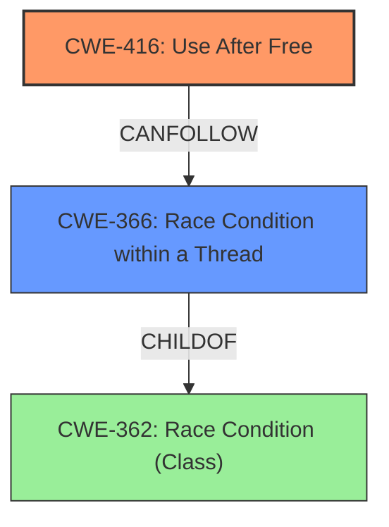

# Final Resolution for CVE-2022-3318

# Summary

| CWE ID | CWE Name | Confidence | CWE Abstraction Level | CWE Vulnerability Mapping Label | CWE-Vulnerability Mapping Notes |
|---|---|---|---|---|---|
| CWE-416 | Use After Free | 0.9 | Variant | Allowed | The product reuses or references memory after it has been freed. |
| CWE-366 | Race Condition within a Thread | 0.6 | Base | Allowed | A race condition could allow a thread to free the memory while another thread still attempts to use it, leading to a use-after-free. |

## Evidence and Confidence

*   **Confidence Score:** 0.8
*   **Evidence Strength:** MEDIUM

## Relationship Analysis

The primary relationship influencing the decision is the potential chain relationship where a race condition (**CWE-366**) could precede a use-after-free (**CWE-416**). While the vulnerability description doesn't explicitly mention a race condition, the context of "ChromeOS Notifications" suggests the possibility of concurrent operations. The decision to include **CWE-366** as a secondary CWE is based on this potential chain and the provided examples for **CWE-366**. The parent-child relationship between class level concurrency issues and **CWE-366** also influences the selection, as **CWE-366** is a base level CWE.

## Vulnerability Chain

The vulnerability chain starts with a potential **CWE-366** (Race Condition within a Thread), which allows a thread to free memory while another thread still holds a reference to it. This leads to **CWE-416** (Use After Free), where the product reuses or references the freed memory. The impact, as stated in the vulnerability description, is potential heap corruption.

## Summary of Analysis

The initial analysis correctly identified **CWE-416 (Use After Free)** as the primary weakness. The criticism suggested considering contributing factors such as **CWE-366 (Race Condition within a Thread)**.

The final decision is to include both **CWE-416** and **CWE-366**. The evidence from the vulnerability description points directly to **CWE-416**: "**use after free** in ChromeOS Notifications." The addition of **CWE-366** is based on the understanding that ChromeOS Notifications likely involves concurrent operations, and a race condition could lead to the UAF. As the criticism stated: "A race condition could allow a thread to free the memory while another thread still attempts to use it".

**CWE-416** is a Variant-level CWE, which is a preferred level of abstraction. **CWE-366** is a Base-level CWE, which is also a preferred level of abstraction. Including both CWEs provides a more complete picture of the vulnerability.