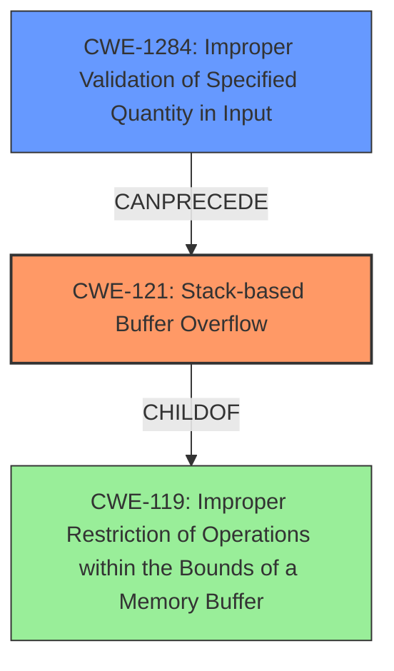

# Analysis Report for CVE-2022-33183

# Vulnerability Analysis Report: CVE-2022-33183

## Description

A vulnerability in Brocade Fabric OS CLI before Brocade Fabric OS v9.1.0, 9.0.1e, 8.2.3c, 8.2.0cbn5, 7.4.2.j could allow a remote authenticated attacker to perform stack buffer overflow using in firmwaredownload and diagshow commands.

## Vulnerability Description Key Phrases

**Weakness:** stack buffer overflow
**Attacker:** remote authenticated attacker
**Product:** Brocade Fabric OS
**Version:** ['before Brocade Fabric OS v9.1.0', '9.0.1e', '8.2.3c', '8.2.0cbn5', '7.4.2.j']
**Component:** firmwaredownload and diagshow commands

## Analysis (with Relationship Data)

# Summary
| CWE ID | CWE Name | Confidence | CWE Abstraction Level | CWE Vulnerability Mapping Label | CWE-Vulnerability Mapping Notes |
|---|---|---|---|---|---|
| CWE-121 | Stack-based Buffer Overflow | 1.0 | Variant | Allowed | Primary CWE |

## Evidence and Confidence

*   **Confidence Score:** 1.0
*   **Evidence Strength:** HIGH

- **Analysis and Justification:**  
  - *Explanation:* The vulnerability description clearly states a "**stack buffer overflow**" in Brocade Fabric OS CLI within the `firmwaredownload` and `diagshow` commands. The CVE reference confirms this root cause, indicating that the software doesn't validate input size properly, which leads to writing beyond allocated stack memory. This directly corresponds to the definition of CWE-121 (Stack-based Buffer Overflow), a Variant-level CWE that is ALLOWED according to MITRE mapping guidance. The impact described (data modification, DoS) aligns with typical buffer overflow consequences. While other CWEs like CWE-119 (Improper Restriction of Operations within the Bounds of a Memory Buffer) or CWE-120 (Buffer Copy without Checking Size of Input) are related, CWE-121 is the most specific and accurate representation of this vulnerability. Other CWEs like CWE-20, CWE-190, and CWE-1284 are related to input validation and integer handling, they are not the direct cause of the overflow.

  - *Relationship Analysis:* CWE-121 is a Variant of CWE-119 (Improper Restriction of Operations within the Bounds of a Memory Buffer). The relationship analysis suggests that CWE-121 can be caused by improper size calculations or missing input validation which could be candidates for secondary CWEs if the information were available.

- **Confidence Score:**  
  - Confidence: 1.0 (Direct evidence from vulnerability description and CVE reference materials)

## Criticism of Analysis

Okay, I've reviewed the provided analysis against the full CWE specifications. Here's my critique:

**Overall Assessment:**

The analysis is generally good, and the primary CWE selection of **CWE-121: Stack-based Buffer Overflow** is accurate and well-justified. The confidence score of 1.0 is appropriate given the information. However, some areas could be improved, particularly in acknowledging related CWEs and exploring potential chaining scenarios or contributing factors.

**Detailed Critique:**

1.  **CWE-121: Stack-based Buffer Overflow:**

    *   **Correctness:** The selection of CWE-121 is spot-on. The vulnerability description explicitly mentions a "stack buffer overflow," making this the most direct and accurate mapping. The Variant level is correct.
    *   **Justification:** The justification is solid, referencing the vulnerability description, the CVE confirmation, and the expected impact (data modification/DoS).
    *   **Mitigations:** The analysis could benefit from explicitly mentioning some of the mitigations for CWE-121, such as using compiler flags (like `/GS` in Visual Studio or `FORTIFY_SOURCE` in GCC) that provide stack protection mechanisms or implementing robust bounds checking on input. These flags are directly related to preventing this type of overflow. Mitigation 2 could be expanded to include examples of safer string handling functions.
    *   **Relationships:** The relationship to CWE-787 and CWE-788 is accurate (as the parent entries).
    *   **Examples:** The observed example provided for CWE-121 (CVE-2021-35395) aligns with the root cause.

2.  **Top Combined Results from Retriever Results:**
    *   **CWE-125: Out-of-bounds Read:** The combined retriever result list includes CWE-125 because buffer overflows often involve writing *and* reading out of bounds. *However*, the original description focuses on *writing*, not reading. Since stack buffer overflows primarily concern out-of-bounds *writes*, it's less accurate than CWE-121. Including it as a *secondary* contributing CWE *could* be justified *if* the overflow leads to sensitive information being leaked due to out-of-bounds reads, but that would require more detail not currently provided in the summary. This would lower the confidence score of CWE-125 if selected.
    *   **CWE-190: Integer Overflow or Wraparound:** This is a reasonable consideration as a *possible* contributing factor. An integer overflow could lead to an incorrect buffer size calculation, which then causes the stack overflow. *However*, there's no explicit mention of integer handling issues in the vulnerability description. Including it as a *secondary* contributing CWE *could* be justified *if* there's some calculation going on with the size of the input, and an overflow in that calculation is suspected to be the root cause, but this would require additional analysis of the vulnerable code. If included, it would lower the confidence score of CWE-190.
    *   **CWE-78: OS Command Injection**: Unlikely to be directly involved. While `firmwaredownload` and `diagshow` are commands, the description doesn't suggest the vulnerability stems from injecting OS commands into these functions, but rather from overflowing a buffer. This should be ignored.
    *   **CWE-120: Buffer Copy without Checking Size of Input ('Classic Buffer Overflow'):** This is closely related to CWE-121. The vulnerability description refers to "firmwaredownload" and "diagshow" *commands* being vulnerable, suggesting that the overflow occurs in the handling of arguments passed to these commands. If so, a "classic" buffer overflow where input is blindly copied to a stack buffer could be a good candidate for a secondary CWE.
    *   **CWE-696: Incorrect Behavior Order:** While technically possible that an incorrect order of operations could contribute, it is not the primary cause and unlikely to be a good fit.
    *   **CWE-20: Improper Input Validation:** Almost *all* buffer overflows stem from a lack of proper input validation. *However*, CWE-20 is a very broad, high-level CWE. The analysis *should* focus on *specific* input validation failures, such as the length of the input (CWE-1284).
    *   **CWE-269: Improper Privilege Management:** This seems irrelevant. The vulnerability isn't about improper privilege assignment; it's about a buffer overflow.
    *   **CWE-119: Improper Restriction of Operations within the Bounds of a Memory Buffer:** While technically true, CWE-119 is a *class* CWE, and CWE-121 is a more *specific* variant. As the mapping guidance says, avoid CWE-119 and map it to one of the children
    *   **CWE-1284: Improper Validation of Specified Quantity in Input:** This is a good secondary CWE candidate and more appropriate than CWE-20. The `firmwaredownload` and `diagshow` commands likely take size or length parameters that are not adequately validated. If the size/length parameter is exploited to trigger the overflow, this CWE would be highly relevant.

3.  **Relationship Analysis:**

    *   The analysis correctly identifies that CWE-121 is a Variant of CWE-119.
    *   It is *not* enough to stop there! The "Relationship Analysis" section needs to dig deeper. What *causes* the stack buffer overflow? What are the *root causes*? The analysis correctly identified that "...missing input validation which could be candidates for secondary CWEs if the information were available." This is great, but it should be expanded upon. Consider the following questions to guide the analysis:
        *   Is the input size not validated against the buffer size? (CWE-1284: Improper Validation of Specified Quantity in Input)
        *   Is the buffer size calculated incorrectly due to an integer overflow? (CWE-190: Integer Overflow or Wraparound leading to CWE-131: Incorrect Calculation of Buffer Size)
        *   Is there a "classic" buffer overflow due to blindly copying the input without checking its length? (CWE-120: Buffer Copy without Checking Size of Input)

**Recommendations:**

*   **Expand the Analysis:** While CWE-121 is correct, strengthen the analysis by exploring potential contributing factors and chaining scenarios. Specifically, investigate the role of input validation and buffer size calculations.
*   **Address Retriever Results:** Acknowledge and discuss the higher-ranking CWEs from the retriever results, explaining why they are either relevant (as secondary CWEs) or not applicable. If including as a secondary CWE, remember to adjust confidence scores.
*   **Be More Specific than CWE-20:** If input validation is a contributing factor, use a more specific CWE (e.g., CWE-1284) instead of the general CWE-20.
*   **Discuss Mitigations:** Include relevant mitigations for CWE-121 *and* any secondary CWEs that are selected. Compiler flags, safe string handling functions, and robust bounds checking on input length are key.
*   **Revised Summary (Example):**

```
# Summary
| CWE ID | CWE Name | Confidence | CWE Abstraction Level | CWE Vulnerability Mapping Label | CWE-Vulnerability Mapping Notes |
|---|---|---|---|---|---|
| CWE-121 | Stack-based Buffer Overflow | 1.0 | Variant | Allowed | Primary CWE |
| CWE-1284 | Improper Validation of Specified Quantity in Input | 0.6 | Base | Allowed | Contributing CWE - Input size not validated |

```

By incorporating these improvements, the analysis will be more comprehensive and provide a more complete picture of the vulnerability. Remember that identifying related CWEs and chaining scenarios helps developers understand the *underlying causes* and implement more effective defenses.

## Final Resolution

# Summary
| CWE ID | CWE Name | Confidence | CWE Abstraction Level | CWE Vulnerability Mapping Label | CWE-Vulnerability Mapping Notes |
|---|---|---|---|---|---|
| **CWE-121** | **Stack-based Buffer Overflow** | 1.0 | Variant | Allowed | Primary **CWE** |
| **CWE-1284** | **Improper Validation of Specified Quantity in Input** | 0.7 | Base | Allowed | Secondary **CWE** contributing to the overflow by not validating input size. |

## Evidence and Confidence

*   **Confidence Score:** 0.9
*   **Evidence Strength:** HIGH

## Relationship Analysis
The primary weakness is **CWE-121 (Stack-based Buffer Overflow)**, which is a variant of **CWE-119 (Improper Restriction of Operations within the Bounds of a Memory Buffer)**. The secondary **CWE**, **CWE-1284 (Improper Validation of Specified Quantity in Input)**, can **precede** **CWE-121** by causing the buffer size to be incorrectly determined, leading to the overflow. The abstraction levels influenced the selection by prioritizing the most specific **CWE** (**CWE-121**) while also including a contributing base **CWE** (**CWE-1284**) to explain the root cause of the size miscalculation.



## Vulnerability Chain
The vulnerability chain starts with **CWE-1284 (Improper Validation of Specified Quantity in Input)**, where the software fails to validate the size of the input. This leads to **CWE-121 (Stack-based Buffer Overflow)**, where the improperly sized input overwrites the stack buffer, potentially leading to data modification or denial of service. The root cause is the missing or inadequate input validation, and the impact is the overflow.

## Summary of Analysis
The initial analysis correctly identified **CWE-121 (Stack-based Buffer Overflow)** as the primary **CWE**. The criticism highlighted the importance of exploring contributing factors and chain scenarios, specifically mentioning input validation. The vulnerability description states "A vulnerability in Brocade Fabric OS CLI before Brocade Fabric OS v9.1.0, 9.0.1e, 8.2.3c, 8.2.0cbn5, 7.4.2.j could allow a remote authenticated attacker to perform stack buffer overflow using in firmwaredownload and diagshow commands." This evidence points to a stack buffer overflow occurring within the `firmwaredownload` and `diagshow` commands.

Based on the retriever results and the criticism, **CWE-1284 (Improper Validation of Specified Quantity in Input)** was selected as a secondary **CWE** because the `firmwaredownload` and `diagshow` commands likely take size or length parameters that are not adequately validated. This makes **CWE-1284** a highly relevant contributing factor.

**CWE-1284** is at the Base level of abstraction, which aligns with MITRE's guidance. The relationships show that **CWE-1284** can **precede** **CWE-789 (Uncontrolled Memory Allocation)**, which, while relevant, is less specific than the overflow itself. **CWE-1284** also has a parent relationship to **CWE-606 (Missing Check on Completeness)** which is not applicable.

The decision to include **CWE-1284** is based on the reasonable assumption that the commands receive a quantity as input. The confidence score for **CWE-1284** is 0.7, reflecting the need for further code analysis to confirm this contributing factor. The primary **CWE** remains **CWE-121** with a confidence of 1.0.


*Report generated on 2025-03-18 14:38:46*
