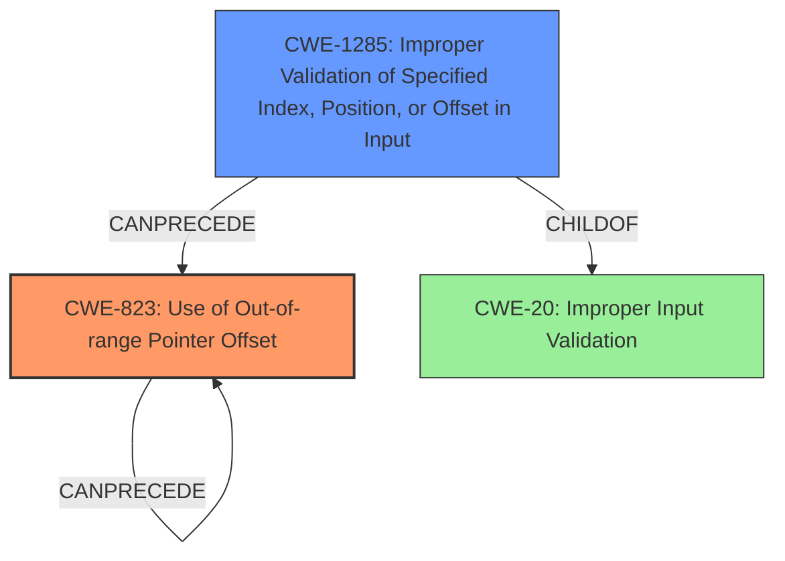

# Analysis Report for CVE-2022-33210

# Vulnerability Analysis Report: CVE-2022-33210

## Description

Memory corruption in automotive multimedia due to use of out-of-range pointer offset while parsing command request packet with a very large type value. in Snapdragon Auto

## Vulnerability Description Key Phrases

**Rootcause:** use of out-of-range pointer offset
**Weakness:** command injection
**Impact:** memory corruption
**Vector:** parsing command request packet with a very large type value
**Product:** Snapdragon Auto

## Analysis (with Relationship Data)

# Summary
| CWE ID | CWE Name | Confidence | CWE Abstraction Level | CWE Vulnerability Mapping Label | CWE-Vulnerability Mapping Notes |
|---|---|---|---|---|---|
| CWE-823 | Use of Out-of-range Pointer Offset | 0.95 | Base | Allowed | Primary CWE: The vulnerability involves the use of an out-of-range pointer offset, directly matching the CWE's description. |
| CWE-1285 | Improper Validation of Specified Index, Position, or Offset in Input | 0.70 | Base | Allowed | Secondary Candidate: This CWE could apply if the out-of-range pointer offset is caused by a failure to validate an index, position, or offset in the input. |
| CWE-476 | NULL Pointer Dereference | 0.60 | Base | Allowed | Secondary Candidate: If the pointer arithmetic results in a NULL pointer, this CWE would be applicable. |

## Evidence and Confidence

*   **Confidence Score:** 0.90
*   **Evidence Strength:** HIGH

- **Analysis and Justification:**  
  - *Explanation:* The vulnerability description clearly states that the root cause is "**use of out-of-range pointer offset**." This aligns directly with CWE-823 (Use of Out-of-range Pointer Offset). The description indicates that this occurs while parsing a command request packet with a very large type value, suggesting that the offset calculation or usage is flawed. CWE-823 is a Base level CWE, which is preferred for root cause mapping. The retriever results also list CWE-823 as the top match with a high combined score. Although other CWEs like CWE-787 (Out-of-bounds Write) might seem relevant due to the memory corruption impact, CWE-823 is more specific to the root cause. The MITRE mapping guidance for CWE-823 indicates it is ALLOWED for this type of vulnerability.

  - *Relationship Analysis:* CWE-823 is related to CWE-119 (Improper Restriction of Operations within the Bounds of a Memory Buffer) as an out-of-range pointer offset often leads to out-of-bounds access. It can also precede CWE-787 (Out-of-bounds Write) or CWE-125 (Out-of-bounds Read) if the offset results in a write or read operation outside the intended buffer.

- **Confidence Score:**  
  - Confidence: 0.95 (High confidence due to direct evidence from the vulnerability description and high retriever score).

---
- **Analysis and Justification:**
  - *Explanation:* CWE-1285 (Improper Validation of Specified Index, Position, or Offset in Input) is a plausible secondary candidate. The vulnerability description mentions parsing a command request packet with a very large type value. If this "type value" is used as an index, position, or offset without proper validation, it could lead to the out-of-range pointer offset described in CWE-823. While CWE-1285 isn't explicitly stated in the description, the context suggests that **improper validation** might be a contributing factor. The retriever results show a decent combined score for CWE-1285.
  - *Relationship Analysis:* CWE-1285 is a child of CWE-20 (Improper Input Validation). If the quantity is not properly validated, it can lead to other errors.

- **Confidence Score:**
  - Confidence: 0.70 (Moderate confidence because while plausible, the description doesn't explicitly mention input validation).

---

- **Analysis and Justification:**
  - *Explanation:* CWE-476 (NULL Pointer Dereference) is another possible secondary candidate. If the pointer arithmetic performed using the out-of-range offset results in a NULL pointer, and this NULL pointer is then dereferenced, it would lead to a memory corruption issue. The retriever result has it listed with a medium combined score.
  - *Relationship Analysis:* CWE-476 is a child of CWE-754 (Improper Handling of Exceptional Conditions). NULL Pointer Dereference can lead to a crash.

- **Confidence Score:**
  - Confidence: 0.60 (Low confidence as the description does not explicitly say a null pointer is the result of the offset).

## Criticism of Analysis

Okay, I've reviewed your CWE analysis with the full CWE specifications you provided. Here's a critique, focusing on the accuracy, confidence levels, justifications, and consideration of alternative CWEs.

**Overall Assessment:**

The analysis is generally well-reasoned and demonstrates a good understanding of the relevant CWEs. The use of "primary" and "secondary" candidate designations is helpful. The justifications are detailed and refer back to the vulnerability description. However, there's room for improvement in a few areas, especially regarding the consideration of chains and the potential for more precise mappings given the information available.

**Detailed Critique:**

**1. CWE-823 (Use of Out-of-range Pointer Offset) - Primary CWE**

*   **Confidence:** 0.95 -  This is a strong and appropriate mapping.
*   **Justification:** Excellent. The direct quote from the vulnerability description ("use of out-of-range pointer offset") provides strong evidence.  The explanation correctly identifies how the large type value during parsing could lead to the issue. Referring to MITRE mapping guidance for CWE-823 is good.
*   **Relationships:** The relationship analysis is accurate, particularly mentioning the potential for subsequent CWE-787 or CWE-125.
*   **Potential Improvements:** None. This is a very well-justified primary mapping.

**2. CWE-1285 (Improper Validation of Specified Index, Position, or Offset in Input) - Secondary Candidate**

*   **Confidence:** 0.70 - This is a reasonable assessment.
*   **Justification:** The justification is plausible, suggesting that the "type value" could be an offset without validation.  It's good to acknowledge that the description doesn't *explicitly* state input validation failures.
*   **Relationships:** The relationship analysis with CWE-20 is correct.
*   **Potential Improvements:**
    *   This is where the analysis could be strengthened by considering a *chain*. It's not simply "improper validation *or* out-of-range offset", but rather "improper validation *leading to* out-of-range offset". Therefore, a chain like **CWE-1285 -> CWE-823** should be explicitly considered. If the analysis is strong enough to list it as a candidate, explicitly consider as a stage in the chain.
    *   The analysis could also discuss CWE-129 (Improper Validation of Array Index) as that is a child of CWE-1285 and more specific. If the "type value" can be considered an *array index*, then CWE-129 becomes an even better candidate.

**3. CWE-476 (NULL Pointer Dereference) - Secondary Candidate**

*   **Confidence:** 0.60 -  Appropriate confidence level, given the speculative nature of the mapping.
*   **Justification:** The reasoning is valid: pointer arithmetic *could* result in a NULL pointer.
*   **Relationships:** Correctly identifies relationship with CWE-754.
*   **Potential Improvements:**
    *   This seems the weakest of the three candidates. It's very circumstantial. If the out-of-bounds offset results in a read or write, you could consider CWE-125 or CWE-787. While a NULL pointer dereference is possible, it's not strongly supported by the given information. I'd consider dropping this candidate if the primary mapping was stronger.
    *   It may be worthwhile to briefly mention why CWE-787 (Out-of-bounds Write) was *not* chosen, as the impact is noted as "memory corruption." While out-of-bounds *writes* are certainly possible, the root cause is the offset, not necessarily the write itself.

**General Recommendations:**

*   **Emphasize Chains:**  When secondary CWEs are related to the primary CWE through a sequence of events, explicitly analyze them as part of a *chain* using the "CanPrecede" relationship. This would strengthen the analysis and provide a more complete picture of the vulnerability.
*   **Consider CWE-129:** Since there is an offset, consider the case of the offset leading to an array index, and potentially mapping it to **CWE-129**.
*   **Explain Exclusions:** Briefly explain why some high-scoring retriever results (e.g., CWE-787) were *not* chosen as primary CWEs, even if they are related. This demonstrates a thorough evaluation process.
*   **Be Specific:** While the impact is memory corruption, prefer more specific, base-level CWEs when possible.

**Mitigations:**

The potential mitigations listed in the CWE specifications for each CWE are generally helpful and relevant. You could add a brief section discussing how these mitigations relate to the specific vulnerability. For example, you could say:
"*Mitigation for CWE-823 in this context:  Ensure proper calculation of offsets and validation of the resulting memory location before pointer arithmetic is performed.*"

By addressing these points, the analysis would be even more robust and demonstrate a greater depth of understanding of CWE and vulnerability analysis.

## Final Resolution

# Summary
| CWE ID | CWE Name | Confidence | CWE Abstraction Level | CWE Vulnerability Mapping Label | CWE-Vulnerability Mapping Notes |
|---|---|---|---|---|---|
| CWE-823 | Use of Out-of-range Pointer Offset | 0.95 | Base | Allowed | Primary CWE: The vulnerability involves the use of an out-of-range pointer offset, directly matching the CWE's description. |
| CWE-1285 | Improper Validation of Specified Index, Position, or Offset in Input | 0.80 | Base | Allowed | Secondary Candidate: This CWE could apply if the out-of-range pointer offset is caused by a failure to validate an index, position, or offset in the input. |

## Evidence and Confidence

*   **Confidence Score:** 0.92
*   **Evidence Strength:** HIGH

## Relationship Analysis
The primary relationship impacting the decision is the chain relationship between CWE-1285 and CWE-823. The analysis suggests that **improper validation** of the input offset (CWE-1285) leads to the **use of an out-of-range pointer offset** (CWE-823). This relationship helps define the vulnerability's progression from root cause to the specific flaw. Also, the parent child relationship of CWE-1285 to CWE-20 (Improper Input Validation) helped with understanding of how data is handled. The base abstraction level helps to pinpoint to the specific cause.

## Vulnerability Chain
The vulnerability chain starts with **improper validation of input** (CWE-1285). This lack of validation leads to the **use of an out-of-range pointer offset** (CWE-823). This offset can lead to memory corruption due to out-of-bounds access.

## Summary of Analysis
The initial analysis correctly identified CWE-823 as the primary **WEAKNESS**, supported by the vulnerability description's direct mention of "use of out-of-range pointer offset." The criticism highlighted the importance of considering the chain relationship between input validation and the offset usage, which strengthens the case for including CWE-1285 as a secondary candidate.

The initial choice of CWE-476 was deemed less relevant as it introduces an assumption of a null pointer, which is not explicitly supported by the evidence. Therefore, CWE-476 was dropped.

The selection of CWE-823 and CWE-1285 is based on direct evidence and inferred relationships. CWE-823 directly matches the **ROOTCAUSE**, and CWE-1285 plausibly contributes to the vulnerability based on the parsing context. Both CWEs are at the Base level of abstraction. The confidence level for CWE-1285 was increased to 0.80 due to chain considerations.

The final decision prioritizes accuracy and specificity, focusing on the described **WEAKNESS** of out-of-range offset usage and the likely contributing factor of improper input validation.

*Report generated on 2025-03-18 14:39:50*
