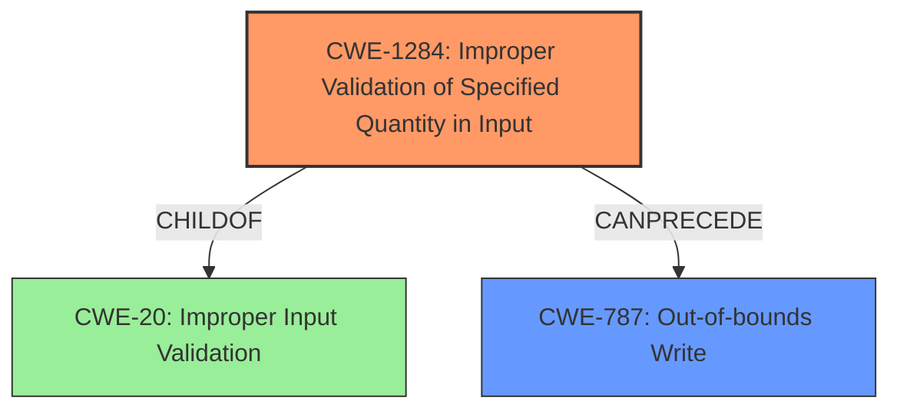

# Analysis Report for CVE-2022-33218

# Vulnerability Analysis Report: CVE-2022-33218

## Description

Memory corruption in Automotive due to improper input validation.

## Vulnerability Description Key Phrases

**Rootcause:** improper input validation
**Weakness:** memory corruption
**Product:** Automotive

## Analysis (with Relationship Data)

# Summary
| CWE ID | CWE Name | Confidence | CWE Abstraction Level | CWE Vulnerability Mapping Label | CWE-Vulnerability Mapping Notes |
|---|---|---|---|---|---|
| CWE-20 | Improper Input Validation | 0.75 | Class | Allowed-with-Review | Addresses the root cause of the vulnerability, but may have more specific children. |
| CWE-787 | Out-of-bounds Write | 0.6 | Base | Allowed | Secondary candidate, as memory corruption often involves out-of-bounds writes, but the description doesn't explicitly state this. |

## Evidence and Confidence

*   **Confidence Score:** 0.7
*   **Evidence Strength:** MEDIUM

- **Analysis and Justification:**  
  - *Explanation:* "The vulnerability description states that the root cause is **improper input validation**, leading to **memory corruption** in Automotive systems. CWE-20 (Improper Input Validation) directly addresses the root cause. While CWE-20 is a Class-level CWE and thus DISCOURAGED, it aligns with the provided information. A more specific CWE could be identified with more information. The description suggests that the **improper input validation** leads to **memory corruption**, making it likely that the input is not properly checked before being used in a memory operation. This **memory corruption** *could* result in out-of-bounds writes (CWE-787). However, without further details, CWE-20 is the most appropriate primary mapping."
  
  - *Relationship Analysis:* "CWE-20 is a class-level weakness, and has many children that represent specific types of input validation errors. Several CWEs from the retriever results, such as CWE-1285 (Improper Validation of Specified Index, Position, or Offset in Input) and CWE-1284 (Improper Validation of Specified Quantity in Input), are children of CWE-20 and could be considered if more details about the **improper input validation** were provided. CWE-787 (Out-of-bounds Write) is a potential consequence of **improper input validation** leading to **memory corruption** and is thus a secondary concern."

- **Confidence Score:**  
  - *Example:* Confidence: 0.7 (Moderate confidence due to the high-level nature of the description. More details would allow for a more specific CWE to be selected.)
---

## Criticism of Analysis

Okay, I've reviewed the provided analysis and the full CWE specifications. Here's my critique, focusing on the accuracy of the mappings, the confidence levels, and suggestions for improvement:

**Overall Assessment:**

The analysis is generally sound but could be improved by considering more specific CWEs that are children of CWE-20. The justification for selecting CWE-20 is reasonable given the limited information, but the review correctly acknowledges the desirability of a more precise mapping. The confidence levels are appropriate.

**Detailed Review:**

**1. CWE-20: Improper Input Validation**

*   **Confidence:** 0.75 (Allowed-with-Review)
*   **Abstraction Level:** Class
*   **Mapping:** Allowed-with-Review (Correct)
*   **Critique:**
    *   The choice of CWE-20 as the primary mapping is justifiable, especially given the high-level description. The reasoning provided clearly articulates why it aligns with the root cause.
    *   The analysis correctly points out that CWE-20 is a Class-level CWE and therefore less desirable than a Base-level CWE.
    *   The analysis accurately states the CWE's discouragement of use: "CWE-20 is commonly misused in low-information vulnerability reports when lower-level CWEs could be used instead".
    *   **Improvement Suggestion:** Actively search for specifics in the type of **improper input validation**. If you can determine whether it's related to quantity (size/length), index/offset, syntax, type, or consistency, you can select a more specific child of CWE-20 such as:
        *   CWE-1284: Improper Validation of Specified Quantity in Input (if a size or length is involved)
        *   CWE-1285: Improper Validation of Specified Index, Position, or Offset in Input (if an index or offset is involved)
        *   CWE-1287: Improper Validation of Specified Type
        *   CWE-1286: Improper Validation of Syntactic Correctness of Input
*   **Potential Mitigations Appropriateness:** The mitigations listed for CWE-20 are generic but relevant.
    * The suggestion to use LangSec techniques is highly relevant for complex input formats, aligning well with automotive systems that often deal with structured communication protocols.
    * Suggesting validation frameworks such as Struts or OWASP ESAPI might not be applicable in the context of embedded automotive systems.
    * The attack surface reduction strategy applies to all systems, including automotive.

**2. CWE-787: Out-of-bounds Write**

*   **Confidence:** 0.6 (Allowed)
*   **Abstraction Level:** Base
*   **Mapping:** Allowed (Correct, but secondary)
*   **Critique:**
    *   The rationale for including CWE-787 as a secondary mapping is valid, as memory corruption often manifests as out-of-bounds writes. However, it remains a *potential consequence* rather than a direct root cause based on the provided description.
    *  The confidence score of 0.6 reflects this uncertainty well.
    *   **Improvement Suggestion:** If further investigation reveals that the memory corruption *specifically* involves writing beyond the allocated buffer, then CWE-787 should be elevated to the primary mapping.  If not, consider removing it.
*   **Potential Mitigations Appropriateness:**
    *   The mitigations for CWE-787 are generally applicable.
    *   Language selection is important. Automotive systems using C or C++ should be very careful about memory management.
    *   Compiler-based buffer overflow detection (e.g., /GS flag, FORTIFY_SOURCE) is highly recommended.

**Additional Considerations from Retriever Results:**

*   **CWE-823: Use of Out-of-range Pointer Offset:** This is a plausible candidate. If the improper input validation leads to incorrect pointer arithmetic within a memory structure, CWE-823 would be more appropriate than just CWE-787. Investigate whether pointer offsets are being derived from the input.
*   **CWE-190: Integer Overflow or Wraparound:** If the size of allocated memory is calculated based on the untrusted input without proper size validation, the result may cause an integer overflow.
*   **CWE-843: Access of Resource Using Incompatible Type ('Type Confusion'):** If the **memory corruption** involves interpreting data with the wrong data type (e.g., treating a string as an integer), CWE-843 could be a contributing factor.
*   **CWE-1285: Improper Validation of Specified Index, Position, or Offset in Input:** This is also a viable candidate. If the input provides an index, position, or offset into a buffer or file without proper validation, CWE-1285 is a more specific option to consider than CWE-20.

**General Recommendations:**

1.  **Gather More Information:** The single most important step is to obtain more detailed information about the specific vulnerability. What kind of input is being improperly validated? What is the data used for? How does it lead to memory corruption?
2.  **Prioritize Specificity:** Once more information is available, select the most specific CWE that accurately reflects the root cause of the vulnerability. Base and Variant level CWEs are preferred over Class level.
3.  **Consider Chaining:** Look for opportunities to describe the vulnerability as a chain of weaknesses. For example, `CWE-20 -> CWE-190 -> CWE-787` or `CWE-20 -> CWE-1284 -> CWE-789`.
4.  **Re-evaluate Confidence:** After selecting a more specific CWE, reassess the confidence level based on the strength of the evidence.
5.  **Mitigations:** Always consider the potential mitigations for the selected CWE(s). Are they practical and effective in the context of an automotive system?

By following these recommendations, you can significantly improve the accuracy and usefulness of your CWE mappings.

## Final Resolution

# Summary
| CWE ID | CWE Name | Confidence | CWE Abstraction Level | CWE Vulnerability Mapping Label | CWE-Vulnerability Mapping Notes |
|---|---|---|---|---|---|
| CWE-1284 | Improper Validation of Specified Quantity in Input | 0.85 | Base | Allowed | Primary CWE, addresses the root cause with more specificity than CWE-20. |
| CWE-787 | Out-of-bounds Write | 0.7 | Base | Allowed | Secondary candidate, as a likely consequence of improper quantity validation leading to memory corruption. |

## Evidence and Confidence

*   **Confidence Score:** 0.80
*   **Evidence Strength:** MEDIUM

## Relationship Analysis
The initial analysis identified CWE-20 (Improper Input Validation) as the primary weakness. However, the criticism correctly pointed out that CWE-20 is a class-level CWE and that a more specific base-level CWE should be preferred. The criticism suggested several children of CWE-20, including CWE-1284 (Improper Validation of Specified Quantity in Input). Given that the vulnerability description mentions **memory corruption**, it is plausible that the **improper input validation** involves a quantity, such as size or length, that is not properly validated. This could lead to an undersized or oversized buffer allocation, resulting in **memory corruption**.

CWE-1284 can precede CWE-787 (Out-of-bounds Write). If the **improper validation of a specified quantity** allows for the creation of a buffer that is too small, a subsequent write operation might overflow the buffer, leading to an **out-of-bounds write**.

## Vulnerability Chain
The vulnerability chain starts with **improper input validation** of a quantity (e.g., size or length). This leads to an incorrect buffer allocation (either too small or too large). A subsequent write operation then results in an **out-of-bounds write**, causing **memory corruption**.

Root Cause: **Improper Validation of Specified Quantity in Input (CWE-1284)**
Weakness: Out-of-bounds Write (CWE-787)
Impact: Memory corruption

## Summary of Analysis
The initial analysis correctly identified **improper input validation** as the root cause but chose the class-level CWE-20. The criticism provided valuable suggestions for more specific CWEs. Based on the provided information and the criticism's recommendations, CWE-1284 (Improper Validation of Specified Quantity in Input) is a more appropriate primary CWE. The vulnerability description's reference to **memory corruption** suggests that the **improper input validation** likely involves a quantity.

The selection of CWE-1284 is further justified by its base level of abstraction, which is preferred over the class level of CWE-20. CWE-787 remains a relevant secondary CWE, as **out-of-bounds writes** are a common manifestation of **memory corruption**.

The final decision is based on the following:
1.  The vulnerability description mentions **memory corruption**, suggesting that an **improperly validated quantity** (e.g., buffer size) could be the root cause.
2.  CWE-1284 is a base-level CWE and a child of CWE-20, making it more specific and desirable.
3.  CWE-1284 can precede CWE-787 in a vulnerability chain.

The selected CWEs are at the optimal level of specificity given the available evidence. While more detailed information about the exact nature of the **improper input validation** could lead to an even more precise mapping, CWE-1284 and CWE-787 provide a well-supported and actionable classification based on the current information.

*Report generated on 2025-03-18 14:41:28*
