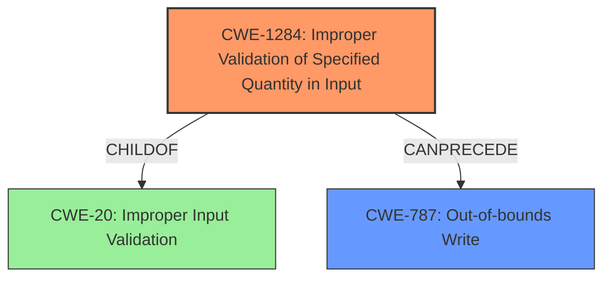

# Final Resolution for CVE-2022-33218

# Summary
| CWE ID | CWE Name | Confidence | CWE Abstraction Level | CWE Vulnerability Mapping Label | CWE-Vulnerability Mapping Notes |
|---|---|---|---|---|---|
| CWE-1284 | Improper Validation of Specified Quantity in Input | 0.85 | Base | Allowed | Primary CWE, addresses the root cause with more specificity than CWE-20. |
| CWE-787 | Out-of-bounds Write | 0.7 | Base | Allowed | Secondary candidate, as a likely consequence of improper quantity validation leading to memory corruption. |

## Evidence and Confidence

*   **Confidence Score:** 0.80
*   **Evidence Strength:** MEDIUM

## Relationship Analysis
The initial analysis identified CWE-20 (Improper Input Validation) as the primary weakness. However, the criticism correctly pointed out that CWE-20 is a class-level CWE and that a more specific base-level CWE should be preferred. The criticism suggested several children of CWE-20, including CWE-1284 (Improper Validation of Specified Quantity in Input). Given that the vulnerability description mentions **memory corruption**, it is plausible that the **improper input validation** involves a quantity, such as size or length, that is not properly validated. This could lead to an undersized or oversized buffer allocation, resulting in **memory corruption**.

CWE-1284 can precede CWE-787 (Out-of-bounds Write). If the **improper validation of a specified quantity** allows for the creation of a buffer that is too small, a subsequent write operation might overflow the buffer, leading to an **out-of-bounds write**.

## Vulnerability Chain
The vulnerability chain starts with **improper input validation** of a quantity (e.g., size or length). This leads to an incorrect buffer allocation (either too small or too large). A subsequent write operation then results in an **out-of-bounds write**, causing **memory corruption**.

Root Cause: **Improper Validation of Specified Quantity in Input (CWE-1284)**
Weakness: Out-of-bounds Write (CWE-787)
Impact: Memory corruption

## Summary of Analysis
The initial analysis correctly identified **improper input validation** as the root cause but chose the class-level CWE-20. The criticism provided valuable suggestions for more specific CWEs. Based on the provided information and the criticism's recommendations, CWE-1284 (Improper Validation of Specified Quantity in Input) is a more appropriate primary CWE. The vulnerability description's reference to **memory corruption** suggests that the **improper input validation** likely involves a quantity.

The selection of CWE-1284 is further justified by its base level of abstraction, which is preferred over the class level of CWE-20. CWE-787 remains a relevant secondary CWE, as **out-of-bounds writes** are a common manifestation of **memory corruption**.

The final decision is based on the following:
1.  The vulnerability description mentions **memory corruption**, suggesting that an **improperly validated quantity** (e.g., buffer size) could be the root cause.
2.  CWE-1284 is a base-level CWE and a child of CWE-20, making it more specific and desirable.
3.  CWE-1284 can precede CWE-787 in a vulnerability chain.

The selected CWEs are at the optimal level of specificity given the available evidence. While more detailed information about the exact nature of the **improper input validation** could lead to an even more precise mapping, CWE-1284 and CWE-787 provide a well-supported and actionable classification based on the current information.