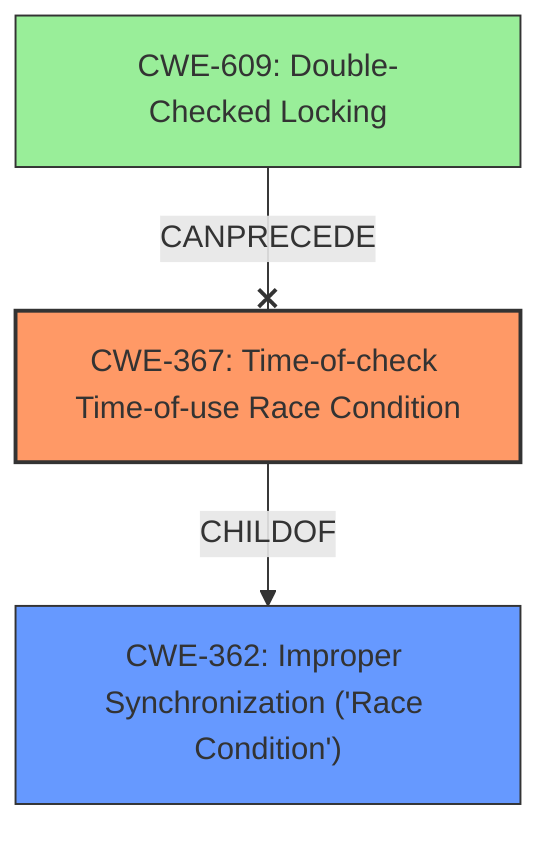

# Analysis Report for CVE-2022-33257

# Vulnerability Analysis Report: CVE-2022-33257

## Description

Memory corruption in Core due to time-of-check time-of-use race condition during dump collection in trust zone.

## Vulnerability Description Key Phrases

**Rootcause:** time-of-check time-of-use race condition
**Weakness:** memory corruption
**Component:** Core

## Analysis (with Relationship Data)

# Summary
| CWE ID | CWE Name | Confidence | CWE Abstraction Level | CWE Vulnerability Mapping Label | CWE-Vulnerability Mapping Notes |
|---|---|---|---|---|---|
| CWE-367 | Time-of-check Time-of-use (TOCTOU) Race Condition | 0.95 | Base | Allowed | Primary CWE |
| CWE-362 | Concurrent Execution using Shared Resource with Improper Synchronization ('Race Condition') | 0.65 | Class | Allowed-with-Review | Secondary Candidate |

## Evidence and Confidence

*   **Confidence Score:** 0.9
*   **Evidence Strength:** HIGH

- **Analysis and Justification:**  
  - *Explanation:* "The vulnerability description explicitly mentions a **time-of-check time-of-use race condition**, which directly corresponds to CWE-367 (Time-of-check Time-of-use (TOCTOU) Race Condition). The description states that this race condition leads to **memory corruption**. CWE-367's description aligns perfectly: 'The product checks the state of a resource before using that resource, but the resource's state can change between the check and the use in a way that invalidates the results of the check. This can cause the product to perform invalid actions when the resource is in an unexpected state.' The 'Usage: Allowed' mapping guidance for CWE-367 further supports this selection. CWE-362 (Concurrent Execution using Shared Resource with Improper Synchronization ('Race Condition')) is a more general class of weakness, and while applicable, CWE-367 provides a more precise characterization of the vulnerability. Therefore, CWE-367 is chosen as the primary CWE."
  
  - *Relationship Analysis:* "CWE-367 is a Base level CWE. Although CWE-362 is a parent (Class) of other race condition related CWEs, CWE-367 is a more specific fit. There are also relationships such as `CANPRECEDE` from CWE-609 (Double-Checked Locking) to CWE-367. Since the description only talks about **time-of-check time-of-use race condition** and no double locking, we don't consider CWE-609."

- **Confidence Score:**  
  - Confidence: 0.95 (High confidence due to explicit mention of TOCTOU race condition)

## Criticism of Analysis

Okay, I've reviewed the analysis and the full CWE specifications provided. Here's my critique:

**Overall Assessment:**

The analysis is generally strong and well-reasoned. The primary CWE selection (CWE-367) is correct and well-justified. The consideration of CWE-362 as a secondary candidate is also appropriate, as it represents the broader category of race conditions. The confidence level assigned is justified.

**Detailed Comments:**

*   **CWE-367 (Primary): Correct and Justified.**
    *   The reasoning for selecting CWE-367 is solid. The vulnerability description explicitly mentions "time-of-check time-of-use race condition," which directly maps to CWE-367's definition.
    *   The explanation of how the resource's state can change between the check and the use is accurate and relevant.
    *   The confidence level of 0.95 is appropriate, given the explicit mention of TOCTOU in the original description.
    *   The mitigations listed for CWE-367 are relevant (avoiding checks, setting effective UID/GID, limiting interleaving of file operations).
    *   The "Relationship" and "Research Gap" notes are also relevant considerations.

*   **CWE-362 (Secondary): Acceptable as Context, but Primarily Covered by CWE-367.**
    *   Identifying CWE-362 as a secondary candidate makes sense, as CWE-367 is a *child* of CWE-362.  All TOCTOU race conditions are, by definition, race conditions related to concurrent execution.
    *   However, it's crucial to recognize that CWE-367 provides the *most specific* and accurate characterization of the vulnerability.  The analysis correctly acknowledges this.
    *   The mapping guidance for CWE-362 ("Allowed-with-Review") reinforces the idea that a more specific child CWE should be preferred when possible.
    *   The mitigations for CWE-362 (synchronization primitives, thread-safe capabilities, minimizing shared resources) are generally applicable to race conditions, but less directly applicable to the *specific* TOCTOU issue.  The mitigations for CWE-367 are more targeted.

*   **Relationship Analysis:**
    *   The analysis correctly notes the parent-child relationship between CWE-362 and CWE-367.
    *   The dismissal of CWE-609 (Double-Checked Locking) is appropriate, as there is no mention of double-checked locking in the vulnerability description.
    *   The focus on the "time-of-check time-of-use" aspect is key to differentiating from other race condition types.

*   **Evidence and Confidence:**
    *   The evidence strength is correctly identified as HIGH, given the explicit mention of TOCTOU.
    *   The Confidence Score of 0.95 reflects that certainty.

**Suggestions for Improvement (Minor):**

*   **Elaborate on 'Trust Zone' Impact:** While the analysis identifies the core weakness, briefly mentioning the specific impact of a TOCTOU in the trust zone could strengthen the justification.  For example, "A successful TOCTOU in the trust zone could lead to unauthorized access to sensitive data or the ability to execute arbitrary code with elevated privileges."  This connects the technical weakness to a tangible security risk.
*   **Consider Potential Attack Vectors:**  While not strictly necessary for CWE mapping, briefly considering how an attacker might *exploit* the TOCTOU could be beneficial.  For example, "An attacker could potentially influence the timing of dump collection to manipulate the data being collected or trigger memory corruption."  This adds context and demonstrates understanding of the practical implications.

**Retriever Results:**

The Retriever results are generally helpful.  The scores are ranking things appropriately.

*   **CWE-364 (Signal Handler Race Condition):** While it is a race condition, it isn't the primary factor.
*   **CWE-476 (NULL Pointer Dereference):** While TOCTOU could *lead* to a NULL pointer dereference, it is not the primary weakness.  It's a potential consequence.
*   **CWE-667 (Improper Locking):** If the code *attempted* to use locking to prevent the TOCTOU but did so incorrectly, CWE-667 could be a secondary consideration. However, without more information, it's not a strong candidate.
*   **CWE-662 (Improper Synchronization):** Similar to CWE-362, this is a very general category and could be applicable in a broad sense, but it's not the most specific or helpful characterization.

**In Summary:**

The analysis is well-done. The primary CWE selection is accurate and thoroughly justified. The secondary CWE is also a reasonable consideration, but the analysis correctly emphasizes the importance of the more specific CWE-367. The suggestions for improvement are minor and aim to add further context and strengthen the connection to real-world security implications.

## Final Resolution

# Summary
| CWE ID | CWE Name | Confidence | CWE Abstraction Level | CWE Vulnerability Mapping Label | CWE-Vulnerability Mapping Notes |
|---|---|---|---|---|---|
| CWE-367 | Time-of-check Time-of-use (TOCTOU) Race Condition | 0.95 | Base | Allowed | Primary CWE |
| CWE-362 | Concurrent Execution using Shared Resource with Improper Synchronization ('Race Condition') | 0.65 | Class | Allowed-with-Review | Secondary Candidate |

## Evidence and Confidence

*   **Confidence Score:** 0.95
*   **Evidence Strength:** HIGH

## Relationship Analysis
The primary relationship that influenced the decision was the parent-child relationship between CWE-362 and CWE-367. CWE-367 is a specific type of race condition and is therefore a child of the more general CWE-362. This relationship guided the selection of CWE-367 as the primary because it is the most specific and accurate representation of the vulnerability described. The analysis also considered the CANPRECEDE relationship from CWE-609 to CWE-367 but ruled it out because there was no evidence of double-checked locking in the vulnerability description.

## Vulnerability Chain
The vulnerability chain starts with the **ROOTCAUSE** being a **CWE-367 (Time-of-check Time-of-use (TOCTOU) Race Condition)**. The product checks the state of a resource, but the resource's state can change before it's used. This leads to **memory corruption** in the Core, specifically during dump collection in the trust zone. This can allow for unauthorized access or execution of arbitrary code. The chain is: **CWE-367** -> **Memory Corruption** -> **Unauthorized Access/Code Execution**.

## Summary of Analysis
The initial analysis and criticism both agree that **CWE-367 (Time-of-check Time-of-use (TOCTOU) Race Condition)** is the most appropriate primary CWE. The vulnerability description explicitly mentions a "time-of-check time-of-use race condition," which directly corresponds to the definition of **CWE-367**. The evidence strength is high due to this explicit mention. The relationship analysis further supports this decision, as **CWE-367** is a more specific child of the more general **CWE-362 (Concurrent Execution using Shared Resource with Improper Synchronization ('Race Condition'))**. The selection of **CWE-367** is at the optimal level of specificity, as it accurately characterizes the **time-of-check time-of-use race condition** described in the vulnerability. The retriever scores also support this selection.

*Report generated on 2025-03-18 14:46:05*
