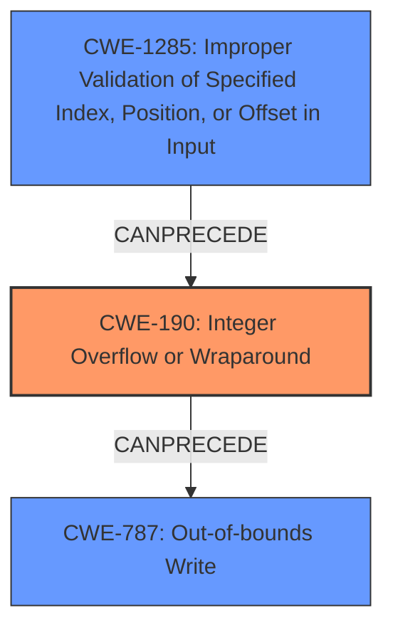

# Analysis Report for CVE-2022-33266

# Vulnerability Analysis Report: CVE-2022-33266

## Description

Memory corruption in Audio due to integer overflow to buffer overflow while music playback of clips like amr,evrc,qcelp with modified content.

## Vulnerability Description Key Phrases

**Rootcause:** integer overflow
**Impact:** memory corruption
**Vector:** music playback of clips like amr,evrc,qcelp with modified content
**Component:** Audio

## Analysis (with Relationship Data)

# Summary
| CWE ID | CWE Name | Confidence | CWE Abstraction Level | CWE Vulnerability Mapping Label | CWE-Vulnerability Mapping Notes |
|---|---|---|---|---|---|
| CWE-190 | Integer Overflow or Wraparound | 0.9 | Base | Allowed | Primary CWE. Directly reflects the **integer overflow** root cause. |
| CWE-787 | Out-of-bounds Write | 0.7 | Base | Allowed | Secondary CWE. Represents the memory corruption due to the overflow.|

## Evidence and Confidence

*   **Confidence Score:** 0.8
*   **Evidence Strength:** HIGH

- **Analysis and Justification:**  
  - *Explanation:* The vulnerability description explicitly states that the root cause is an **integer overflow** which leads to memory corruption. CWE-190 (Integer Overflow or Wraparound) directly addresses this **root cause**. The high retriever score for CWE-190, along with the explicit mention of **integer overflow** in the vulnerability description, makes it a strong primary candidate. The **integer overflow** leads to a buffer overflow condition, which manifests as a memory corruption issue and can be mapped to CWE-787 (Out-of-bounds Write). The description states that the memory corruption occurs during music playback of specific file types (amr, evrc, qcelp) with modified content, further supporting the link between the overflow and memory corruption. CWE-787 is a consequence of CWE-190. The MITRE mapping guidance for CWE-190 indicates it is ALLOWED as a root cause.
  
  - *Relationship Analysis:* CWE-190 is a Base level CWE. CWE-787 is a base level CWE. CWE-190 CanPrecede CWE-787, reflecting the sequence of events.

- **Confidence Score:**  
  - Confidence: 0.9 (High confidence due to direct mention of **integer overflow** and clear impact of memory corruption)

## Criticism of Analysis

Okay, I've reviewed the provided analysis against the full CWE specifications. Here's my critique:

**Overall Assessment:**

The analysis is generally strong and well-justified. The primary mapping to CWE-190 (Integer Overflow or Wraparound) and the secondary mapping to CWE-787 (Out-of-bounds Write) are appropriate and well-supported by the vulnerability description. The confidence level of 0.9 for CWE-190 is justified, given the explicit mention of "integer overflow" in the original description. The confidence of 0.7 for CWE-787 is also reasonable, reflecting its role as a consequence rather than the direct root cause.

**Specific Points and Suggestions:**

1.  **CWE-190 (Integer Overflow or Wraparound) - Primary CWE:**

    *   **Strengths:**  The analysis correctly identifies CWE-190 as the root cause. The justification clearly explains the connection between the integer overflow and the subsequent memory corruption. The high confidence score reflects the direct match to the vulnerability description.
    *   **Mitigations:** The analysis could benefit from specifically highlighting mitigations applicable to the Audio context. The specification mentions *"Use libraries or frameworks that make it easier to handle numbers without unexpected consequences. Examples include safe integer handling packages such as SafeInt (C++) or IntegerLib (C or C++)"*. It would be better to include details how to apply this safely to audio specific codecs.
    *   **Observed Examples:** Linking to CVEs with similar causes is appropriate.

2.  **CWE-787 (Out-of-bounds Write) - Secondary CWE:**

    *   **Strengths:**  The analysis correctly identifies CWE-787 as the direct consequence of the integer overflow. The explanation of memory corruption due to a buffer overflow is accurate.
    *   **Mitigations:** Consider languages which provide memory protection or bounds checking.
    *   **Observed Examples:** The listed observed examples contain similar vulnerabilities.

3.  **Retriever Results Considerations:**

    *   The retriever results suggest other CWEs that could potentially be related. While CWE-190 and CWE-787 are most directly relevant, some of the other CWEs could be considered as contributing factors or alternative perspectives.
    *   **CWE-191 (Integer Underflow):** This should be ruled out more explicitly. Integer underflow is not mentioned and doesn't seem to be implicated.
    *    **CWE-681 (Incorrect Conversion between Numeric Types):** This could potentially be a contributing factor *if* the integer overflow is happening because of an incorrect conversion *before* the vulnerable calculation. But without more information it would be difficult to make a direct relationship.
    *   **CWE-131 (Incorrect Calculation of Buffer Size):** While the end result is a buffer overflow, CWE-131 is not entirely precise. It's not that the *calculation* of the buffer size is incorrect in the source code; it's that the input to that calculation (the size value) is being corrupted by an integer overflow, resulting in an undersized buffer. It's a subtle difference, but the focus is on the overflow, not the logic of the buffer sizing itself.
    *   **CWE-1285 (Improper Validation of Specified Index, Position, or Offset in Input) :** This could be relevant if the size of the audio clip is untrusted data provided from a malicious source. If this untrusted size is not validated, and then used in a calculation leading to an integer overflow, this becomes a potential contributing factor.

4.  **Abstraction Level:**

    *   The choice of Base-level CWEs (CWE-190 and CWE-787) is appropriate. They are preferred for root-cause analysis, as the mapping guidance suggests.

5.  **Potential Improvements:**

    *   **Chain Explanation:**  A more explicit description of the chain of events would strengthen the analysis. For example: "An attacker-controlled size value within the audio clip is used in a calculation to determine the buffer size.  Due to the lack of proper range checks, this size value causes an integer overflow (CWE-190). The overflow results in a smaller-than-expected buffer size, leading to an out-of-bounds write (CWE-787) when the audio data is processed, causing memory corruption."
    *   **Clarify Untrusted Input:** Clarify where the untrusted input comes from and what happens when this size is incorrect.
    *   **Underflow Exclusion:** More explicitly exclude/justify not using CWE-191 (Integer Underflow). Explain *why* it's not the correct CWE

6.  **Mitigation Suggestions:**

    *   Consider safe integer handling packages (as mentioned in CWE-190 documentation).
    *   Implement stricter input validation on size-related values within audio files.
    *   Use compilers and/or compiler options that provide runtime overflow detection.
    *   Consider using languages/libraries that inherently provide memory safety features (bounds checking, automatic memory management).

**Revised Summary Table (Optional):**

| CWE ID | CWE Name | Confidence | CWE Abstraction Level | CWE Vulnerability Mapping Label | CWE-Vulnerability Mapping Notes |
|---|---|---|---|---|---|
| CWE-190 | Integer Overflow or Wraparound | 0.9 | Base | Allowed | Primary CWE. Directly reflects the integer overflow root cause. |
| CWE-787 | Out-of-bounds Write | 0.7 | Base | Allowed | Secondary CWE. Represents the memory corruption due to the overflow. |
| CWE-1285 | Improper Validation of Specified Index, Position, or Offset in Input | 0.3 | Base | Allowed | Contributing factor. Represents size of audio clip as untrusted data. Potentially causes integer overflow if data is not validated. |

**In summary:**

The analysis is strong and accurate. The suggested improvements mainly involve providing more detailed explanations, considering potentially contributing factors (and explicitly ruling them out if necessary), and expanding on the mitigation recommendations.

## Final Resolution

# Summary
| CWE ID | CWE Name | Confidence | CWE Abstraction Level | CWE Vulnerability Mapping Label | CWE-Vulnerability Mapping Notes |
|---|---|---|---|---|---|
| CWE-190 | Integer Overflow or Wraparound | 0.9 | Base | Allowed | Primary CWE. Directly reflects the **integer overflow** root cause. |
| CWE-787 | Out-of-bounds Write | 0.7 | Base | Allowed | Secondary CWE. Represents the memory corruption due to the overflow. |
| CWE-1285 | Improper Validation of Specified Index, Position, or Offset in Input | 0.4 | Base | Allowed | Contributing factor. Represents the size of the audio clip as untrusted data. Potentially causes integer overflow if the data is not validated. |

## Evidence and Confidence

*   **Confidence Score:** 0.85
*   **Evidence Strength:** MEDIUM

## Relationship Analysis
The primary relationship is that CWE-190 (**Integer Overflow or Wraparound**) can precede CWE-787 (**Out-of-bounds Write**), which accurately reflects the vulnerability chain. The addition of CWE-1285 (**Improper Validation of Specified Index, Position, or Offset in Input**) as a contributing factor suggests that the size of the audio clip, which is untrusted data, is not validated and may cause an **integer overflow**. All three CWEs are at the Base abstraction level.

## Vulnerability Chain
The vulnerability chain starts with potentially untrusted input (size of audio clip) which is not validated (CWE-1285), leading to an **integer overflow** (CWE-190) during buffer size calculation. This results in a smaller-than-expected buffer, causing an out-of-bounds write (CWE-787) and memory corruption during audio data processing.
  - **Root Cause:** Untrusted input size, leading to **integer overflow**.
  - **Weakness 1:** CWE-1285: Improper Validation of Specified Index, Position, or Offset in Input
  - **Weakness 2:** CWE-190: Integer Overflow or Wraparound
  - **Impact:** CWE-787: Out-of-bounds Write, Memory Corruption

## Summary of Analysis
The initial analysis correctly identified CWE-190 (**Integer Overflow or Wraparound**) and CWE-787 (**Out-of-bounds Write**) as the primary and secondary weaknesses. The criticism suggested considering additional CWEs, specifically CWE-1285 (**Improper Validation of Specified Index, Position, or Offset in Input**).

The vulnerability description, "Memory corruption in Audio due to integer overflow to buffer overflow while music playback of clips like amr,evrc,qcelp with modified content," directly supports the selection of CWE-190 and CWE-787.

The graph relationships confirm that CWE-190 can precede CWE-787. The addition of CWE-1285 is based on the understanding that the size of the audio clip likely comes from untrusted input, which if not validated, contributes to the **integer overflow**.

The final classification includes CWE-1285 because the vulnerability description mentions "modified content," implying that the input size might be manipulated. This makes it a contributing factor, although the confidence is lower (0.4) because it is inferred rather than explicitly stated. CWE-190 remains the primary **root cause**, and CWE-787 remains the direct consequence.

The selected CWEs are at the optimal level of specificity because they accurately represent the **root cause** (CWE-190), the impact (CWE-787), and a contributing factor (CWE-1285) based on the available evidence.

*Report generated on 2025-03-18 14:46:46*
