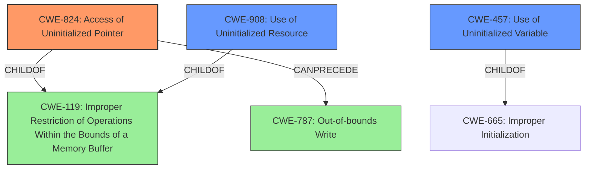

# Final Resolution for CVE-2022-33280

# Summary
| CWE ID    | CWE Name                       | Confidence | CWE Abstraction Level | CWE Vulnerability Mapping Label | CWE-Vulnerability Mapping Notes |
| --------- | ------------------------------ | ---------- | --------------------- | ------------------------------- | ----------------------------- |
| CWE-824   | Access of Uninitialized Pointer | 0.95       | Base                  | Allowed                         | Primary CWE. The **uninitialized pointer** leads to memory corruption when accessed. Example: CVE-2024-32878, CVE-2010-0211, CVE-2009-2768 |
| CWE-908   | Use of Uninitialized Resource   | 0.75       | Base                  | Allowed                         | Secondary Candidate. A broader category encompassing **uninitialized pointers**. Example: CVE-2019-9805, CVE-2008-4197, CVE-2008-2934                                          |
| CWE-457   | Use of Uninitialized Variable | 0.65       | Variant               | Allowed                         | Secondary Candidate. A pointer is a type of variable. Example: CVE-2019-15900, CVE-2008-3688, CVE-2008-0081                                                                     |
| CWE-787   | Out-of-Bounds Write             | 0.45       | Base                  | Allowed                         | Potential Consequence (Chain). If the **uninitialized pointer** contains a random address, writing to it could cause an out-of-bounds write.                    |

## Evidence and Confidence

*   **Confidence Score:** 0.95
*   **Evidence Strength:** HIGH

## Relationship Analysis
The primary weakness is CWE-824, a Base CWE. CWE-908 and CWE-457 are related but less specific. CWE-908 (Use of Uninitialized Resource) is a Base CWE that broadly covers the use of any **uninitialized resource**, while CWE-457 (Use of Uninitialized Variable) is a Variant that refers to any **uninitialized variable**. A pointer is a variable and can be considered a resource, thus justifying their inclusion as secondary candidates. The relationship between CWE-824 and CWE-787 (Out-of-Bounds Write) is a "Can Precede" relationship, indicating a potential vulnerability chain where the **uninitialized pointer** leads to an out-of-bounds write. The chosen CWEs reflect an optimal level of specificity, with CWE-824 accurately representing the **root cause**.

## Vulnerability Chain
The vulnerability chain starts with the **uninitialized pointer** (CWE-824). This leads to memory corruption due to accessing an invalid memory location. If a write operation occurs at this invalid location, it could result in an out-of-bounds write (CWE-787).
  - **Root Cause:** **Uninitialized Pointer** (CWE-824)
  - **Weakness:** Accessing the **uninitialized pointer** leading to memory corruption.
  - **Impact:** Potential out-of-bounds write (CWE-787) and further system instability.

## Summary of Analysis
The analysis is based on the vulnerability description stating "**access of uninitialized pointer**". This directly maps to CWE-824 (Access of Uninitialized Pointer). The graph relationships show that CWE-824 can lead to CWE-787, representing a potential vulnerability chain. The selection of CWE-824 is at the optimal level of specificity as it is a Base CWE that accurately describes the **root cause** of the vulnerability. The inclusion of CWE-908 and CWE-457 as secondary candidates provides context but are less specific. The high confidence is due to the direct match between the vulnerability description and the CWE description for CWE-824.