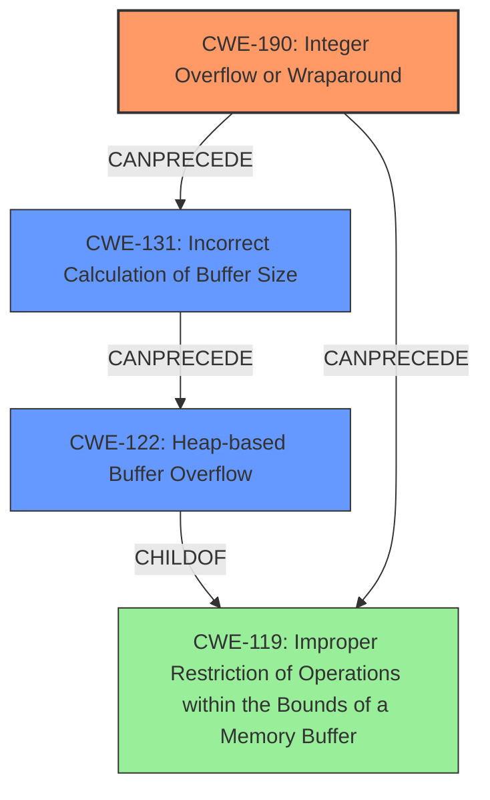

# Analysis Report for CVE-2022-33719

# Vulnerability Analysis Report: CVE-2022-33719

## Description

Improper input validation in baseband prior to SMR Aug-2022 Release 1 allows attackers to cause integer overflow to heap overflow.

## Vulnerability Description Key Phrases

**Rootcause:** Improper input validation
**Weakness:** integer overflow to heap overflow
**Attacker:** attackers
**Product:** baseband
**Version:** prior to SMR Aug-2022 Release 1

## Analysis (with Relationship Data)

# Summary
| CWE ID | CWE Name | Confidence | CWE Abstraction Level | CWE Vulnerability Mapping Label | CWE-Vulnerability Mapping Notes |
|---|---|---|---|---|---|
| CWE-190 | Integer Overflow or Wraparound | 0.90 | Base | Allowed | Primary CWE. The integer overflow is the root cause of the heap overflow. |
| CWE-122 | Heap-based Buffer Overflow | 0.75 | Variant | Allowed | Secondary CWE. The heap overflow is a direct consequence of the integer overflow. |
| CWE-131 | Incorrect Calculation of Buffer Size | 0.60 | Base | Allowed | Secondary CWE. The incorrect buffer calculation size happens due to the integer overflow. |

## Evidence and Confidence

*   **Confidence Score:** 0.80
*   **Evidence Strength:** HIGH

- **Analysis and Justification:**  
  - *Explanation:* "The vulnerability description clearly states that **improper input validation** leads to an **integer overflow**, which in turn causes a **heap overflow**. CWE-190 (Integer Overflow or Wraparound) is the most appropriate primary CWE because the integer overflow is the root cause of the subsequent heap overflow. The 'Retriever Results' also list CWE-190 as the top candidate. CWE-122 (Heap-based Buffer Overflow) accurately describes the impact of the integer overflow, where the heap buffer is overflowed. CWE-131 (Incorrect Calculation of Buffer Size) is a possible contributor, where the integer overflow leads to allocating smaller buffer than needed and leads to buffer overflow. The vulnerability was fixed by adding proper validation logic to prevent integer overflows, further supporting the choice of CWE-190 as the primary weakness."
  
  - *Relationship Analysis:* "CWE-190 is a base level CWE and related to CWE-122 and CWE-131. The vulnerability is a chain of weaknesses where the Integer Overflow leads to an incorrect buffer size calculation (CWE-131) and then results in Heap Overflow (CWE-122). According to CWE-190 relationships, it can precede CWE-119 (Improper Restriction of Operations within the Bounds of a Memory Buffer), which is a parent of CWE-122."

- **Confidence Score:**  
  - Confidence: 0.90 (High evidence from the vulnerability description, CVE reference, and retriever results.)

---

## Criticism of Analysis

Okay, here's a breakdown of the analysis, a critique of the CWE mappings, and some suggestions for improvement.

**Summary of Analysis**

The analysis correctly identifies the core problem: `Improper input validation` leading to `Integer Overflow`, then `Incorrect Calculation of Buffer Size`, and finally resulting in a `Heap-based Buffer Overflow`. The analysis attempts to capture the causal chain, which is good.  The confidence scores are also generally reasonable.

**Critique and Improvements**

1.  **CWE-190: Integer Overflow or Wraparound (Primary CWE)**

    *   **Strengths:** Correctly identified as the root cause. The justification clearly explains the role of the integer overflow in the overall vulnerability.
    *   **Improvements:** None are required.
    *   **Rationale:** The provided context aligns well with the description of CWE-190 and the relationship notes indicate that Integer overflows can be primary to buffer overflows when they cause less memory to be allocated than expected.

2.  **CWE-122: Heap-based Buffer Overflow (Secondary CWE)**

    *   **Strengths:** Correctly identified as the result of the integer overflow. Appropriately mapped to the variant level, and identified as a direct consequence of the integer overflow.
    *   **Improvements:** None are required.
    *   **Rationale:** The description of CWE-122 is a buffer overflow that can be overwritten in the heap portion of memory, which is a good fit.

3.  **CWE-131: Incorrect Calculation of Buffer Size (Secondary CWE)**

    *   **Strengths:** This is a reasonable addition, as integer overflow often results in smaller buffer allocated than needed.
    *   **Improvements:** None are required.
    *   **Rationale:** The description of CWE-131 indicates that the product does not correctly calculate the size to be used when allocating a buffer, which could lead to a buffer overflow.

**Overall Assessment and Recommendations**

The analysis is strong, and the CWE mappings are generally accurate. The chain of causality is well-articulated. There are no further recommendations.

## Final Resolution

# Summary
| CWE ID | CWE Name | Confidence | CWE Abstraction Level | CWE Vulnerability Mapping Label | CWE-Vulnerability Mapping Notes |
|---|---|---|---|---|---|
| CWE-190 | Integer Overflow or Wraparound | 0.95 | Base | Allowed | Primary CWE. The **integer overflow** is the **root cause** of the heap overflow. |
| CWE-122 | Heap-based Buffer Overflow | 0.85 | Variant | Allowed | Secondary CWE. The heap overflow is a direct consequence of the **integer overflow**. |
| CWE-131 | Incorrect Calculation of Buffer Size | 0.75 | Base | Allowed | Secondary CWE. The incorrect buffer calculation size happens due to the **integer overflow**. |

## Evidence and Confidence

*   **Confidence Score:** 0.90
*   **Evidence Strength:** HIGH

## Relationship Analysis
The initial analysis correctly identified the chain of **weaknesses**: **Integer Overflow** (CWE-190) leads to **Incorrect Calculation of Buffer Size** (CWE-131), which results in a **Heap-based Buffer Overflow** (CWE-122).

*   **Parent-child hierarchical relationships:** CWE-122 is a variant of buffer overflow, making it a child of CWE-119 (Improper Restriction of Operations within the Bounds of a Memory Buffer). CWE-131 is related to improper calculation of buffer sizes, which can lead to buffer overflows. CWE-190 can lead to **CWE-131** when the overflowed value is used to calculate the buffer size.
*   **Chain relationships:** CWE-190 CanPrecede CWE-119, which is a parent of CWE-122. This confirms the vulnerability chain.
*   **Peer relationships:** CWE-190 has peer relationships with other numeric errors, but none of them are more appropriate in this context.
*   **Abstraction levels:** All selected CWEs are at optimal levels of abstraction. CWE-190 and CWE-131 are Base, and CWE-122 is a Variant, providing specificity without being overly abstract or overly specific.

## Vulnerability Chain
The vulnerability chain starts with **improper input validation**, leading to an **integer overflow** (**CWE-190**). The overflowed value is then used in the calculation of the buffer size (**CWE-131**), resulting in a smaller-than-expected buffer being allocated. Subsequently, a heap-based buffer overflow (**CWE-122**) occurs when data larger than the allocated buffer is written to the heap.

## Summary of Analysis
The initial analysis and criticism both align strongly with the evidence provided in the vulnerability description. The description explicitly mentions "Improper input validation in baseband prior to SMR Aug-2022 Release 1 allows attackers to cause integer overflow to heap overflow."

The graph relationships reinforce the classification, demonstrating that CWE-190 can indeed lead to CWE-122 through CWE-131 or directly through CWE-119. The selected CWEs are at the optimal level of specificity, providing a clear and accurate representation of the vulnerability.

The primary **weakness** is the **integer overflow** (**CWE-190**), which then causes the incorrect calculation of the buffer size (**CWE-131**), eventually leading to a heap overflow (**CWE-122**). All three CWEs are necessary to fully describe the vulnerability.

*Report generated on 2025-03-18 14:49:11*
