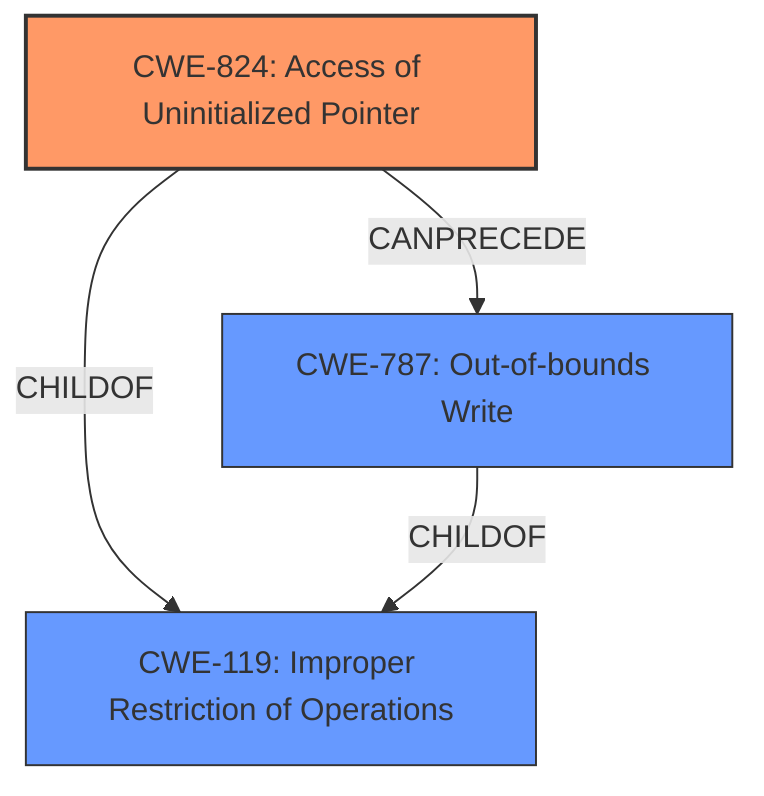

# Analysis Report for CVE-2022-3378

# Vulnerability Analysis Report: CVE-2022-3378

## Description

Horner Automations Cscape version 9.90 SP 7 and prior does not properly validate user-supplied data. If a user opens a maliciously formed FNT file, then an attacker could execute arbitrary code within the current process by accessing an uninitialized pointer, leading to an out-of-bounds memory write.

## Vulnerability Description Key Phrases

**Rootcause:** uninitialized pointer
**Impact:** out-of-bounds memory write
**Vector:** maliciously formed FNT file
**Attacker:** attacker
**Product:** Horner Automations Cscape
**Version:** version 9.90 SP 7 and prior

## Analysis (with Relationship Data)

# Summary
| CWE ID | CWE Name | Confidence | CWE Abstraction Level | CWE Vulnerability Mapping Label | CWE-Vulnerability Mapping Notes |
|---|---|---|---|---|---|
| CWE-824 | Access of Uninitialized Pointer | 0.9 | Base | Allowed | This is the primary weakness as the **uninitialized pointer** is the root cause. |
| CWE-787 | Out-of-bounds Write | 0.7 | Base | Allowed | This is a secondary effect of the **uninitialized pointer**. |

## Evidence and Confidence

*   **Confidence Score:** 0.8
*   **Evidence Strength:** HIGH

- **Analysis and Justification:**  
  - *Explanation:* The vulnerability description explicitly states the root cause is an **uninitialized pointer**. This directly corresponds to CWE-824 (Access of Uninitialized Pointer). The vulnerability description also indicates that accessing the **uninitialized pointer** leads to an out-of-bounds memory write. This corresponds to CWE-787 (Out-of-bounds Write). CWE-824 is the primary weakness as it is the root cause, while CWE-787 is a secondary weakness as it's an impact. The CVE Reference Links Content Summary section supports this by highlighting the **uninitialized pointer** as the root cause and the out-of-bounds write as a result. MITRE mapping guidance indicates that both CWE-824 and CWE-787 are ALLOWED.

  - *Relationship Analysis:* CWE-824 can precede CWE-787, as using an **uninitialized pointer** can lead to writing to an unintended memory location.

- **Confidence Score:**  
  - Confidence: 0.9 (High evidence supporting CWE-824 as the primary weakness and CWE-787 as a secondary weakness.)

---

## Criticism of Analysis

Okay, here's a detailed review of the provided analysis, considering the full CWE specifications you provided:

**Overall Assessment:**

The analysis is generally strong and well-justified. The primary mapping to CWE-824 (Access of Uninitialized Pointer) is appropriate, given the vulnerability description's emphasis on this as the root cause. The secondary mapping to CWE-787 (Out-of-bounds Write) is also valid, as it represents the likely impact of the uninitialized pointer being used to write to memory.  The confidence scores are reasonable. The explanation is comprehensive.

**Specific Comments & Suggestions:**

*   **CWE-824: Access of Uninitialized Pointer:**

    *   **Confidence Score:** 0.9 is appropriate. The vulnerability description explicitly states the uninitialized pointer, making this a solid match.
    *   **CWE Vulnerability Mapping Notes:** The explanation is clear and accurate.
    *   **Mitigation:** The description for CWE-824 lacks any mitigations. To improve the overall analysis, consider adding general mitigations that can prevent the uninitialized pointer from occurring. Some examples include:
    *   **Initialization during declaration:**  Initialize pointers to NULL or a valid memory address when they are declared.
    *   **Defensive Programming:** Use assertions or other checks to ensure that pointers are properly initialized before use.
    *   **Static Analysis:** Use static analysis tools to identify potential instances of uninitialized pointers.
    *   **Dynamic Analysis:** Utilize dynamic analysis to ensure all variables are initialized before being used.

*   **CWE-787: Out-of-bounds Write:**

    *   **Confidence Score:** 0.7 is reasonable. It is a consequence of CWE-824, but not explicitly stated as such beyond the fact of the out-of-bounds write.
    *   **CWE Vulnerability Mapping Notes:** The explanation that this is a secondary effect is accurate.
    *   **Mitigation:** Review the suggested mitigations in CWE-787 and add general mitigations that can prevent the out-of-bounds write from occurring. Some examples include:
    *   **Language Selection:** If possible, use a language that provides built-in bounds checking or other memory safety features.
    *   **Bounds Checking:** Implement bounds checking before writing to a buffer to ensure that the write will not exceed the buffer's boundaries.
    *   **Code Review:** Conduct thorough code reviews to identify potential out-of-bounds write vulnerabilities.

*   **Retriever Results Review:**

    *   The Retriever Results offers a few alternative CWEs that should be briefly reviewed and rejected with justification:
    *   **CWE-823 (Use of Out-of-range Pointer Offset):** While related to pointer arithmetic, this CWE is less precise than CWE-824 and CWE-787. The core issue isn't *necessarily* the offset being wrong, but the pointer itself being uninitialized. Therefore, it is right to reject CWE-823.
    *   **CWE-1284 (Improper Validation of Specified Quantity in Input):** This could be a contributing factor *if* the uninitialized pointer is later used in a calculation related to buffer size. However, without more information, it's not a central cause, and input validation failures were not the root cause.
    *   **CWE-252 (Unchecked Return Value):**  Could be tangentially related if a function that *should* have initialized the pointer failed and the return value wasn't checked. But the description doesn't suggest this.
    *   **CWE-476 (NULL Pointer Dereference):** While possible, the description specifies an *uninitialized* pointer, which is broader than *NULL*. The pointer *could* be NULL, but it could also have any arbitrary value. So, CWE-824 is more appropriate.
    *   **CWE-125 (Out-of-bounds Read):** This is *not* the impact of the vulnerability but instead CWE-787 is as it is an Out-of-bounds *Write*
    *   **CWE-121 (Stack-based Buffer Overflow):** Without evidence of a specific stack-based buffer, you can reject this
    *   **CWE-456 (Missing Initialization of a Variable):** This is similar to CWE-824, but CWE-824 is specific to pointers making it more precise and correct.
    *   **CWE-20 (Improper Input Validation):** As a Class-level CWE, it's usually too broad. The report suggests the root cause of the vulnerability is the uninitialized pointer, not a failure to validate input.

*   **General Suggestions:**

    *   **Chain Analysis:** The "Relationships" sections in the CWE specifications are helpful. You've already identified that CWE-824 can precede CWE-787. Explore other relationships (e.g., CWE-824's relationship to CWE-119) to see if there's a broader context to the vulnerability.
    *   **CWE Examples:** The examples provided in the CWE specifications can help you understand nuances of each CWE and determine if there are more precise matches. They're also useful for adding context to your report.
    *   **Maintenance Notes:** Pay attention to the "Maintenance" notes in the CWE specifications, as they often contain warnings about misuse or provide further context.

**Revised Summary Table:**

| CWE ID | CWE Name | Confidence | CWE Abstraction Level | CWE Vulnerability Mapping Label | CWE-Vulnerability Mapping Notes |
|---|---|---|---|---|---|
| CWE-824 | Access of Uninitialized Pointer | 0.9 | Base | Allowed | This is the primary weakness as the uninitialized pointer is the root cause. Addressed mitigations and prevented the uninitialized pointer from occurring. |
| CWE-787 | Out-of-bounds Write | 0.7 | Base | Allowed | This is a secondary effect of the uninitialized pointer. Addressed mitigations that can prevent the out-of-bounds write from occurring. |

By incorporating these suggestions, you can create an even more robust and informative analysis.

## Final Resolution

# Summary

| CWE ID | CWE Name | Confidence | CWE Abstraction Level | CWE Vulnerability Mapping Label | CWE-Vulnerability Mapping Notes |
|---|---|---|---|---|---|
| CWE-824 | Access of **Uninitialized Pointer** | 0.9 | Base | Allowed | This is the primary **weakness** as the **uninitialized pointer** is the **root cause**. |
| CWE-787 | Out-of-bounds Write | 0.7 | Base | Allowed | This is a secondary effect of the **uninitialized pointer**. |

## Evidence and Confidence

*   **Confidence Score:** 0.9
*   **Evidence Strength:** HIGH

## Relationship Analysis

The primary relationship impacting the decision is that CWE-824 (Access of **Uninitialized Pointer**) can precede CWE-787 (Out-of-bounds Write). This accurately represents the vulnerability chain where the use of an **uninitialized pointer** leads to an out-of-bounds write. The analysis also considered several peer relationships, ultimately rejecting them in favor of the more specific CWE-824 and CWE-787. The base abstraction level of both CWEs is appropriate for mapping to the **root cause** and impact.

## Vulnerability Chain

The vulnerability chain starts with the **root cause**, an **uninitialized pointer** (CWE-824). When the application attempts to use this **uninitialized pointer**, it leads to an out-of-bounds write (CWE-787), allowing for arbitrary code execution.

## Summary of Analysis

The initial analysis correctly identified CWE-824 as the primary **weakness** due to the explicit mention of an **uninitialized pointer** in the vulnerability description: "If a user opens a maliciously formed FNT file, then an attacker could execute arbitrary code within the current process by accessing an **uninitialized pointer**, leading to an out-of-bounds memory write."

The criticism provided a helpful review of related CWEs and suggested mitigations. The analysis considered alternative CWEs provided by the retriever but accurately rejected them based on specificity and the information provided in the vulnerability description. For example, CWE-476 (NULL Pointer Dereference) was considered, but CWE-824 was deemed more appropriate because the pointer is described as **uninitialized**, which is broader than simply being NULL.

The selected CWEs are at the optimal level of specificity because they accurately represent the **root cause** (CWE-824) and the direct consequence (CWE-787) of the vulnerability based on the available evidence. The graph relationships, particularly the 'CanPrecede' relationship, further solidify the understanding of the vulnerability chain. The confidence score remains high due to the direct evidence and strong justification.

*Report generated on 2025-03-18 14:50:40*
