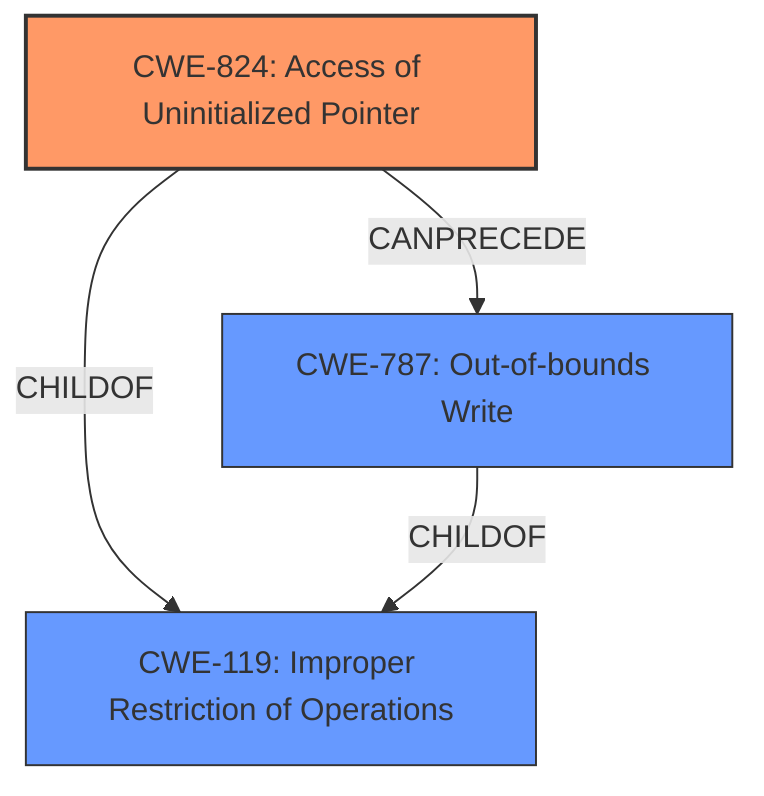

# Final Resolution for CVE-2022-3378

# Summary

| CWE ID | CWE Name | Confidence | CWE Abstraction Level | CWE Vulnerability Mapping Label | CWE-Vulnerability Mapping Notes |
|---|---|---|---|---|---|
| CWE-824 | Access of **Uninitialized Pointer** | 0.9 | Base | Allowed | This is the primary **weakness** as the **uninitialized pointer** is the **root cause**. |
| CWE-787 | Out-of-bounds Write | 0.7 | Base | Allowed | This is a secondary effect of the **uninitialized pointer**. |

## Evidence and Confidence

*   **Confidence Score:** 0.9
*   **Evidence Strength:** HIGH

## Relationship Analysis

The primary relationship impacting the decision is that CWE-824 (Access of **Uninitialized Pointer**) can precede CWE-787 (Out-of-bounds Write). This accurately represents the vulnerability chain where the use of an **uninitialized pointer** leads to an out-of-bounds write. The analysis also considered several peer relationships, ultimately rejecting them in favor of the more specific CWE-824 and CWE-787. The base abstraction level of both CWEs is appropriate for mapping to the **root cause** and impact.

## Vulnerability Chain

The vulnerability chain starts with the **root cause**, an **uninitialized pointer** (CWE-824). When the application attempts to use this **uninitialized pointer**, it leads to an out-of-bounds write (CWE-787), allowing for arbitrary code execution.

## Summary of Analysis

The initial analysis correctly identified CWE-824 as the primary **weakness** due to the explicit mention of an **uninitialized pointer** in the vulnerability description: "If a user opens a maliciously formed FNT file, then an attacker could execute arbitrary code within the current process by accessing an **uninitialized pointer**, leading to an out-of-bounds memory write."

The criticism provided a helpful review of related CWEs and suggested mitigations. The analysis considered alternative CWEs provided by the retriever but accurately rejected them based on specificity and the information provided in the vulnerability description. For example, CWE-476 (NULL Pointer Dereference) was considered, but CWE-824 was deemed more appropriate because the pointer is described as **uninitialized**, which is broader than simply being NULL.

The selected CWEs are at the optimal level of specificity because they accurately represent the **root cause** (CWE-824) and the direct consequence (CWE-787) of the vulnerability based on the available evidence. The graph relationships, particularly the 'CanPrecede' relationship, further solidify the understanding of the vulnerability chain. The confidence score remains high due to the direct evidence and strong justification.