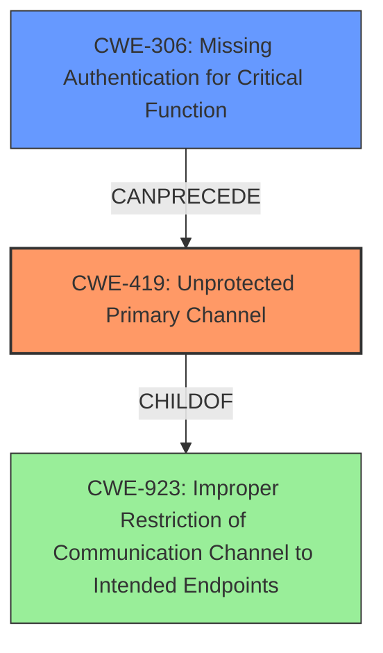

# Analysis Report for CVE-2022-33932

# Vulnerability Analysis Report: CVE-2022-33932

## Description

Dell PowerScale OneFS, versions 9.0.0 up to and including 9.1.0.19, 9.2.1.12, 9.3.0.6, and 9.4.0.2, contain an unprotected primary channel vulnerability. An unauthenticated network malicious attacker may potentially exploit this vulnerability, leading to a denial of filesystem services.

## Vulnerability Description Key Phrases

**Weakness:** unprotected primary channel
**Impact:** denial of filesystem services
**Attacker:** unauthenticated network malicious attacker
**Product:** Dell PowerScale OneFS
**Version:** ['9.0.0 up to and including 9.1.0.19', '9.2.1.12', '9.3.0.6', '9.4.0.2']

## Analysis (with Relationship Data)

# Summary
| CWE ID | CWE Name | Confidence | CWE Abstraction Level | CWE Vulnerability Mapping Label | CWE-Vulnerability Mapping Notes |
|---|---|---|---|---|---|
| CWE-419 | Unprotected Primary Channel | 0.95 | Base | Allowed | Primary CWE |
| CWE-306 | Missing Authentication for Critical Function | 0.65 | Base | Allowed | Secondary Candidate |

## Evidence and Confidence

*   **Confidence Score:** 0.85
*   **Evidence Strength:** HIGH

- **Analysis and Justification:**  
  - *Explanation:* The vulnerability description explicitly states the presence of an "**unprotected primary channel**" in Dell PowerScale OneFS. This aligns directly with the definition of CWE-419 (Unprotected Primary Channel), which describes a scenario where a product uses a primary channel for administration or restricted functionality but does not properly protect the channel. The CVE Reference Links Content Summary confirms this by stating the root cause is an "**unprotected primary channel**." The impact, denial of filesystem services, is a consequence of this weakness. The Retriever Results also lists CWE-419 as the top match, with a "Base" abstraction level and an "Allowed" usage according to MITRE mapping guidance.
  
  - *Relationship Analysis:* CWE-419 does not have direct parent-child relationships listed, but it is related to authentication and channel security. It's a base-level CWE, providing a specific description of the vulnerability.

- **Confidence Score:**  
  - Confidence: 0.95 (High confidence due to explicit mention in the vulnerability description and CVE summary, as well as the Retriever results)

---
- **Analysis and Justification:**  
  - *Explanation:* As a secondary mapping, I considered CWE-306 (Missing Authentication for Critical Function) because the "unprotected primary channel" implies a lack of authentication or inadequate authentication mechanisms on that channel. An unauthenticated attacker can exploit the channel, as stated in the vulnerability description. While CWE-419 directly addresses the channel protection issue, the missing authentication is a contributing factor. The Retriever Results lists CWE-306 as a candidate, with a "Base" abstraction level and an "Allowed" usage.

  - *Relationship Analysis:* CWE-306 is a base-level CWE and could be considered a prerequisite to CWE-419. However, since the description focuses on the unprotected channel, CWE-419 is the primary weakness.

- **Confidence Score:**
  - Confidence: 0.65 (Moderate confidence as the missing authentication is implied but not explicitly stated as the primary cause)

## Criticism of Analysis

Okay, here's a review of the provided CWE analysis, taking into account the full CWE specifications you've included.

**Overall Assessment:**

The primary CWE assignment of **CWE-419: Unprotected Primary Channel** is accurate and well-justified. The analysis correctly identifies the direct relationship between the vulnerability description and the CWE definition. The confidence score of 0.95 is appropriate. The secondary candidate of **CWE-306: Missing Authentication for Critical Function** is also reasonable, although the confidence score of 0.65 reflects the fact that it's an implied, rather than explicitly stated, weakness. The retriever results further corroborate these mappings.

**Detailed Review:**

**1. CWE-419: Unprotected Primary Channel (Primary Mapping)**

*   **Accuracy:** Excellent. The vulnerability is explicitly described as an "unprotected primary channel," making this a direct and obvious match. The description aligns perfectly with the CWE definition: "The product uses a primary channel for administration or restricted functionality, but it does not properly protect the channel."
*   **Justification:** The justification is strong.  It correctly points to the explicit mention in the vulnerability description and CVE summary. It also accurately highlights the impact (denial of filesystem services) as a likely consequence of this weakness.
*   **Abstraction Level:** Correctly identified as "Base," which aligns with the MITRE mapping guidance that prefers base-level mappings for root causes.
*   **Mapping Guidance:** The analysis follows the mapping guidance by carefully reading the name and description and ensuring it's an appropriate fit.
*   **Mitigations:** The provided mitigations in the CWE specification (do not expose admin functionality and protect it with strong authentication) are relevant to this vulnerability. They emphasize the importance of securing the primary channel.
*   **Relationships:** It would be useful to explicitly state the parent relationship ChildOf -> CWE-923 (Improper Restriction of Communication Channel to Intended Endpoints). This relationship highlights the broader context of securing communication channels.
*   **Known Examples:** The analysis correctly provides this CVE as a known example.

**2. CWE-306: Missing Authentication for Critical Function (Secondary Mapping)**

*   **Accuracy:** Reasonable, but less direct than CWE-419.  The connection relies on the *implication* that the "unprotected primary channel" lacks proper authentication, or that existing authentication mechanisms are insufficient.
*   **Justification:** The justification acknowledges the implied nature of the missing authentication.  It correctly states that the ability of an unauthenticated attacker to exploit the channel points to this weakness.
*   **Abstraction Level:** Correctly identified as "Base."
*   **Mapping Guidance:**  The analysis follows the mapping guidance.
*   **Mitigations:** The mitigations provided in the CWE specification (divide software into areas and use a centralized authentication capability; identify all potential communication channels) are relevant and highlight the need for a robust authentication strategy.  These mitigations further support the connection, even if implied.
*   **Relationships:** The analysis correctly identifies that CWE-306 could be considered a prerequisite to CWE-419. However, it needs to emphasize more that the primary focus of the vulnerability is the unprotected channel itself, rather than the complete absence of authentication (which might not be the case). The system might have some form of authentication which is not robust enough.
*   **Known Examples:** The list of observed examples for CWE-306 is relevant, although none of them is this particular CVE.

**Critique of Retriever Results:**

The retriever results are generally supportive. The inclusion of CWE-280 (Improper Handling of Insufficient Permissions or Privileges), CWE-523 (Unprotected Transport of Credentials), CWE-420 (Unprotected Alternate Channel), CWE-305 (Authentication Bypass by Primary Weakness), CWE-410 (Insufficient Resource Pool), CWE-269 (Improper Privilege Management), CWE-400 (Uncontrolled Resource Consumption) and CWE-274 (Improper Handling of Insufficient Privileges) suggests areas that could be looked at further or that the provided analysis might have missed. These are less directly related, but their presence highlights the complexity of security analysis.

**Suggestions for Improvement:**

*   **Explicitly State Relationship to CWE-923:** Under CWE-419, specifically mention its parent relationship: `ChildOf -> CWE-923: Improper Restriction of Communication Channel to Intended Endpoints`. This would broaden the understanding of the vulnerability's context.
*   **Refine Justification for CWE-306:** Clarify the justification for CWE-306 by stating that while an unauthenticated attacker can exploit the channel, the problem is not the complete lack of authentication, but rather the *inadequacy* of the existing authentication mechanisms on the "primary channel." The existing mechanisms are not strong enough to protect the channel.
*   **Acknowledge Limitations:** Briefly acknowledge that other CWEs (like those in the retriever results) *could* potentially be related, but that the primary focus remains on CWE-419 and, to a lesser extent, CWE-306. This demonstrates a thoroughness in the analysis.
*   **Consider potential chaining:** Consider the possibility of weakness chaining. For example, missing authentication (CWE-306) could enable a denial-of-service attack (related to resource consumption - CWE-400). While these are secondary effects, mentioning them would make the analysis more complete.

**Revised Summary Table:**

| CWE ID | CWE Name | Confidence | CWE Abstraction Level | CWE Vulnerability Mapping Label | CWE-Vulnerability Mapping Notes |
|---|---|---|---|---|---|
| CWE-419 | Unprotected Primary Channel | 0.95 | Base | Allowed | Primary CWE. ChildOf -> CWE-923 |
| CWE-306 | Missing Authentication for Critical Function | 0.65 | Base | Allowed | Secondary Candidate. Implies inadequate authentication mechanisms on the unprotected channel. |

By incorporating these suggestions, the analysis will be even more robust and provide a clearer understanding of the vulnerability's root cause and potential implications.

## Final Resolution

# Summary
| CWE ID | CWE Name | Confidence | CWE Abstraction Level | CWE Vulnerability Mapping Label | CWE-Vulnerability Mapping Notes |
|---|---|---|---|---|---|
| CWE-419 | Unprotected Primary Channel | 0.95 | Base | Allowed | Primary CWE. ChildOf -> CWE-923 |
| CWE-306 | Missing Authentication for Critical Function | 0.65 | Base | Allowed | Secondary Candidate. Implies inadequate authentication mechanisms on the unprotected channel. |

## Evidence and Confidence

*   **Confidence Score:** 0.90
*   **Evidence Strength:** HIGH

## Relationship Analysis
The primary CWE, **CWE-419 (Unprotected Primary Channel)**, is a base-level CWE directly addressing the vulnerability described. Its parent relationship to CWE-923 (Improper Restriction of Communication Channel to Intended Endpoints) provides a broader context of securing communication channels. The secondary CWE, **CWE-306 (Missing Authentication for Critical Function)**, is also a base-level CWE, representing a potential contributing factor due to inadequate authentication on the primary channel. While a direct parent-child relationship between CWE-306 and CWE-419 is not listed, the relationship analysis suggests that CWE-306 could be a prerequisite for CWE-419.

## Vulnerability Chain
The vulnerability chain starts with the **ROOTCAUSE** of an **unprotected primary channel (CWE-419)**. This may be caused by **missing or inadequate authentication (CWE-306)** on the channel. The lack of proper protection allows an unauthenticated network attacker to exploit the channel, leading to the impact of denial of filesystem services.

## Summary of Analysis
The initial analysis and criticism both align on the selection of **CWE-419 (Unprotected Primary Channel)** as the primary weakness. The vulnerability description explicitly states an "**unprotected primary channel**," providing direct evidence for this classification. The criticism refines the justification for the secondary CWE, **CWE-306 (Missing Authentication for Critical Function)**, by clarifying that the issue is not the complete absence of authentication but rather the inadequacy of existing mechanisms. The relationship analysis further supports this by suggesting that **CWE-306** could be a prerequisite for **CWE-419**. The final decision reflects the evidence-based approach, prioritizing the explicit mention of the "**unprotected primary channel**" while acknowledging the potential contribution of inadequate authentication. The selected CWEs are at the optimal level of specificity, with **CWE-419** being a base-level CWE that directly addresses the vulnerability.

*Report generated on 2025-03-17 04:26:49*
