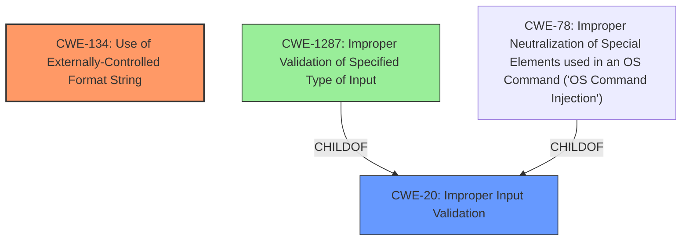

# Final Resolution for CVE-2022-33938

# Summary
| CWE ID | CWE Name | Confidence | CWE Abstraction Level | CWE Vulnerability Mapping Label | CWE-Vulnerability Mapping Notes |
|---|---|---|---|---|---|
| CWE-134 | Use of Externally-Controlled Format String | 1.0 | Base | Allowed | Primary CWE |
| CWE-20  | Improper Input Validation               | 0.8 | Class | Discouraged | Secondary Candidate: The lack of sanitization of user-supplied data before use in format string functions demonstrates improper input validation. |

## Evidence and Confidence

*   **Confidence Score:** 0.9
*   **Evidence Strength:** HIGH

## Relationship Analysis
The decision was influenced by the following CWE relationships:
  - CWE-20 is a parent of CWE-1287, which relates to validating specific input types. This suggests that if we had more information about the specific type of input validation that was missing, we could choose CWE-1287. However, based on the current evidence, the broader **CWE-20: Improper Input Validation** is more appropriate as a secondary candidate.
  - CWE-20 is a Class level CWE, and the mapping guidance discourages the use of Class level CWEs when more specific Base level CWEs are available. Since CWE-134 adequately describes the **ROOTCAUSE**, this is the primary CWE.
  - CWE-78 is a peer of CWE-88 (Improper Neutralization of Special Elements in a Command), and a child of CWE-77 (Improper Neutralization of Special Elements in a Command). We are not dealing with command injection here, so this CWE is not appropriate.

## Vulnerability Chain
The vulnerability chain begins with a lack of input validation (**CWE-20**) allowing user-controlled data to be passed to the format string function. This leads to the use of an externally-controlled format string (**CWE-134**), which can then result in memory corruption, information disclosure, or denial of service. The **ROOTCAUSE** is the lack of input validation, and **WEAKNESS** is the externally-controlled format string that leverages the lack of input validation.

## Summary of Analysis
The initial analysis correctly identified **CWE-134 [Use of Externally-Controlled Format String]** as the primary **WEAKNESS**. The evidence from the vulnerability description explicitly mentions "format string injection" and the use of user-controlled parameters (`cmd` and `id`) in the `vsnprintf` function without proper sanitization. This aligns directly with the definition of CWE-134.

The criticism suggested adding **CWE-20 [Improper Input Validation]** as a secondary weakness, which is a valid point. The lack of sanitization of the `cmd` and `id` parameters before they are used in constructing the format string is a clear case of improper input validation. While the mapping guidance discourages the use of CWE-20 when more specific CWEs are available, in this case, CWE-20 captures the broader issue of missing input validation that leads to the format string vulnerability.

The suggestion to consider **CWE-1287 [Improper Validation of Specified Type of Input]** is less compelling. While it's possible that the input should be validated for a specific type, the primary issue is the lack of any validation at all. Therefore, CWE-20 is the more appropriate secondary weakness.

The evidence to support the **CWE-134** classification is: "A format string injection vulnerability exists in the `ghome_process_control_packet` functionality...A specially-crafted XCMD can lead to memory corruption, information disclosure and denial of service. An attacker can send a malicious XML payload to trigger this vulnerability." This clearly indicates a format string injection vulnerability.

The evidence to support the inclusion of **CWE-20** is: "The `ghome_process_control_packet` function does not sanitize the `cmd` and `id` values..." This statement directly implies a lack of input validation.

The final decision is to include CWE-134 as the primary CWE and CWE-20 as a secondary candidate. This provides a more complete picture of the vulnerability by highlighting both the specific format string injection issue and the underlying lack of input validation. The confidence score is reduced to 0.9 to reflect that while CWE-134 is a near-certain match, CWE-20 is a strong candidate that could potentially be replaced by a more specific input validation CWE if more details were available about the expected input format.