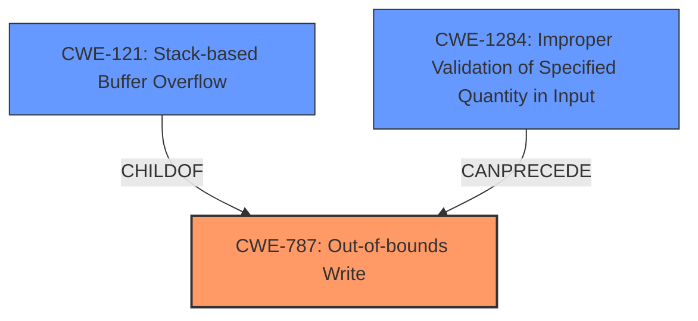

# Analysis Report for CVE-2022-34287

# Vulnerability Analysis Report: CVE-2022-34287

## Description

A vulnerability has been identified in PADS Standard/Plus Viewer (All versions). The affected application contains a stack corruption vulnerability while parsing PCB files. An attacker could leverage this vulnerability to leak information in the context of the current process. (FG-VD-22-052, FG-VD-22-056)

## Vulnerability Description Key Phrases

**Rootcause:** stack corruption
**Impact:** information disclosure
**Vector:** parsing PCB files
**Attacker:** attacker
**Product:** PADS Standard/Plus Viewer
**Version:** All versions

## Analysis (with Relationship Data)

# Summary
| CWE ID | CWE Name | Confidence | CWE Abstraction Level | CWE Vulnerability Mapping Label | CWE-Vulnerability Mapping Notes |
|---|---|---|---|---|---|
| CWE-787 | Out-of-bounds Write | 0.9 | Base | Allowed | Primary CWE |
| CWE-121 | Stack-based Buffer Overflow | 0.6 | Variant | Allowed | Secondary Candidate |

## Evidence and Confidence

*   **Confidence Score:** 0.9
*   **Evidence Strength:** HIGH

- **Analysis and Justification:**  
  - *Explanation:* The vulnerability description states "**stack corruption** vulnerability while parsing PCB files". The "CVE Reference Links Content Summary" expands on this, mentioning "**Weaknesses/vulnerabilities present**: Improper Restriction of Operations within the Bounds of a Memory Buffer (CWE-119), leading to stack corruption." CWE-787 (Out-of-bounds Write) is a Base level CWE that describes writing data past the end or before the beginning of the intended buffer, which aligns with the concept of **stack corruption** due to writing outside of allocated stack memory. The mapping guidance for CWE-787 is "Allowed."
  CWE-121 (Stack-based Buffer Overflow) is a Variant of CWE-787 and describes a condition where the buffer being overwritten is allocated on the stack. The vulnerability states "**stack corruption**" so CWE-121 is a good secondary candidate.

  - *Relationship Analysis:* CWE-787 is a base level weakness and a parent of CWE-121 (Stack-based Buffer Overflow). CWE-787 is also a child of CWE-119 (Improper Restriction of Operations within the Bounds of a Memory Buffer), reflecting that out-of-bounds writes are a type of buffer error.

- **Confidence Score:**  
  - Confidence: 0.9 (High confidence based on the explicit mention of "stack corruption" and the alignment with CWE-787's definition.)

## Criticism of Analysis

Okay, I have reviewed the provided analysis and the full CWE specifications. Here's my critique, focusing on the accuracy of the CWE mappings, the confidence levels, and alternative CWEs that might be relevant.

**Overall Assessment:**

The analysis is generally sound and the primary CWE mapping to CWE-787 (Out-of-bounds Write) is accurate and well-justified.  The inclusion of CWE-121 (Stack-based Buffer Overflow) as a secondary candidate is also reasonable. The confidence score of 0.9 for CWE-787 is justified given the clear indication of "stack corruption" in the vulnerability description. The provided CWE specifications provide clear justification for the choice.

**Detailed Critique:**

*   **CWE-787: Out-of-bounds Write (Primary)**
    *   **Accuracy:** Correct. The root cause is described as "stack corruption," directly implying a write operation outside the intended buffer boundaries. The vulnerability description indicates that this occurs while parsing PCB files, which means untrusted input is processed in an unsafe way.
    *   **Justification:** The analysis correctly points out that CWE-787 is a Base level CWE that aligns with the concept of writing outside allocated stack memory. The "Allowed" mapping guidance for CWE-787 is appropriate.
    *   **Mitigations:** The analysis doesn't explicitly mention mitigations but the CWE specifications lists appropriate high-level mitigations, such as using memory-safe languages, vetted libraries, and compiler-based overflow detection mechanisms (e.g., /GS flag in Visual Studio). These mitigations would be highly relevant to prevent this type of vulnerability.
    *   **CWE Specification Analysis:** The provided CWE specification confirms that CWE-787 is the appropriate Base level CWE and a parent of CWE-121.

*   **CWE-121: Stack-based Buffer Overflow (Secondary)**
    *   **Accuracy:** Correct. As the description mentions "stack corruption," CWE-121 is a very strong secondary candidate as it specifies that the overflow occurs on the stack.  It is a Variant of CWE-787, providing more specific information.
    *   **Justification:** The analysis correctly states the relationship between CWE-787 and CWE-121, highlighting that the latter specifies the location of the buffer overflow on the stack.
    *   **Mitigations:** Similar to CWE-787, the mitigations for CWE-121 include compiler-based protections (e.g., canaries), and secure coding practices.
    *   **CWE Specification Analysis:** The provided CWE specification confirms that CWE-121 is a child of CWE-787.

*   **Other CWE Considerations (Lower Priority, but Possible Chains):**
    *   **CWE-20: Improper Input Validation:**  While the primary issue is the out-of-bounds write, the vulnerability is triggered by *parsing* a malicious PCB file. This implies that the *parser* is not properly validating the structure and data within the PCB file.  A chain *could* be considered where CWE-20 (or one of its more specific children like CWE-1284: Improper Validation of Specified Quantity in Input, if a size field is not validated) leads to CWE-787/CWE-121. However, the given description focuses on the memory corruption itself rather than the input validation aspect, so it should only be considered in a detailed analysis and with lower priority.
    *   **CWE-119: Improper Restriction of Operations within the Bounds of a Memory Buffer:** While CWE-119 is a parent to CWE-787, it is discouraged from use in CWE mappings because it's a broad category that provides less specific information. The analysis already maps to a more specific weakness.
    *   **CWE-125: Out-of-bounds Read:** The vulnerability description says "An attacker could leverage this vulnerability to leak information in the context of the current process." This impact might be caused by reading from the corrupted stack in addition to or instead of the write causing corruption. It is worth considering if CWE-125 is applicable even though the root cause is the write.

**Recommendations:**

*   **Consider adding a brief discussion of potential mitigations in the analysis itself.** While listing CWEs is important, briefly mentioning relevant mitigation strategies (e.g., compiler-based protections, safe string handling functions) can increase the practical value of the analysis.
*   **Acknowledge the potential role of CWE-20:** Mention that improper input validation during PCB file parsing is a potential contributing factor, possibly as a chained weakness. Although, given the information provided, it is reasonable to keep the focus on memory corruption. If more information becomes available that input validation issues were the cause, then this recommendation should be strongly considered.
*   **Address out-of-bounds read in impact**: Mention CWE-125 in impact if appropriate.

**Revised Summary Table (incorporating the recommendations):**

| CWE ID | CWE Name | Confidence | CWE Abstraction Level | CWE Vulnerability Mapping Label | CWE-Vulnerability Mapping Notes |
|---|---|---|---|---|---|
| CWE-787 | Out-of-bounds Write | 0.9 | Base | Allowed | Primary CWE |
| CWE-121 | Stack-based Buffer Overflow | 0.6 | Variant | Allowed | Secondary Candidate |
| CWE-20 | Improper Input Validation | 0.3 | Class | Allowed | Contributing Factor; Input validation during PCB parsing may be insufficient |

By incorporating these suggestions, the analysis will become even more comprehensive and useful for developers and security professionals.

## Final Resolution

# Summary
| CWE ID | CWE Name | Confidence | CWE Abstraction Level | CWE Vulnerability Mapping Label | CWE-Vulnerability Mapping Notes |
|---|---|---|---|---|---|
| CWE-787 | Out-of-bounds Write | 0.9 | Base | Allowed | Primary CWE |
| CWE-121 | Stack-based Buffer Overflow | 0.6 | Variant | Allowed | Secondary Candidate |
| CWE-1284 | Improper Validation of Specified Quantity in Input | 0.4 | Base | Allowed | Contributing Factor; Input validation during PCB parsing may be insufficient |

## Evidence and Confidence

*   **Confidence Score:** 0.9
*   **Evidence Strength:** HIGH

## Relationship Analysis
The primary relationship is that CWE-121 (Stack-based Buffer Overflow) is a variant of CWE-787 (**Out-of-bounds Write**), providing more specificity about the location of the overflow. The potential for CWE-1284 (Improper Validation of Specified Quantity in Input) is considered as a contributing factor, potentially preceding the **out-of-bounds write**. These relationships helped refine the classification to reflect both the root cause and the specific context of the vulnerability.

## Vulnerability Chain
The vulnerability chain starts with a potential **improper validation of input (CWE-1284)** during the parsing of a PCB file. This could lead to an **out-of-bounds write (CWE-787)** on the stack, resulting in **stack corruption (CWE-121)**. The final impact is information leakage due to the corrupted stack.

## Summary of Analysis
The initial analysis correctly identified CWE-787 (**Out-of-bounds Write**) as the primary weakness, supported by the vulnerability description mentioning "**stack corruption**". The inclusion of CWE-121 (Stack-based Buffer Overflow) as a secondary candidate is also appropriate, given that it specifies the location of the overflow.

The criticism raised a valid point about considering potential contributing factors, such as **improper input validation**. While the provided description focuses on the memory corruption, it's reasonable to acknowledge that inadequate input validation during PCB file parsing could lead to the **out-of-bounds write**. Therefore, CWE-1284 (Improper Validation of Specified Quantity in Input) is included as a contributing factor, though with lower confidence due to the lack of explicit evidence. The final decision reflects a balance between direct evidence and potential contributing factors, ensuring the classification is at the optimal level of specificity.
The evidence for **stack corruption** is provided by the initial description: "A vulnerability has been identified in PADS Standard/Plus Viewer (All versions). The affected application contains a **stack corruption** vulnerability while parsing PCB files."

*Report generated on 2025-03-18 14:52:02*
