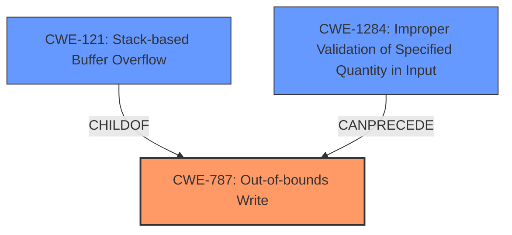

# Final Resolution for CVE-2022-34287

# Summary
| CWE ID | CWE Name | Confidence | CWE Abstraction Level | CWE Vulnerability Mapping Label | CWE-Vulnerability Mapping Notes |
|---|---|---|---|---|---|
| CWE-787 | Out-of-bounds Write | 0.9 | Base | Allowed | Primary CWE |
| CWE-121 | Stack-based Buffer Overflow | 0.6 | Variant | Allowed | Secondary Candidate |
| CWE-1284 | Improper Validation of Specified Quantity in Input | 0.4 | Base | Allowed | Contributing Factor; Input validation during PCB parsing may be insufficient |

## Evidence and Confidence

*   **Confidence Score:** 0.9
*   **Evidence Strength:** HIGH

## Relationship Analysis
The primary relationship is that CWE-121 (Stack-based Buffer Overflow) is a variant of CWE-787 (**Out-of-bounds Write**), providing more specificity about the location of the overflow. The potential for CWE-1284 (Improper Validation of Specified Quantity in Input) is considered as a contributing factor, potentially preceding the **out-of-bounds write**. These relationships helped refine the classification to reflect both the root cause and the specific context of the vulnerability.

## Vulnerability Chain
The vulnerability chain starts with a potential **improper validation of input (CWE-1284)** during the parsing of a PCB file. This could lead to an **out-of-bounds write (CWE-787)** on the stack, resulting in **stack corruption (CWE-121)**. The final impact is information leakage due to the corrupted stack.

## Summary of Analysis
The initial analysis correctly identified CWE-787 (**Out-of-bounds Write**) as the primary weakness, supported by the vulnerability description mentioning "**stack corruption**". The inclusion of CWE-121 (Stack-based Buffer Overflow) as a secondary candidate is also appropriate, given that it specifies the location of the overflow.

The criticism raised a valid point about considering potential contributing factors, such as **improper input validation**. While the provided description focuses on the memory corruption, it's reasonable to acknowledge that inadequate input validation during PCB file parsing could lead to the **out-of-bounds write**. Therefore, CWE-1284 (Improper Validation of Specified Quantity in Input) is included as a contributing factor, though with lower confidence due to the lack of explicit evidence. The final decision reflects a balance between direct evidence and potential contributing factors, ensuring the classification is at the optimal level of specificity.
The evidence for **stack corruption** is provided by the initial description: "A vulnerability has been identified in PADS Standard/Plus Viewer (All versions). The affected application contains a **stack corruption** vulnerability while parsing PCB files."