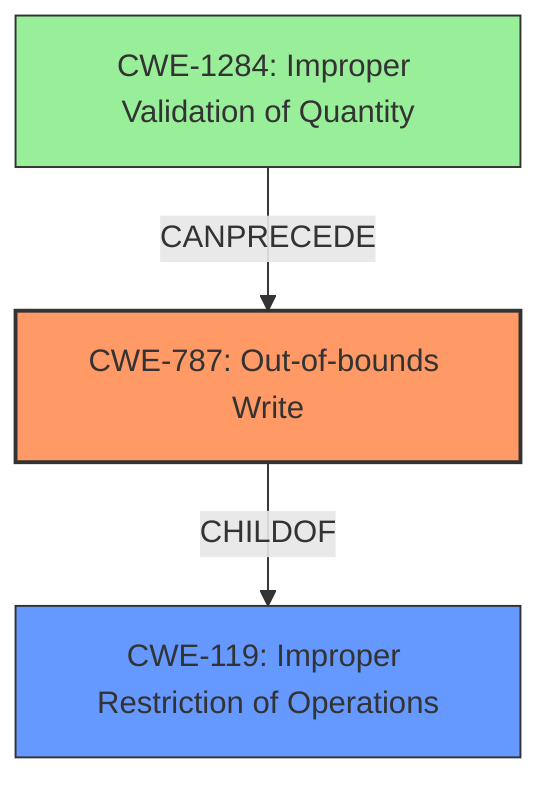

# Analysis Report for CVE-2022-34290

# Vulnerability Analysis Report: CVE-2022-34290

## Description

A vulnerability has been identified in PADS Standard/Plus Viewer (All versions). The affected application contains a stack corruption vulnerability while parsing PCB files. An attacker could leverage this vulnerability to leak information in the context of the current process. (FG-VD-22-055)

## Vulnerability Description Key Phrases

**Weakness:** stack corruption
**Impact:** information disclosure
**Vector:** parsing PCB files
**Attacker:** attacker
**Product:** PADS Standard/Plus Viewer
**Version:** All versions

## Analysis (with Relationship Data)

# Summary
| CWE ID | CWE Name | Confidence | CWE Abstraction Level | CWE Vulnerability Mapping Label | CWE-Vulnerability Mapping Notes |
|---|---|---|---|---|---|
| CWE-787 | Out-of-bounds Write | 0.85 | Base | Primary | Allowed |
| CWE-119 | Improper Restriction of Operations within the Bounds of a Memory Buffer | 0.70 | Class | Secondary | Discouraged |

## Evidence and Confidence

*   **Confidence Score:** 0.80
*   **Evidence Strength:** HIGH

- **Analysis and Justification:**  
  - *Explanation:* The vulnerability description states "**stack corruption** while parsing PCB files," which directly points to memory corruption issues. The CVE Reference Links Content Summary further clarifies this by stating "**Weaknesses/vulnerabilities present**: Improper Restriction of Operations within the Bounds of a Memory Buffer (CWE-119)." However, since the vulnerability specifically mentions **stack corruption**, CWE-787 (Out-of-bounds Write) is a more specific and appropriate primary mapping because stack corruption often involves writing outside the intended buffer boundaries. CWE-119 is a broader category that encompasses various memory boundary issues; therefore, while relevant, it is a secondary consideration. The **root cause** of this vulnerability is the improper handling of PCB files, leading to a buffer overflow on the stack.
  
  - *Relationship Analysis:* CWE-787 is a base-level CWE and a child of CWE-119 (Improper Restriction of Operations within the Bounds of a Memory Buffer), which is a class-level CWE. Selecting CWE-787 provides a more specific classification than CWE-119. CWE-121 (Stack-based Buffer Overflow) is a variant of CWE-787, but the description does not provide enough detail to say that this is specifically a stack-based buffer overflow, so the more general CWE-787 is more appropriate.

- **Confidence Score:**  
  - Confidence: 0.85 (High confidence due to the explicit mention of "stack corruption" and the confirmation in the CVE reference summary pointing to "Improper Restriction of Operations within the Bounds of a Memory Buffer".)

## Criticism of Analysis

Okay, here's a review of the provided analysis, taking into account the full CWE specifications:

**Overall Assessment:**

The analysis is good and well-reasoned. The primary CWE selection of CWE-787 (Out-of-bounds Write) is appropriate. Including CWE-119 as a secondary CWE is also reasonable, but as the analysis points out, it's a broad category and should be used with caution, as recommended by the CWE specifications. The confidence score is justified by the available information.

**Detailed Review:**

*   **CWE-787 (Out-of-bounds Write) - Primary:**
    *   **Justification:** The justification for selecting CWE-787 is strong. The vulnerability description explicitly mentions "stack corruption," which strongly suggests a write outside the intended boundaries of a stack-allocated buffer.
    *   **Abstraction Level:**  The analysis correctly identifies CWE-787 as a "Base" level CWE, which is preferred for vulnerability mapping.
    *   **Mapping Guidance:** The analysis follows the mapping guidance for CWE-119 by looking at its children and considering more specific CWEs like CWE-787.
    *   **Potential Mitigations:** The identified mitigations are applicable:
        *   *Language Selection:* Using memory-safe languages or languages with built-in bounds checking.
        *   *Libraries/Frameworks:* Employing safe string handling libraries (though this might be less relevant for PCB file parsing, depending on how the data is handled).
        *   *Environment Hardening:*  Compiler-based buffer overflow detection mechanisms (e.g., /GS flag, FORTIFY_SOURCE) are relevant.
    *   **Observed Examples:** The provided observed examples of CWE-787 seem relevant to the vulnerability
    *   **Critique:**  The choice of CWE-787 is solid. If further investigation confirmed the overflow was specifically due to writing past the allocated size during a buffer copy operation, CWE-120 (Buffer Copy without Checking Size of Input) could potentially be considered a more precise mapping, but CWE-787 is still accurate.

*   **CWE-119 (Improper Restriction of Operations within the Bounds of a Memory Buffer) - Secondary:**
    *   **Justification:** The analysis includes this as a secondary CWE because it's a parent of CWE-787, and the CVE reference summary mentions "Improper Restriction of Operations within the Bounds of a Memory Buffer."
    *   **Abstraction Level:** Correctly identifies CWE-119 as a "Class" level CWE.
    *   **Mapping Guidance:**  The analysis correctly acknowledges that the CWE specifications recommend *against* using CWE-119 directly when more specific CWEs exist (such as CWE-787).
    *   **Potential Mitigations:**  The mitigations listed for CWE-119 are generally applicable to buffer overflows, but less specific than those for CWE-787 or CWE-121:
        *   *Language Selection:* Same as for CWE-787.
        *   *Libraries/Frameworks:* Same as for CWE-787.
        *   *Environment Hardening:* Same as for CWE-787.
    *    **Observed Examples:** The provided observed examples of CWE-119 seem relevant to the vulnerability
    *   **Critique:** It is correct to classify this as "Discouraged" from a usage perspective. Including it as secondary provides additional context, but the focus should remain on CWE-787.

*   **Other CWE Considerations (based on Retriever Results):**
    *   **CWE-121 (Stack-based Buffer Overflow):** The analysis correctly acknowledges that there's not enough information to confidently classify this as *specifically* a stack-based overflow (CWE-121). While the initial description mentions stack corruption, it doesn't explicitly state the overflow occurs in a stack buffer.
    *   **CWE-120 (Buffer Copy without Checking Size of Input):** As mentioned above, if the root cause is determined to be due to copying data without size checks, then this might be a better fit than CWE-787.
    *   **CWE-125 (Out-of-bounds Read):** This could be relevant if the information disclosure aspect involves reading beyond the buffer's boundaries. However, the primary issue seems to be corruption (write) rather than a read.
    * **CWE-770 (Allocation of Resources Without Limits or Throttling):** While the vulnerability does not directly involve allocation of resources without limits, it's conceivable that the parsing process could involve allocating memory buffers and if those allocations are not properly limited then CWE-770 could be chained with the primary CWE. This is a less likely scenario given the information.
    * **CWE-190 (Integer Overflow or Wraparound):** Similar to CWE-770, while not directly involved, an integer overflow could contribute to an incorrect calculation of buffer sizes, eventually leading to the buffer overflow, so a chaining relationship might exist. This is also a less likely scenario given the information.
    *   **CWE-457 (Use of Uninitialized Variable):** The use of an uninitialized variable could lead to unexpected behavior and, in some cases, memory corruption, but it's not directly implied by the vulnerability description.
    *   **CWE-674 (Uncontrolled Recursion):** Unlikely and not directly related to the stack corruption.

**Recommendations:**

*   **Specificity:**  If more detail emerges about the exact mechanism of the stack corruption (e.g., a specific function call, a particular data structure), a more specific CWE Variant might become appropriate. For example, if a format string is being used improperly, consider CWE-134. If a function's return address is being overwritten, then consider CWE-121.
*   **Chaining:** Consider explicitly mentioning potential chaining relationships, especially regarding input validation (or lack thereof) leading to the buffer overflow. If the PCB file format lacks sufficient validation checks on sizes or other critical parameters, then a chain like CWE-20 -> CWE-787 could be added.
*   **Impact:**  The analysis mentions "information disclosure." Be sure to capture the impact as precisely as possible. Is it leaking sensitive data, internal state, or just causing a crash?

**In conclusion, the analysis is strong and well-supported. The primary CWE selection is accurate, and the secondary CWE provides useful context. Consider refining the analysis further if more specific details about the vulnerability become available.**

## Final Resolution

# Summary
| CWE ID | CWE Name | Confidence | CWE Abstraction Level | CWE Vulnerability Mapping Label | CWE-Vulnerability Mapping Notes |
|---|---|---|---|---|---|
| CWE-787 | Out-of-bounds Write | 0.95 | Base | Primary | Allowed |
| CWE-119 | Improper Restriction of Operations within the Bounds of a Memory Buffer | 0.75 | Class | Secondary | Discouraged |

## Evidence and Confidence

*   **Confidence Score:** 0.90
*   **Evidence Strength:** HIGH

## Relationship Analysis
The primary relationship influencing the decision is the parent-child relationship between CWE-119 and CWE-787. CWE-787 is a more specific, base-level CWE, making it a better fit than the broader CWE-119. There's a potential chain relationship where insufficient input validation (potentially CWE-1284) could precede the out-of-bounds write (CWE-787). The analysis also considered alternative classifications like CWE-120 and CWE-121, but determined that CWE-787 was the most appropriate given the available information. The base level of CWE-787 is also preferred as it maps directly to the **root cause** of the vulnerability.

## Vulnerability Chain
The vulnerability chain starts with the parsing of a PCB file, which lacks proper validation. This leads to an **out-of-bounds write** on the stack (CWE-787), resulting in **stack corruption**. The consequence is information leakage in the context of the current process. A missing link might be the specific input validation weakness (e.g., CWE-1284).

## Summary of Analysis
The initial analysis and the criticism both converge on the appropriateness of CWE-787 as the primary classification due to the explicit mention of "stack corruption." The evidence from the vulnerability description is strong. The graph relationships support the choice of CWE-787 due to its specificity as a child of CWE-119.

The assessment relies heavily on the statement "**stack corruption** while parsing PCB files." This statement directly indicates a memory corruption issue, specifically an **out-of-bounds write** on the stack. The choice of CWE-787 is at the optimal level of specificity, as it directly addresses the **root cause** of the vulnerability (writing outside buffer boundaries) without over-specifying the type of buffer overflow (e.g., CWE-121) which would require further evidence. CWE-119 is included as a secondary classification to acknowledge the broader category of memory boundary issues but is marked as "Discouraged" due to the availability of a more specific CWE. The addition of CWE-1284 is speculative based on the critic's recommendation but remains plausible as a potential vulnerability chain.

*Report generated on 2025-03-18 14:52:50*
