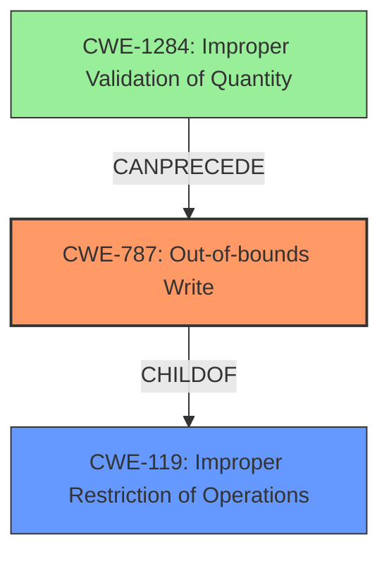

# Final Resolution for CVE-2022-34290

# Summary
| CWE ID | CWE Name | Confidence | CWE Abstraction Level | CWE Vulnerability Mapping Label | CWE-Vulnerability Mapping Notes |
|---|---|---|---|---|---|
| CWE-787 | Out-of-bounds Write | 0.95 | Base | Primary | Allowed |
| CWE-119 | Improper Restriction of Operations within the Bounds of a Memory Buffer | 0.75 | Class | Secondary | Discouraged |

## Evidence and Confidence

*   **Confidence Score:** 0.90
*   **Evidence Strength:** HIGH

## Relationship Analysis
The primary relationship influencing the decision is the parent-child relationship between CWE-119 and CWE-787. CWE-787 is a more specific, base-level CWE, making it a better fit than the broader CWE-119. There's a potential chain relationship where insufficient input validation (potentially CWE-1284) could precede the out-of-bounds write (CWE-787). The analysis also considered alternative classifications like CWE-120 and CWE-121, but determined that CWE-787 was the most appropriate given the available information. The base level of CWE-787 is also preferred as it maps directly to the **root cause** of the vulnerability.

## Vulnerability Chain
The vulnerability chain starts with the parsing of a PCB file, which lacks proper validation. This leads to an **out-of-bounds write** on the stack (CWE-787), resulting in **stack corruption**. The consequence is information leakage in the context of the current process. A missing link might be the specific input validation weakness (e.g., CWE-1284).

## Summary of Analysis
The initial analysis and the criticism both converge on the appropriateness of CWE-787 as the primary classification due to the explicit mention of "stack corruption." The evidence from the vulnerability description is strong. The graph relationships support the choice of CWE-787 due to its specificity as a child of CWE-119.

The assessment relies heavily on the statement "**stack corruption** while parsing PCB files." This statement directly indicates a memory corruption issue, specifically an **out-of-bounds write** on the stack. The choice of CWE-787 is at the optimal level of specificity, as it directly addresses the **root cause** of the vulnerability (writing outside buffer boundaries) without over-specifying the type of buffer overflow (e.g., CWE-121) which would require further evidence. CWE-119 is included as a secondary classification to acknowledge the broader category of memory boundary issues but is marked as "Discouraged" due to the availability of a more specific CWE. The addition of CWE-1284 is speculative based on the critic's recommendation but remains plausible as a potential vulnerability chain.