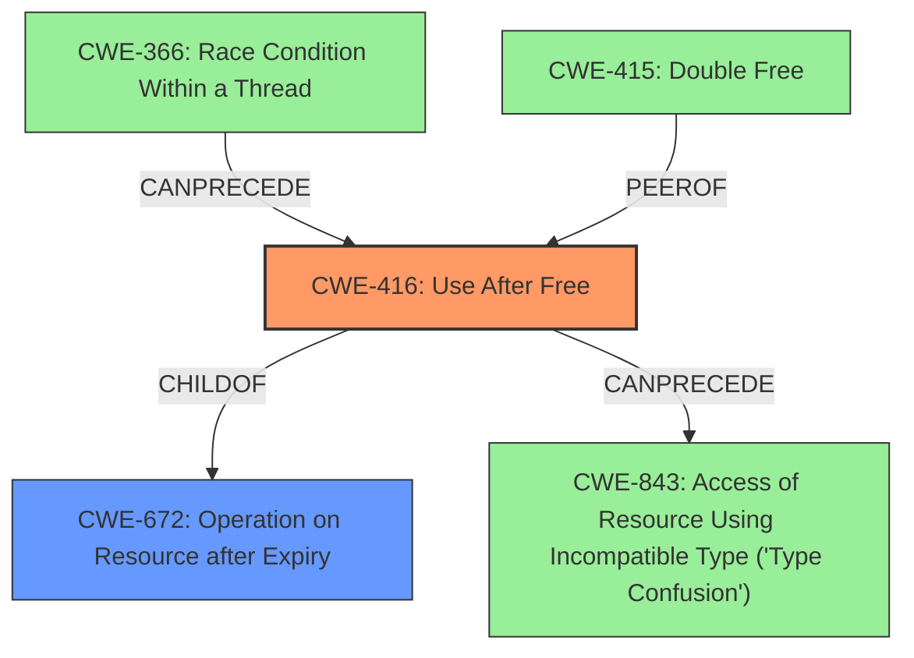

# Analysis Report for CVE-2022-3445

# Vulnerability Analysis Report: CVE-2022-3445

## Description

Use after free in Skia in Google Chrome prior to 106.0.5249.119 allowed a remote attacker to potentially exploit heap corruption via a crafted HTML page. (Chromium security severity High)

## Vulnerability Description Key Phrases

**Rootcause:** use after free
**Weakness:** heap corruption
**Vector:** crafted HTML page
**Attacker:** remote attacker
**Product:** Google Chrome
**Version:** prior to 106.0.5249.119
**Component:** Skia

## Analysis (with Relationship Data)

# Summary
| CWE ID | CWE Name | Confidence | CWE Abstraction Level | CWE Vulnerability Mapping Label | CWE-Vulnerability Mapping Notes |
|---|---|---|---|---|---|
| CWE-416 | Use After Free | 1.0 | Variant | Primary | Allowed |

## Evidence and Confidence

*   **Confidence Score:** 1.0
*   **Evidence Strength:** HIGH

- **Analysis and Justification:**  
  - *Explanation:* The vulnerability description clearly states a "**use after free**" in Skia, leading to potential **heap corruption**. This directly aligns with CWE-416 (Use After Free), which describes the condition where memory is reused or referenced after it has been freed. The CVE Reference Links Content Summary reinforces this by stating that the root cause is a "Use-after-free in Skia" and identifies the presence of a "use-after-free vulnerability." The retriever results also strongly suggest CWE-416 as the primary candidate. Given the specific details provided, CWE-416 is the most accurate and specific representation of the weakness. The MITRE mapping guidance for CWE-416 indicates that this mapping is ALLOWED.

  - *Relationship Analysis:* CWE-416 is a variant of CWE-672 (Operation on Resource after Expiry). The vulnerability involves accessing memory after it has been freed, potentially leading to unpredictable behavior and exploitation. There are also CANFOLLOW relationships to CWE-754, CWE-362, and CWE-1265. These relationships indicate that a use-after-free can potentially lead to resource leaks, race conditions, or other exploitable conditions.

- **Confidence Score:**  
  - Confidence: 1.0 (Strong evidence from the vulnerability description, CVE reference summary, and retriever results)

---

## Criticism of Analysis

Okay, I've reviewed the provided analysis and the full CWE specifications for the listed CWEs. Here's my critique, focusing on the accuracy of the primary CWE mapping, the justification provided, and consideration of alternative CWEs:

**Overall Assessment:**

The primary CWE mapping to **CWE-416 (Use After Free)** is **accurate and well-justified**. The analysis correctly identifies the key phrase "use after free" in the vulnerability description and the supporting documentation. The confidence score of 1.0 is appropriate, given the strong evidence.

**Strengths of the Analysis:**

*   **Clear and Concise Justification:** The explanation clearly links the vulnerability description to the CWE definition. It highlights the core issue of reusing memory after it has been freed, directly mapping to CWE-416.
*   **Reference to Mapping Guidance:** The analysis explicitly mentions that the MITRE mapping guidance for CWE-416 indicates that the mapping is ALLOWED, demonstrating awareness of the intended usage of CWEs.
*   **Consideration of Relationships:** The analysis briefly mentions the ChildOf and CanFollow relationships of CWE-416, showing a broader understanding of how this CWE fits within the overall structure.
*   **Review of Retriever Results:** The analysis takes into account the Retriever Results, which suggest CWE-416.

**Areas for Potential Improvement and Discussion:**

1.  **Overemphasis on Heap Corruption:** The original vulnerability description mentions "heap corruption." While use-after-free vulnerabilities *can* lead to heap corruption, the analysis should be careful not to let the presence of "heap corruption" overshadow the primary root cause, which is the use-after-free. Heap corruption is a *consequence* of UAF, and not the primary cause.

2.  **Alternative CWEs & Ranking:**  The Retriever Results present a ranked list of potential CWEs. It would strengthen the analysis to discuss *why* the other top contenders (CWE-843, CWE-366, and CWE-415) were *not* chosen, even though they had decent scores.  For example:

    *   **CWE-843 (Access of Resource Using Incompatible Type ('Type Confusion')):** While type confusion *could* occur as a result of using freed memory (the new data written might be interpreted incorrectly), it's not the *fundamental* problem. The core issue is accessing memory that's no longer valid, regardless of the data's type. It would be good to state this explicitly in the analysis.

    *   **CWE-366 (Race Condition within a Thread):** While race conditions *could* lead to UAF, it is not the primary cause of the vulnerability in this case. Race conditions are more about concurrency issues, where threads are not properly synchronized to access the shared resources. Unless concurrency is explicitly mentioned, CWE-366 should be excluded.

    *   **CWE-415 (Double Free):** Double free is the case where the same memory is freed twice.

3.  **Specificity Within CWE-416:** While CWE-416 is the correct primary mapping, it's a Variant-level CWE. The specification for CWE-416 doesn't go much deeper, but it's worth noting that there aren't many more specific CWEs beneath it. A future version of CWE might have more specific sub-types of Use After Free.

4.  **Mitigation Strategies:** The analysis is focused on identifying the weakness and doesn't discuss potential mitigation strategies. While not always required, briefly mentioning relevant mitigations would add value. For CWE-416, suitable mitigations could include:
    *   Using languages with automatic memory management (as noted in the CWE description).
    *   Employing techniques like smart pointers or reference counting to manage memory more safely.
    *   Using static analysis tools to detect potential use-after-free vulnerabilities during development.
    *   Setting pointers to `NULL` after freeing the memory they point to (although, as the CWE description notes, this isn't a foolproof solution in complex scenarios).
    *   Using address sanitizer tools to detect the vulnerabilities during tests.

5.  **Relationship to Heap Corruption:** Given the original vulnerability's mention of "heap corruption," it would be useful to elaborate on the *relationship* between CWE-416 and heap corruption. Explain that UAF *can* lead to heap corruption because after the memory is freed, it can be reallocated for another purpose. When the original pointer is then used, it might overwrite data belonging to the newly allocated object, resulting in heap corruption and potentially arbitrary code execution.

**Revised Analysis Snippet (incorporating suggestions):**

"The vulnerability description clearly states a "**use after free**" in Skia, leading to potential **heap corruption**. This directly aligns with CWE-416 (Use After Free), which describes the condition where memory is reused or referenced after it has been freed. The CVE Reference Links Content Summary reinforces this by stating that the root cause is a "Use-after-free in Skia" and identifies the presence of a "use-after-free vulnerability." The retriever results also strongly suggest CWE-416 as the primary candidate. While the description also mentions "heap corruption," this is a *consequence* of the use-after-free, and not the root cause itself. A use-after-free can lead to heap corruption if the freed memory is reallocated and then overwritten via the dangling pointer.

Alternative CWEs considered were: CWE-843 (Access of Resource Using Incompatible Type ('Type Confusion')), CWE-366 (Race Condition within a Thread), and CWE-415 (Double Free). CWE-843, while *potentially* arising as a *result* of UAF, is not the primary issue. The core problem is accessing freed memory, *regardless* of the data's type. CWE-366 is only relevant if there is an explicit concurrency issue mentioned.  CWE-415 describes the case where memory is freed twice; the case is not a double free, but a use after a single free. Given the specific details provided, CWE-416 is the most accurate and specific representation of the weakness. The MITRE mapping guidance for CWE-416 indicates that this mapping is ALLOWED.

Potential mitigations for CWE-416 include using memory-safe languages, employing smart pointers or reference counting, using static analysis and address sanitizer tools, and setting pointers to `NULL` after freeing the associated memory."

In summary, the analysis is strong, but could be improved by explicitly addressing alternative CWEs and emphasizing that "heap corruption" is a *consequence* of the UAF, not the root cause. Adding a brief discussion of mitigation strategies would also increase its value.

## Final Resolution

# Summary
| CWE ID | CWE Name | Confidence | CWE Abstraction Level | CWE Vulnerability Mapping Label | CWE-Vulnerability Mapping Notes |
|---|---|---|---|---|---|
| CWE-416 | Use After Free | 1.0 | Variant | Primary CWE | Allowed |

## Evidence and Confidence

*   **Confidence Score:** 1.0
*   **Evidence Strength:** HIGH

## Relationship Analysis
The primary relationship influencing the decision is that CWE-416 is a Variant of CWE-672 (Operation on Resource after Expiry). While other CWEs like CWE-843 (Type Confusion), CWE-366 (Race Condition) and CWE-415 (Double Free) were considered, they were deemed less relevant as they represent potential consequences or preconditions rather than the direct cause of the vulnerability described. The abstraction level of CWE-416 as a Variant provides sufficient specificity for this vulnerability.

## Vulnerability Chain
The vulnerability chain starts with a **use after free** (**CWE-416**) in Skia. The **root cause** is the improper management of memory, specifically reusing or referencing memory after it has been freed. This can lead to **heap corruption**, as the freed memory may be reallocated and the dangling pointer can then overwrite data belonging to the newly allocated object. The impact is that a remote attacker can potentially exploit this heap corruption via a crafted HTML page, leading to arbitrary code execution.

## Summary of Analysis
The initial analysis correctly identified **CWE-416 (Use After Free)** as the primary **weakness**. The criticism raised valid points about overemphasizing heap corruption and the need to explicitly address alternative CWEs. The revised analysis snippet incorporates these suggestions by clarifying that heap corruption is a consequence of the **use after free**, not the root cause, and by explaining why alternative CWEs such as CWE-843, CWE-366, and CWE-415 were not chosen. The vulnerability description clearly states "**use after free**", leading to potential **heap corruption**. This directly aligns with CWE-416, which describes the condition where memory is reused or referenced after it has been freed. The CVE Reference Links Content Summary reinforces this by stating that the **root cause** is a "**Use-after-free** in Skia" and identifies the presence of a "**use-after-free** vulnerability." The MITRE mapping guidance for CWE-416 indicates that this mapping is ALLOWED. The selected CWE is at the optimal level of specificity, as it directly describes the **weakness** and is a Variant-level CWE.

*Report generated on 2025-03-18 14:55:17*
