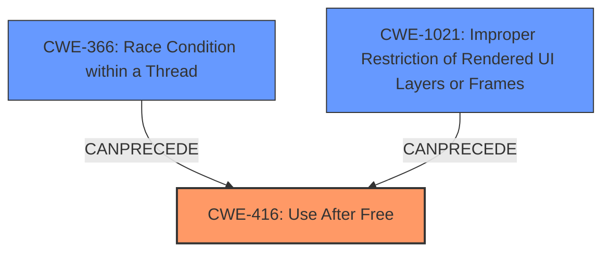

# Final Resolution for CVE-2022-3448

# Summary
| CWE ID | CWE Name | Confidence | CWE Abstraction Level | CWE Vulnerability Mapping Label | CWE-Vulnerability Mapping Notes |
|---|---|---|---|---|---|
| CWE-416 | Use After Free | 0.9 | Variant | Allowed | Primary CWE. Direct cause of the vulnerability. |
| CWE-366 | Race Condition within a Thread | 0.4 | Base | Allowed | Potentially a contributing factor. Concurrency within the Permissions API might lead to **Use-After-Free** if a resource is freed by one thread while another thread still holds a reference. Further investigation required. |
| CWE-1021 | Improper Restriction of Rendered UI Layers or Frames | 0.3 | Base | Allowed | Potentially a contributing factor to tricking the user to carry out the attack. Further investigation required. |

## Evidence and Confidence

*   **Confidence Score:** 0.8
*   **Evidence Strength:** MEDIUM

## Relationship Analysis
The initial analysis correctly identified CWE-416 (Use After Free) as the primary **weakness**. However, the criticism highlighted the potential involvement of other CWEs, particularly CWE-366 (Race Condition within a Thread) and CWE-1021 (Improper Restriction of Rendered UI Layers or Frames).

The relationships between these CWEs are as follows:

*   CWE-366 can precede CWE-416, meaning a race condition could create the conditions necessary for a **use-after-free** to occur. This is plausible given the asynchronous nature of Javascript and Chrome's Permissions API.
*   CWE-1021, while less direct, could be a contributing factor if the crafted HTML page employed clickjacking or UI redress techniques to trick the user into performing actions that trigger the **vulnerability**.

The abstraction levels also influenced the selection. CWE-416 is a Variant, providing a specific description of the memory management error. CWE-366 and CWE-1021 are Base level, representing more general conditions that could contribute to the **vulnerability**.

## Vulnerability Chain
The **vulnerability** chain begins with a potential race condition (CWE-366) or UI manipulation (CWE-1021).

1.  A race condition (CWE-366) within the Permissions API could lead to a situation where memory is freed by one thread while another thread still holds a reference to it.
2.  Alternatively, a crafted HTML page could use clickjacking (CWE-1021) to trick a user into performing specific UI gestures.
3.  The **root cause** is the **use-after-free** condition (CWE-416), where the product reuses or references memory after it has been freed.
4.  The consequence is potential heap corruption, as mentioned in the **vulnerability** description.

## Summary of Analysis
The analysis is based on the provided evidence, primarily the **vulnerability** description, which explicitly states "**Use after free** in Permissions API". This direct mention makes CWE-416 the most appropriate primary **weakness**.

The graph relationships highlighted by the criticism influenced the decision to include CWE-366 and CWE-1021 as secondary CWEs. While not directly stated in the **vulnerability** description, the potential for a race condition within the Permissions API and the use of a crafted HTML page suggest these factors could contribute to the conditions that allow the **use-after-free** to occur.

The selected CWEs are at the optimal level of specificity. CWE-416 is a Variant that directly describes the memory management error. CWE-366 and CWE-1021 are Base level, representing potential contributing factors.

The inclusion of CWE-366 and CWE-1021 is based on the following reasoning:

*   The asynchronous nature of Javascript and Chrome's Permissions API makes a race condition plausible.
*   The mention of "specific UI gestures" and "crafted HTML page" suggests the possibility of UI manipulation techniques.

However, the confidence in these secondary CWEs is lower due to the lack of direct evidence in the **vulnerability** description. Further investigation would be needed to confirm their involvement.