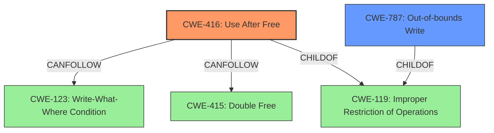

# Final Resolution for CVE-2022-34484

# Summary
| CWE ID | CWE Name | Confidence | CWE Abstraction Level | CWE Vulnerability Mapping Label | CWE-Vulnerability Mapping Notes |
|---|---|---|---|---|---|
| CWE-416 | Use After Free | 0.85 | Variant | Allowed | Primary CWE |
| CWE-787 | Out-of-bounds Write | 0.70 | Base | Allowed | Secondary Candidate |

## Evidence and Confidence

*   **Confidence Score:** 0.83
*   **Evidence Strength:** HIGH

## Relationship Analysis
The primary relationship influencing the decision is the direct alignment of the vulnerability description ("heap-use-after-free") with **CWE-416 (Use After Free)**. The "CanFollow" relationships of **CWE-416 (Use After Free)** to **CWE-123 (Write-What-Where Condition)** and **CWE-415 (Double Free)** provide context on potential consequences. **CWE-787 (Out-of-bounds Write)** is considered a secondary candidate due to the general "memory corruption" description, with no direct evidence to confirm it. The Variant level of **CWE-416 (Use After Free)** and the Base level of **CWE-787 (Out-of-bounds Write)** are appropriate for their respective roles.

## Vulnerability Chain
The vulnerability chain starts with the **ROOTCAUSE**: a "heap-use-after-free" condition (**CWE-416 (Use After Free)**). This occurs when memory is accessed after it has been freed. This can lead to **WEAKNESS**: **memory corruption**, potentially resulting in arbitrary code execution. A secondary potential weakness is **CWE-787 (Out-of-bounds Write)**, which could be a contributing factor or a consequence of the initial memory corruption, especially if triggered by malformed input discovered through fuzzing. This is a possible but unconfirmed link in the chain.

## Summary of Analysis
The analysis is based on the provided evidence, specifically the vulnerability description containing "heap-use-after-free," leading to the selection of **CWE-416 (Use After Free)** as the primary **WEAKNESS**. The criticism suggests considering **CWE-415 (Double Free)**, however there is no direct evidence for this. The graph relationships support the selection of **CWE-416 (Use After Free)** as the primary issue, with **CWE-787 (Out-of-bounds Write)** as a potential secondary factor contributing to the overall **memory corruption**.

The decision is justified by the direct match between the vulnerability description and the definition of **CWE-416 (Use After Free)**. The level of specificity is optimal, as **CWE-416 (Use After Free)** is a Variant-level CWE that accurately describes the specific type of memory management error. The mitigations suggested in the criticism, such as using memory-safe languages, are also relevant and support the classification.

Confidence Score: 0.83