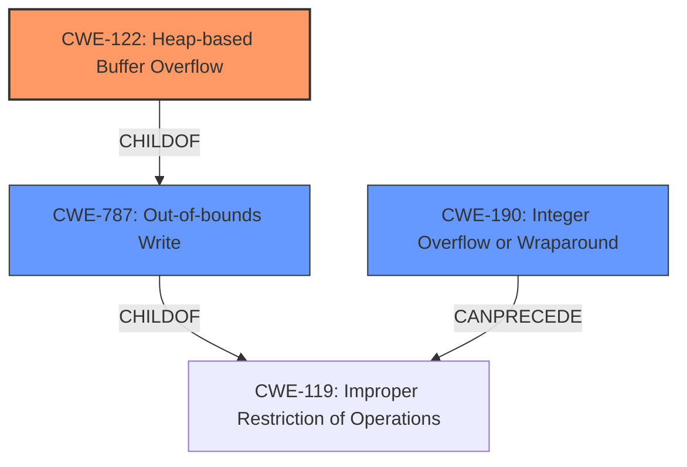

# Final Resolution for CVE-2022-34503

# Summary

| CWE ID | CWE Name | Confidence | CWE Abstraction Level | CWE Vulnerability Mapping Label | CWE-Vulnerability Mapping Notes |
|---|---|---|---|---|---|
| CWE-122 | Heap-based Buffer Overflow | 0.95 | Variant | Primary | Allowed |
| CWE-190 | Integer Overflow or Wraparound | 0.60 | Base | Secondary | Allowed |
| CWE-787 | Out-of-bounds Write | 0.50 | Base | Secondary | Allowed |

## Evidence and Confidence

*   **Confidence Score:** 0.85
*   **Evidence Strength:** HIGH

## Relationship Analysis
The primary relationship influencing the decision is the parent-child relationship, specifically that CWE-122 (Heap-based Buffer Overflow) is a variant of CWE-119 (Improper Restriction of Operations Within the Bounds of a Memory Buffer) and a child of CWE-787 (Out-of-bounds Write). The selection of CWE-122 is due to the explicit mention of "heap buffer overflow" in the vulnerability description, making it the most specific and appropriate choice. CWE-190 is included as a secondary factor due to the mention of a negative value possibly leading to an integer overflow. CWE-787 is chosen as a secondary factor due to the out-of-bounds write leading to the overflow.

## Vulnerability Chain
The vulnerability chain starts with a potential **integer overflow (CWE-190)** when calculating the size or number of entries for a buffer. This can lead to an **incorrect calculation of the buffer size or an out-of-bounds write (CWE-787)**. This, in turn, results in a **heap-based buffer overflow (CWE-122)**, where data is written beyond the allocated buffer on the heap. The final impact is a denial of service (DoS).

## Summary of Analysis
The initial analysis and criticism were both well-justified and contained sufficient evidence. The primary selection of CWE-122 is based on the explicit mention of a "heap buffer overflow" in the vulnerability description, which is strong evidence.

> QPDF v8.4.2 was discovered to contain a heap buffer overflow via the function QPDFprocessXRefStream.

The graph relationships influenced the decision by confirming that CWE-122 is the most specific variant of a buffer overflow, fitting the vulnerability description best. The selection of CWE-122 is at the optimal level of specificity, as it accurately describes the **heap buffer overflow** condition, while CWE-119 is too general. The addition of CWE-787 is added as a secondary cause as it is due to an out-of-bounds write beyond the `actual_size` buffer.

The moderate confidence in CWE-190 stems from the *implied* possibility of an integer overflow, based on the mention of a negative value contributing to the issue. Further investigation would be needed to confirm this.

The final determination is based on a combination of direct evidence (explicit mention of "heap buffer overflow"), relationship analysis (CWE-122 being a specific variant), and mapping guidance (ALLOWED usage for CWE-122, CWE-190 and CWE-787).