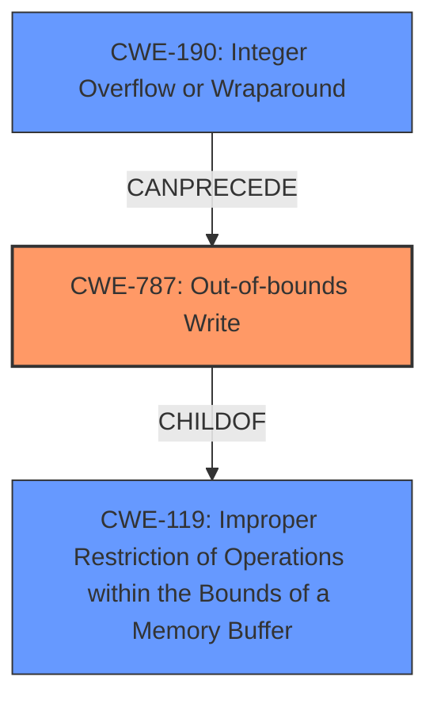

# Final Resolution for CVE-2022-34970

# Summary
| CWE ID | CWE Name | Confidence | CWE Abstraction Level | CWE Vulnerability Mapping Label | CWE-Vulnerability Mapping Notes |
|---|---|---|---|---|---|
| CWE-787 | Out-of-bounds Write | 0.90 | Base | Allowed | Primary CWE: Direct consequence of the integer overflow leading to a heap-based buffer overflow. |
| CWE-190 | Integer Overflow or Wraparound | 0.75 | Base | Allowed | Secondary CWE: Contributing factor leading to an incorrect buffer size calculation or index manipulation, resulting in the heap overflow. |

## Evidence and Confidence

*   **Confidence Score:** 0.85
*   **Evidence Strength:** HIGH

## Relationship Analysis
The most important relationships are the chain relationship where **CWE-190** can precede **CWE-787**, and the hierarchical relationship where **CWE-787** is a child of **CWE-119**.

## Vulnerability Chain
The vulnerability chain starts with **CWE-190** (Integer Overflow or Wraparound) leading to **CWE-787** (Out-of-bounds Write), which manifests as a heap-based buffer overflow. The integer overflow results in an incorrect calculation or index manipulation, causing data to be written outside the intended buffer boundaries on the heap.

## Summary of Analysis
The initial analysis identified **CWE-122** (Heap-based Buffer Overflow) and **CWE-190** (Integer Overflow or Wraparound). The criticism correctly pointed out that the evidence for **CWE-122** should be rated as HIGH since it is explicitly mentioned in the vulnerability description. The criticism also suggested considering **CWE-193**, **CWE-126**, and **CWE-787**.

After considering the retriever results and the criticism, I've determined that **CWE-787** (Out-of-bounds Write) is a more accurate primary **WEAKNESS** than **CWE-122** (Heap-based Buffer Overflow). While the vulnerability is manifested as a heap-based buffer overflow, **CWE-787** directly represents the action that causes the overflow. The vulnerability description states, "Crow before 1.0+4 has a heap-based buffer overflow via the function qs_parse in query_string.h. On successful exploitation this vulnerability allows attackers to remotely execute arbitrary code in the context of the vulnerable service." The phrase "heap-based buffer overflow" indicates the location and result of the write, while "incorrectly incremented index" suggests an out-of-bounds write caused by **CWE-190**.

**CWE-122** is a variant of **CWE-787**, but **CWE-787** is a base level CWE, which is more desirable as the primary **ROOTCAUSE**.
**CWE-190** remains a contributing factor as the integer overflow leads to the out-of-bounds write.

**CWE-193** (Off-by-one Error) is a possibility, but the description mentions "incorrectly incremented index", which is better captured by **CWE-190** leading to **CWE-787**. **CWE-126** (Buffer Over-read) is less likely as the primary issue is a write, not a read.

Therefore, the final classification is **CWE-787** as the primary **WEAKNESS** and **CWE-190** as a secondary contributing factor. This reflects a more accurate and specific representation of the vulnerability based on the provided evidence and relationship analysis.