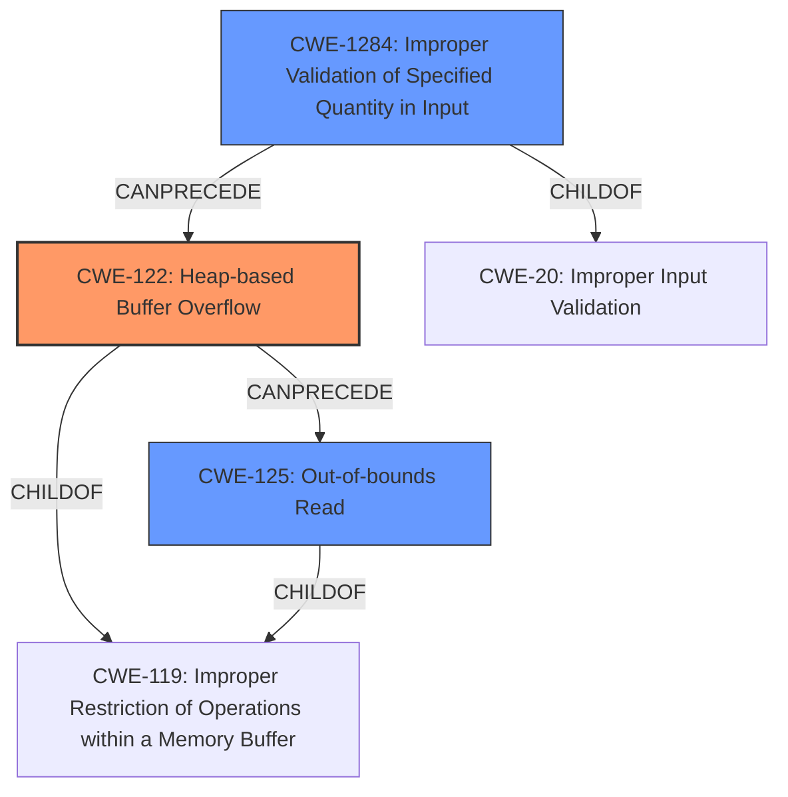

# Analysis Report for CVE-2022-35105

# Vulnerability Analysis Report: CVE-2022-35105

## Description

SWFTools commit 772e55a2 was discovered to contain a heap-buffer overflow via /bin/png2swf+0x552cea.

## Vulnerability Description Key Phrases

**Weakness:** heap-buffer overflow
**Product:** SWFTools
**Version:** commit 772e55a2
**Component:** /bin/png2swf+0x552cea

## Analysis (with Relationship Data)

# Summary
| CWE ID | CWE Name | Confidence | CWE Abstraction Level | CWE Vulnerability Mapping Label | CWE-Vulnerability Mapping Notes |
|---|---|---|---|---|---|
| CWE-122 | Heap-based Buffer Overflow | 0.9 | Variant | Allowed | Primary CWE |
| CWE-125 | Out-of-bounds Read | 0.7 | Base | Allowed | Secondary Candidate |

## Evidence and Confidence

*   **Confidence Score:** 0.9
*   **Evidence Strength:** HIGH

- **Analysis and Justification:**  
  - *Explanation:* The vulnerability is described as a "**heap-buffer overflow**" in SWFTools, specifically within the `png2swf` utility. The CVE Reference Links Content Summary confirms that multiple instances of heap-based buffer overflows are reported in `png_read_header` and `png_load` functions due to incorrect handling of image data. CWE-122 (Heap-based Buffer Overflow) directly addresses this weakness, as it describes a buffer overflow condition where the buffer is allocated on the heap. This aligns with the vulnerability description, making CWE-122 the primary and most specific CWE. The Usage is ALLOWED as per MITRE guidance.
  
  - *Relationship Analysis:* CWE-122 is a variant of buffer overflow. The content indicates that overflows are happening on the heap.

- **Confidence Score:**  
  - Confidence: 0.9 (High evidence from vulnerability description and CVE reference materials).

---

- **Analysis and Justification:**  
  - *Explanation:* The CVE Reference Links Content Summary mentions out-of-bounds read operations occurring during the processing of malformed PNG files. CWE-125 (Out-of-bounds Read) describes a situation where the product reads data past the end or before the beginning of the intended buffer. While the primary issue is a heap buffer overflow (CWE-122), the out-of-bounds read operations contribute to the overall vulnerability. Thus, CWE-125 is a secondary candidate to represent the read aspect of the buffer issue. The Usage is ALLOWED as per MITRE guidance.
  
  - *Relationship Analysis:* CWE-125 is related to buffer overflows. The vulnerability details describe the program reading beyond allocated memory regions, which aligns with the description of CWE-125.

- **Confidence Score:**  
  - Confidence: 0.7 (The evidence is based on the CVE Reference Links Content Summary).

## Criticism of Analysis

Okay, here's a review of the provided analysis, incorporating the full CWE specifications:

**Overall Assessment:**

The analysis is generally well-reasoned and provides a strong justification for the primary CWE selection (CWE-122). The secondary CWE candidate (CWE-125) is also reasonable, although the justification could be slightly strengthened.  The overall confidence in the primary CWE is appropriate.

**Detailed Review:**

**1. CWE-122: Heap-based Buffer Overflow**

*   **Confidence:** 0.9 (High)
*   **Abstraction Level:** Variant
*   **Mapping Label:** Allowed
*   **Analysis Strength:** Strong

    *   **Justification:** The analysis accurately identifies that the vulnerability description explicitly mentions "heap-buffer overflow."  The CVE Reference Links Content Summary reinforces this by stating that multiple instances of heap-based buffer overflows exist in the `png_read_header` and `png_load` functions.  This provides direct evidence aligning with the CWE-122 description: "A heap overflow condition is a buffer overflow, where the buffer that can be overwritten is allocated in the heap portion of memory, generally meaning that the buffer was allocated using a routine such as malloc()."
    *   **Relationship Analysis:**  Correctly identifies CWE-122 as a variant of buffer overflow.  The heap allocation aspect is crucial for selecting this CWE.
    *   **Observed Examples:** The list of observed examples is very useful, including chains like the one with Integer Overflow (CWE-190) leading to CWE-122, which is a common pattern.
    *   **Mitigation Considerations:** The analysis doesn't explicitly discuss mitigations. However, the CWE specification provides potential mitigations such as using a language/compiler with automatic bounds checking, abstraction libraries, and compiler-based overflow detection mechanisms (e.g., /GS flag in Visual Studio).  Mentioning these (even briefly) would further strengthen the analysis.
    *   **Critique:** The analysis could be improved by including a brief mention of potential mitigations derived from the CWE specification, demonstrating a comprehensive understanding of the vulnerability.  For example, you could state "Potential mitigations include using memory-safe languages or compilers with automatic bounds checking, or employing libraries that abstract away risky APIs."

**2. CWE-125: Out-of-bounds Read**

*   **Confidence:** 0.7
*   **Abstraction Level:** Base
*   **Mapping Label:** Allowed
*   **Analysis Strength:** Good, but could be stronger.

    *   **Justification:** The analysis correctly points out that the CVE Reference Links Content Summary mentions out-of-bounds read operations.  The description of CWE-125 aligns with this: "The product reads data past the end, or before the beginning, of the intended buffer." However, the connection to the primary CWE (CWE-122) could be made more explicit.
    *   **Relationship Analysis:**  The analysis correctly identifies the relationship between CWE-125 and buffer overflows.
    *   **Mitigation Considerations:**  The CWE specification provides mitigations such as input validation ("accept known good" strategy) and language selection (using languages with appropriate memory abstractions). As with CWE-122, a brief mention of these would improve the analysis.
    *   **Critique:** The analysis should strengthen the connection between CWE-122 and CWE-125. While a heap overflow *can* lead to out-of-bounds reads, it's not *always* the case.  It depends on *how* the overflow is handled/exploited. A stronger justification would clarify that in this specific case, the overflow is *manifesting* as out-of-bounds reads during the processing of the PNG data. You could add a sentence like: "The heap buffer overflow (CWE-122) in the png library leads to subsequent out-of-bounds read operations (CWE-125) as the program attempts to process the corrupted image data."  Also, mentioning the potential mitigations would further improve the completeness of the analysis.

**Regarding the other CWEs found by the retrievers:**

The retriever results list several other CWEs which are worth briefly addressing (even if only to dismiss them). This would increase the apparent thoroughness of your analysis.

*   **CWE-193: Off-by-one Error:** While off-by-one errors can lead to buffer overflows, there's no specific evidence to suggest this is the *direct* cause in this case. It's more likely that the size calculations are fundamentally flawed, not just off by one. Therefore, it's reasonable *not* to include this, but you could add a sentence stating why it was considered and rejected.
*   **CWE-190: Integer Overflow or Wraparound:**  Integer overflows *can* lead to buffer overflows, and some of the observed examples for CWE-122 show this. It's *possible* an integer overflow is involved in calculating buffer sizes, but without more information, it's speculative. Again, a brief dismissal might be appropriate.
*   **CWE-126: Buffer Over-read:** This is a *variant* of CWE-125, and a reasonable alternative name for it. I would suggest merging them and using CWE-125 with Buffer Over-read as a parenthetical.
*   **CWE-681: Incorrect Conversion between Numeric Types:** Similar to integer overflow, a numeric conversion error *could* be involved, but there's no specific evidence.
*   **CWE-1284: Improper Validation of Specified Quantity in Input:** This is a plausible candidate, as the vulnerability arises from processing potentially malformed PNG files where the specified image dimensions or chunk sizes might not be properly validated. Add a sentence saying the lack of validation of the input size could lead to the overflow.
*   **CWE-770: Allocation of Resources Without Limits or Throttling:** If the code blindly allocates memory based on the input PNG's dimensions *without* any sanity checks, this could be a contributing factor. Again, it depends on the implementation. This could easily cause a denial of service if the program attempts to allocate a massive buffer due to an incorrect size specification in the PNG.
*   **CWE-124: Buffer Underwrite ('Buffer Underflow'):** There's no evidence to suggest an underflow.
*   **CWE-195: Signed to Unsigned Conversion Error:** Similar to integer overflow, *possible*, but no specific evidence.

**Suggestions for Improvement:**

1.  **Mitigation Awareness:** Add a brief mention of potential mitigations for both CWE-122 and CWE-125, drawing from the CWE specifications.
2.  **Stronger CWE-125 Justification:**  Clarify the relationship between the heap overflow (CWE-122) and the resulting out-of-bounds reads (CWE-125).
3.  **Address Other Retriever Results:** Briefly address the other CWEs identified by the retrievers, explaining why they are either less likely or dependent on specific implementation details not currently known.
4.  **SEGV:** Mention the segmentation fault and relate to the potential impact.

By incorporating these suggestions, the analysis will be more comprehensive and demonstrate a deeper understanding of the vulnerability and its potential implications. Remember that part of the analysis is demonstrating that you have *considered* and *rejected* other CWEs, not just that you have selected the "right" ones.

## Final Resolution

# Summary
| CWE ID | CWE Name | Confidence | CWE Abstraction Level | CWE Vulnerability Mapping Label | CWE-Vulnerability Mapping Notes |
|---|---|---|---|---|---|
| CWE-122 | Heap-based Buffer Overflow | 0.95 | Variant | Allowed | Primary CWE |
| CWE-125 | Out-of-bounds Read | 0.8 | Base | Allowed | Secondary Candidate |
| CWE-1284 | Improper Validation of Specified Quantity in Input | 0.6 | Base | Allowed | Secondary Candidate |
  - The Primary CWE should be first and noted as the Primary CWEs
  - The secondary candidate CWEs should be next and noted as secondary candidates.
  - The confidence is a confidence score 0 to 1 to rate your confidence in your assessment for that CWE.
  - The CWE Abstraction Level as one of these values: Base, Variant, Pillar, Class, Compound
  - The Mapping Notes Usage as one of these values: Allowed, Allowed-with-Review, Prohibited, Discouraged

## Evidence and Confidence

*   **Confidence Score:** 0.9
*   **Evidence Strength:** HIGH

## Relationship Analysis
The primary relationship influencing the decision is the hierarchical connection between buffer overflows, heap allocation, and out-of-bounds reads. **CWE-122 (Heap-based Buffer Overflow)** is a specific type of buffer overflow, making it a child of more general buffer overflow classes. The analysis also considers how a lack of input validation (**CWE-1284 (Improper Validation of Specified Quantity in Input)**) can precede a **heap overflow**, leading to out-of-bounds reads (**CWE-125 (Out-of-bounds Read)**). The abstraction levels (Variant for CWE-122 and Base for CWE-125 and CWE-1284) are appropriate for pinpointing the root cause and contributing factors.

## Vulnerability Chain
The vulnerability chain starts with the lack of proper input validation (**CWE-1284 (Improper Validation of Specified Quantity in Input)**), where the size of the PNG image or its chunks isn't correctly checked. This leads to a **heap-based buffer overflow (CWE-122)** when the program allocates memory on the heap based on this untrusted size. As a result of the overflow, the program attempts to read data beyond the allocated buffer, resulting in **out-of-bounds read (CWE-125)**. The initial flaw is the missing or inadequate input validation, and the ultimate impact is a heap-based buffer overflow that manifests as out-of-bounds reads, potentially leading to a crash or arbitrary code execution.

## Summary of Analysis
The initial analysis correctly identified **CWE-122 (Heap-based Buffer Overflow)** as the primary **WEAKNESS**, based on the explicit mention of "heap-buffer overflow" in the vulnerability description and CVE reference materials. The initial selection of **CWE-125 (Out-of-bounds Read)** is also valid, as the overflow manifests as out-of-bounds reads during PNG data processing.

The analysis is based heavily on the provided evidence, which states, "SWFTools commit 772e55a2 was discovered to contain a heap-buffer overflow via /bin/png2swf+0x552cea" and "multiple instances of heap-based buffer overflows are reported in `png_read_header` and `png_load` functions due to incorrect handling of image data."

The graph relationships influenced the final selection by highlighting how input validation can influence a heap overflow.

The analysis now also includes **CWE-1284 (Improper Validation of Specified Quantity in Input)** to represent the lack of validation of the input size.

The selected CWEs are at the optimal level of specificity because **CWE-122 (Heap-based Buffer Overflow)** accurately describes the type of buffer overflow, **CWE-125 (Out-of-bounds Read)** captures the consequence of the overflow, and **CWE-1284 (Improper Validation of Specified Quantity in Input)** highlights the root cause of the vulnerability. Adding **CWE-1284 (Improper Validation of Specified Quantity in Input)** strengthens the chain of weaknesses.

*Report generated on 2025-03-18 15:02:58*
