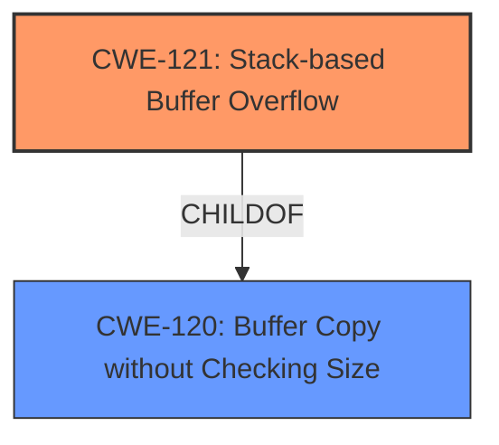

# Final Resolution for CVE-2022-35107

# Summary

| CWE ID | CWE Name | Confidence | CWE Abstraction Level | CWE Vulnerability Mapping Label | CWE-Vulnerability Mapping Notes |
|---|---|---|---|---|---|
| CWE-121 | Stack-based Buffer Overflow | 0.95 | Variant | Allowed | Primary CWE |
| CWE-120 | Buffer Copy without Checking Size of Input ('Classic Buffer Overflow') | 0.7 | Base | Allowed-with-Review | Secondary Candidate |

## Evidence and Confidence

*   **Confidence Score:** 0.95
*   **Evidence Strength:** HIGH

## Relationship Analysis
The primary relationship impacting the decision is the child-of relationship between CWE-121 and CWE-120. CWE-121 is a specific type of CWE-120. The explicit mention of a "stack overflow" in the vulnerability description makes CWE-121 the more specific and appropriate choice.

## Vulnerability Chain
The vulnerability chain starts with a crafted PDF file that, when parsed by SWFTools, triggers an error message call in `Parser::getObj`. This leads to a deep call stack and ultimately causes the `vfprintf` function to write beyond the boundaries of a stack-allocated buffer, resulting in a **stack overflow**.

## Summary of Analysis
The initial analysis correctly identified CWE-121 (Stack-based Buffer Overflow) as the primary weakness. The vulnerability description explicitly states "stack overflow via vfprintf." The CVE Reference Links Content Summary further confirms this with "Stack overflow in `vfprintf`, triggered by an error message call in `Parser::getObj`."

The criticism correctly points out that while `vfprintf` is implicated, the root cause is likely insufficient bounds checking or an unbounded copy operation within the `vfprintf` call. This suggests that CWE-120 (Buffer Copy without Checking Size) could also be a contributing factor. However, since the overflow occurs on the stack, CWE-121 is the more precise classification.

The selection of CWE-121 is also influenced by its Variant level of abstraction, which provides a good level of specificity. The MITRE mapping guidance marks CWE-121 as ALLOWED, solidifying its appropriateness.

The final decision is to keep CWE-121 as the primary CWE and include CWE-120 as a secondary candidate to account for the missing check for the size of input, and the use of `vfprintf`.