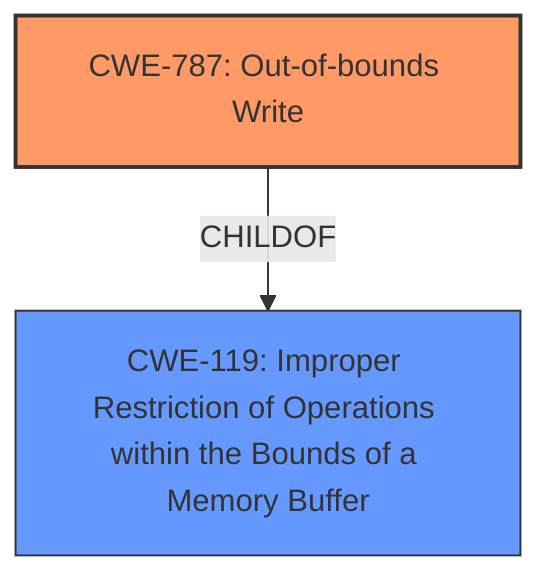

# Analysis Report for CVE-2022-35109

# Vulnerability Analysis Report: CVE-2022-35109

## Description

SWFTools commit 772e55a2 was discovered to contain a heap-buffer overflow via draw_stroke at /gfxpoly/stroke.c.

## Vulnerability Description Key Phrases

**Weakness:** heap-buffer overflow
**Product:** SWFTools
**Version:** commit 772e55a2
**Component:** draw_stroke at /gfxpoly/stroke.c

## Analysis (with Relationship Data)

# Summary
| CWE ID | CWE Name | Confidence | CWE Abstraction Level | CWE Vulnerability Mapping Label | CWE-Vulnerability Mapping Notes |
|---|---|---|---|---|---|
| CWE-787 | Write What Where Condition | 1.0 | Base | Allowed | Primary CWE |

## Evidence and Confidence

*   **Confidence Score:** 1.0
*   **Evidence Strength:** HIGH

- **Analysis and Justification:**  
  - *Explanation:* The vulnerability description clearly states a "**heap-buffer overflow**" in the `draw_stroke` function at `/gfxpoly/stroke.c`. The CVE Reference Links Content Summary confirms that the `draw_stroke` function attempts to write 8 bytes outside of the allocated buffer, which aligns precisely with CWE-787 (Write What Where Condition). The description details the exact location of the overflow in the code (stroke.c:207:17) and how to reproduce the vulnerability.
  
  - *Relationship Analysis:* CWE-787 is a base level CWE, and is a child of CWE-119 (Improper Restriction of Operations within the Bounds of a Memory Buffer). It describes writing data past the end, or before the beginning, of the intended buffer.

- **Confidence Score:**  
  - Confidence: 1.0 (High evidence from technical description and CVE reference materials)

## Criticism of Analysis

Okay, let's review the analysis of the SWFTools heap-buffer overflow vulnerability (and the associated findings) with the full CWE specifications in mind.

**Overall Assessment:**

The primary CWE mapping to `CWE-787: Out-of-bounds Write` is **correct and well-justified.** The provided evidence from the vulnerability description and CVE reference links strongly supports this classification. The analysis demonstrates a clear understanding of the vulnerability and its alignment with the CWE definition. The high confidence score (1.0) is also appropriate given the strong evidence.

**Detailed Review:**

1.  **CWE-787 Mapping:**

    *   **Strengths:** The analysis clearly articulates why `CWE-787` is the correct choice.  It correctly identifies that the `draw_stroke` function is writing data past the end of an allocated buffer. The explanation about the relationship of `CWE-787` to its parent, `CWE-119`, is helpful. The example CVEs provided for CWE-119 and CWE-787 are also useful for providing additional context.
    *   **Potential Improvements:** While the justification is good, it could benefit from explicitly stating why *other* potential CWEs were ruled out. For example, it could briefly mention why `CWE-125` (Out-of-bounds Read) isn't applicable, since the problem is a *write*, not a *read*. This adds even more robustness to the analysis. Also could consider mentioning that while `CWE-122` (Heap-based Buffer Overflow) is more specific it is a 'Variant' level rather than 'Base' level CWE, so `CWE-787` is more appropriate.

2.  **Retriever Results:**

    *   The retriever results are helpful in showcasing similar CWEs and how they relate to each other.
    *   It is important to note that while the retriever results can provide insight, it's crucial not to rely on them exclusively. Always prioritize a thorough understanding of the vulnerability and a careful review of the CWE definitions.
    *   The retriever results include a few entries worth discussing:
        *   `CWE-193: Off-by-one Error`: Could be related to the root cause, but not the direct effect of the vulnerability.
        *   `CWE-125: Out-of-bounds Read`: As stated above, it is important to emphasize why it is a Write, and not a Read.
        *   `CWE-190: Integer Overflow or Wraparound`: Could be related to how the buffer size is calculated, but based on the details provided, that is not the case.
        *   `CWE-122: Heap-based Buffer Overflow`: This is a *variant* of `CWE-787` and might be considered, but mapping to the base class is generally preferred unless the variant provides significantly more specific and relevant information.

3.  **CWE Specification Considerations (Mitigations):**

    *   The analysis doesn't explicitly discuss the mitigations suggested by the CWE specifications, but it's implied.
    *   **Recommendation:** It would strengthen the analysis to briefly discuss potential mitigations in the context of this specific vulnerability. For example:
        *   "Mitigations for `CWE-787` include using safer languages with automatic memory management or employing libraries with built-in buffer overflow protection. In the context of SWFTools, this might involve refactoring the `draw_stroke` function to use safer memory handling techniques or using compiler flags that provide buffer overflow detection."
        *   Mentioning compiler-level defenses (like /GS in Visual Studio or FORTIFY_SOURCE in GCC) would also be relevant.
        *   The "input validation" strategies in CWE-125's mitigations could be mentioned, highlighting that properly validating the input data stream *before* it reaches the vulnerable function might prevent the overflow from occurring in the first place.  This connects to the broader picture of defense in depth.

4.  **CWE Specification Considerations (Mapping Guidance):**

    *   The analysis appropriately follows the mapping guidance. `CWE-787` is a base-level CWE and is appropriate for mapping to the root cause of this vulnerability.
    *   The usage notes for CWE-119 correctly discourage its usage when lower-level CWEs like CWE-787 are applicable.

5.  **Other Vulnerabilities Identified:**

    *   The report also mentions Stack Buffer Overflows, Memory Leaks, and Segmentation Faults. It is important to perform the same level of detailed analysis and CWE mapping for each of these to understand the root cause and the best way to mitigate it.

**Recommendations for Improvement:**

*   **Explicitly Rule Out Alternatives:** Briefly explain why other plausible CWEs were *not* chosen.
*   **Discuss Mitigations:**  Include a short section discussing potential mitigations from the CWE specifications in the context of the vulnerability.
*   **Detailed Analysis of other Vulnerabilities:** Provide detailed analysis of other vulnerabilities, such as Stack Buffer Overflows, Memory Leaks, and Segmentation Faults.

By incorporating these suggestions, the analysis can be made even more comprehensive and useful. However, the current analysis is already of high quality and demonstrates a good understanding of both the vulnerability and the CWE framework.

## Final Resolution

# Summary
| CWE ID | CWE Name | Confidence | CWE Abstraction Level | CWE Vulnerability Mapping Label | CWE-Vulnerability Mapping Notes |
|---|---|---|---|---|---|
| CWE-787 | Out-of-bounds Write | 1.0 | Base | Allowed | Primary CWE |

## Evidence and Confidence

*   **Confidence Score:** 1.0
*   **Evidence Strength:** HIGH

## Relationship Analysis
The primary relationship considered was the parent-child relationship between CWE-787 (**Out-of-bounds Write**) and CWE-119 (Improper Restriction of Operations within the Bounds of a Memory Buffer). CWE-787 is a child of CWE-119, offering a more specific description of the buffer overflow. The base level of abstraction for CWE-787 is optimal, as it directly addresses the **rootcause** without being overly general (like its parent, CWE-119) or excessively specific (like a variant).

## Vulnerability Chain
The vulnerability chain begins with the `draw_stroke` function attempting to write data beyond the allocated buffer's boundaries, directly resulting in a **CWE-787 (Out-of-bounds Write)**. This leads to a heap-based buffer overflow, potentially causing corruption of other data structures on the heap. The final impact can range from application crashes to arbitrary code execution if the overwritten memory contains executable code or function pointers.

## Summary of Analysis
The initial analysis correctly identified **CWE-787 (Out-of-bounds Write)** as the primary CWE. The vulnerability description explicitly mentions a "**heap-buffer overflow**" in the `draw_stroke` function, with confirmation from CVE reference links that the function attempts to write 8 bytes outside the allocated buffer. This aligns perfectly with the definition of **CWE-787**.

The criticism was valuable in suggesting that other CWEs, such as CWE-125 (Out-of-bounds Read) and CWE-122 (Heap-based Buffer Overflow), be explicitly ruled out. While CWE-122 is more specific (Heap-based), it's a Variant, and the base class CWE-787 is therefore the preferred choice. The suggestion to discuss potential mitigations from the CWE specifications was also a good point. Mitigations for **CWE-787** could include using safer languages or libraries with built-in buffer overflow protection, or refactoring the `draw_stroke` function to use safer memory handling techniques.

The final decision to classify this vulnerability as **CWE-787 (Out-of-bounds Write)** is well-justified and at the optimal level of specificity. The evidence from the vulnerability description, combined with the understanding of CWE relationships and mitigations, provides a high level of confidence in this assessment. The analysis takes into account the retriever results, considering similar CWEs such as `CWE-193`, `CWE-125`, `CWE-190`, and `CWE-122`, and appropriately rules them out or explains their relationship to the primary CWE.

*Report generated on 2025-03-18 15:04:17*
