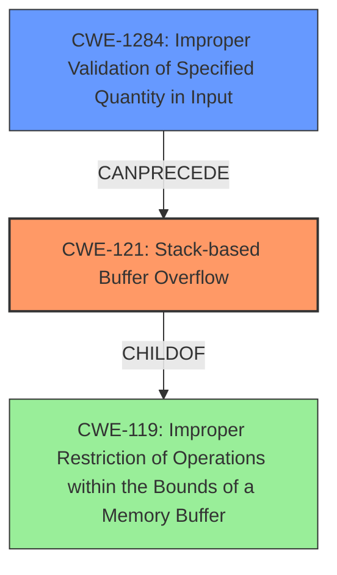

# Final Resolution for CVE-2022-35111

# Summary
| CWE ID | CWE Name | Confidence | CWE Abstraction Level | CWE Vulnerability Mapping Label | CWE-Vulnerability Mapping Notes |
|---|---|---|---|---|---|
| CWE-121 | Stack-based Buffer Overflow | 0.9 | Variant | Allowed | Primary CWE |
| CWE-1284 | Improper Validation of Specified Quantity in Input | 0.4 | Base | Allowed | Secondary Candidate |

## Evidence and Confidence

*   **Confidence Score:** 0.9
*   **Evidence Strength:** MEDIUM

## Relationship Analysis
The primary relationship impacting the decision is the hierarchical relationship between CWE-121 (**Stack-based Buffer Overflow**) and its parent, CWE-119 (**Improper Restriction of Operations within the Bounds of a Memory Buffer**). CWE-121 is a variant of CWE-119, providing a more specific classification for stack-based overflows. The potential for CWE-1284 (**Improper Validation of Specified Quantity in Input**) to precede CWE-121 indicates a possible vulnerability chain. If input is not validated and used to determine the size of data copied onto the stack, it can lead to the **buffer overflow**.

## Vulnerability Chain
The vulnerability chain starts with a potential lack of input validation (**CWE-1284**), where the size of the data to be copied is not properly checked. This leads to a **stack-based buffer overflow (CWE-121)** when copying data to a buffer on the stack, resulting in the possibility of overwriting adjacent memory locations and potentially leading to arbitrary code execution.

## Summary of Analysis
The initial analysis correctly identified CWE-121 (**Stack-based Buffer Overflow**) as the primary weakness, with strong evidence from the vulnerability description explicitly stating "stack overflow." The criticism suggested considering potential contributing factors. Based on the retriever results and the potential for unvalidated input to influence the size of the data copied to the stack, CWE-1284 (**Improper Validation of Specified Quantity in Input**) is added as a secondary candidate. The confidence in CWE-121 remains high (0.9) due to the direct evidence. The confidence in CWE-1284 is lower (0.4) as it is based on a possible scenario.

The decision is based on the provided evidence and the relationships between CWEs. CWE-121 is at the optimal level of specificity, as it directly describes the stack overflow. CWE-1284 is included to highlight a potential contributing factor in the vulnerability chain.