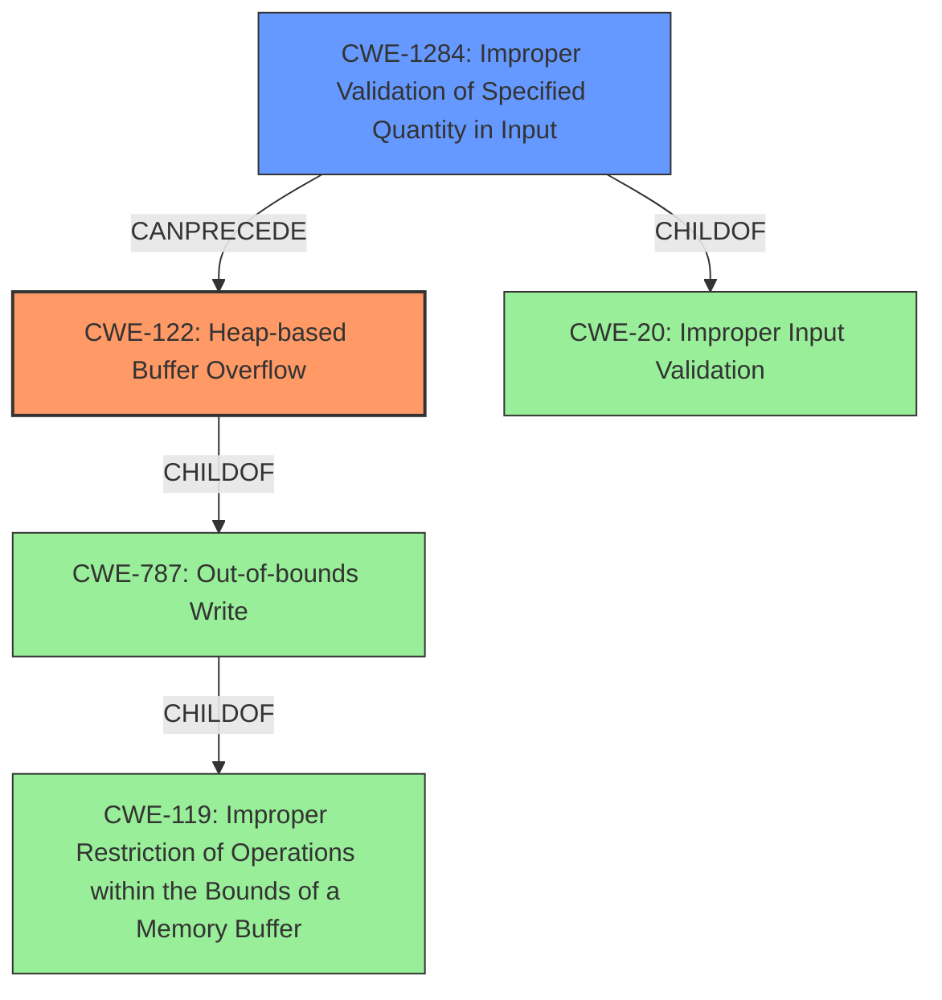

# Final Resolution for CVE-2022-35218

# Summary
| CWE ID | CWE Name | Confidence | CWE Abstraction Level | CWE Vulnerability Mapping Label | CWE-Vulnerability Mapping Notes |
|---|---|---|---|---|---|
| CWE-122 | Heap-based Buffer Overflow | 0.95 | Variant | Allowed | Primary CWE. The vulnerability description explicitly states a **heap-based buffer overflow**. |
| CWE-1284 | Improper Validation of Specified Quantity in Input | 0.9 | Base | Allowed | Secondary Candidate. The root cause is the **insufficient validation** of the packet origin parameter's length, allowing a large value to be supplied, which can lead to the **buffer overflow**. |

## Evidence and Confidence

*   **Confidence Score:** 0.95
*   **Evidence Strength:** HIGH

## Relationship Analysis
The primary relationship is that **CWE-1284 (Improper Validation of Specified Quantity in Input)** can directly lead to **CWE-122 (Heap-based Buffer Overflow)**. By failing to validate the length of the packet origin parameter, an attacker can supply an excessively long value. When this value is used in memory allocation on the heap, it leads to an out-of-bounds write, resulting in the heap-based buffer overflow. CWE-122 is a variant of **CWE-787 (Out-of-bounds Write)**, which is a child of **CWE-119 (Improper Restriction of Operations within the Bounds of a Memory Buffer)**. CWE-1284 is a child of **CWE-20 (Improper Input Validation)**.

## Vulnerability Chain
The vulnerability chain starts with **CWE-1284 (Improper Validation of Specified Quantity in Input)**, where the product fails to validate the length of the packet origin parameter. This allows an attacker to supply an excessively large length value. This value is then used in memory allocation on the heap, leading to **CWE-122 (Heap-based Buffer Overflow)** because the allocated buffer is too small to accommodate the attacker-supplied data. The final impact is a disruption of service.

## Summary of Analysis
The initial analysis correctly identified **CWE-122 (Heap-based Buffer Overflow)** as the primary weakness and **CWE-1284 (Improper Validation of Specified Quantity in Input)** as the secondary contributing factor. The vulnerability description explicitly states a "**heap-based buffer overflow** due to **insufficient validation** for packet origin parameter length." This provides strong evidence for both CWEs.

The criticism suggested addressing why other potential CWEs were not selected. Here's that analysis:
*   **CWE-130 (Improper Handling of Length Parameter Inconsistency):** While there *is* a length parameter involved, the primary issue is the *lack* of validation, not an inconsistency between declared and actual length.
*   **CWE-193 (Off-by-one Error):** An off-by-one error *could* be a contributing factor, but it's not explicitly stated or implied, and the insufficient validation is the more direct cause.
*   **CWE-190 (Integer Overflow or Wraparound):** Similar to CWE-193, integer overflow *could* be a factor if the length is used in a calculation for buffer allocation, but it's not explicitly stated or implied.

The graph relationships confirm that **CWE-1284** is a root cause that *can precede* **CWE-122**. **CWE-122** is a more specific instance of **CWE-787 (Out-of-bounds Write)**, making it a more appropriate choice than the more general **CWE-787**.
The selected CWEs are at the optimal level of specificity, with **CWE-122** being a variant that accurately describes the location of the **buffer overflow**, and **CWE-1284** being a base CWE that identifies the root cause of the vulnerability.
The confidence score has been increased to 0.95 based on the clear evidence in the vulnerability description and the relationship analysis.