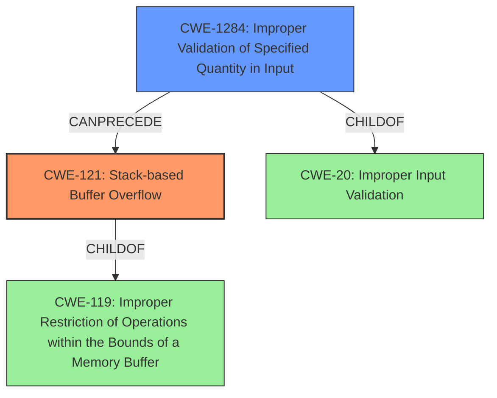

# Analysis Report for CVE-2022-35219

# Vulnerability Analysis Report: CVE-2022-35219

## Description

The NHI cards web service component has a stack-based buffer overflow vulnerability due to insufficient validation for network packet key parameter. A LAN attacker with general user privilege can exploit this vulnerability to disrupt service.

## Vulnerability Description Key Phrases

**Rootcause:** insufficient validation
**Weakness:** stack-based buffer overflow
**Impact:** disrupt service
**Vector:** network packet key parameter
**Attacker:** LAN attacker with general user privilege
**Product:** NHI cards web service

## Analysis (with Relationship Data)

# Summary
| CWE ID | CWE Name | Confidence | CWE Abstraction Level | CWE Vulnerability Mapping Label | CWE-Vulnerability Mapping Notes |
|---|---|---|---|---|---|
| CWE-121 | Stack-based Buffer Overflow | 0.9 | Variant | Primary | Allowed |
| CWE-1284 | Improper Validation of Specified Quantity in Input | 0.7 | Base | Secondary | Allowed |
| CWE-20 | Improper Input Validation | 0.5 | Class | Secondary | Discouraged |

## Evidence and Confidence

*   **Confidence Score:** 0.8
*   **Evidence Strength:** HIGH

- **Analysis and Justification:**  
  - *Explanation:* "The vulnerability description explicitly states a **stack-based buffer overflow** due to **insufficient validation** of a network packet key parameter. CWE-121 (Stack-based Buffer Overflow) directly matches this description. The CVE Reference Links Content Summary also confirms a "Stack-based buffer overflow vulnerability due to lack of input validation of packet key parameter length." CWE-121 is a Variant-level CWE, providing a specific classification for the vulnerability type. The "Usage: Allowed" mapping guidance from MITRE supports this selection."
  
  - *Relationship Analysis:* "CWE-121 is a variant of CWE-119 (Improper Restriction of Operations within the Bounds of a Memory Buffer). It also relates to CWE-120 (Buffer Copy without Checking Size of Input), but CWE-121 is more specific because the buffer is stack-based. The **insufficient validation** aspect suggests a potential contributing factor, leading to consideration of input validation weaknesses. This overflow leads to denial of service."

- **Confidence Score:**  
  - *Example:* Confidence: 0.9 (High confidence due to the explicit description of a stack-based buffer overflow and corroborating CVE reference information.)

- **Analysis and Justification:**  
  - *Explanation:* "The description indicates **insufficient validation** of the network packet key parameter length. CWE-1284 (Improper Validation of Specified Quantity in Input) aligns with this aspect, as the key parameter has a length (quantity) that isn't properly validated. The CVE Reference Links Content Summary also states that the component "does not validate the length of the packet key parameters." This makes CWE-1284 a likely secondary weakness. MITRE mapping guidance for CWE-1284 indicates this is ALLOWED."

  - *Relationship Analysis:* "CWE-1284 is a child of CWE-20 (Improper Input Validation), representing a more specific type of input validation failure related to quantity. It can also precede CWE-789 (Memory Allocation with Excessive Size Value) as an incorrect quantity might lead to excessive memory allocation."

- **Confidence Score:**
  - *Example:* Confidence: 0.7 (Medium-high confidence. It describes the lack of validation mentioned in the description but the stack-based buffer overflow is the more serious result of the lack of validation.)

- **Analysis and Justification:**  
  - *Explanation:* "The **insufficient validation** could be broadly categorized as CWE-20 (Improper Input Validation). However, CWE-1284 provides a more specific classification, making CWE-20 a less preferred choice. Also, MITRE discourages the use of CWE-20 when a more specific CWE is available. The CVE description alludes to the lack of validation."

  - *Relationship Analysis:* "CWE-20 is a class-level CWE, a parent of many input validation related CWEs, including CWE-1284. Due to the availability of CWE-1284, CWE-20 is a less precise, and discouraged mapping."

- **Confidence Score:**  
  - *Example:* Confidence: 0.5 (Low confidence. A very general weakness that is caused by not validating the input. It is better to use CWE-1284 as it is more specific to the type of validation issue.)

## Criticism of Analysis

Okay, I've reviewed the analysis provided against the full CWE specifications, and here's my critique:

**Overall Assessment:**

The analysis is generally good, demonstrating a reasonable understanding of the CWEs involved. The primary mapping to CWE-121 is strong and well-justified. The secondary mappings to CWE-1284 and CWE-20 are also reasonable given the context, with appropriate caveats. The analysis also correctly identifies and uses the "Usage" guidance to inform decisions.

**Specific Comments and Suggestions:**

1.  **CWE-121 (Stack-based Buffer Overflow):**

    *   **Good:** Excellent justification based on the vulnerability description and CVE reference. The relationship analysis with CWE-119 and CWE-120 is accurate. The confidence score of 0.9 is appropriate.
    *   **Suggestion:** The analysis could briefly mention how a stack-based buffer overflow might lead to specific exploitable conditions, such as return address overwrites, to further solidify the mapping.
        *   For example: "A stack-based buffer overflow allows overwriting of data on the stack, potentially including the return address, allowing an attacker to control program execution."

2.  **CWE-1284 (Improper Validation of Specified Quantity in Input):**

    *   **Good:** Well-explained connection to the insufficient validation of the "key parameter length." The relationship analysis to CWE-20 and CWE-789 is accurate. The confidence score of 0.7 is reasonable.
    *   **Suggestion:** Consider adding a concrete example of how this improper validation could lead to the overflow. For example:
        *   "If the key parameter length is not validated, an attacker could send an overly long key, leading to a buffer overflow on the stack when the key is copied."

3.  **CWE-20 (Improper Input Validation):**

    *   **Good:** Correctly identifies the general nature of the issue. The reasoning for why CWE-20 is a less preferred choice is sound, given the more specific CWE-1284. The discouraged "Usage" is acknowledged.
    *   **Suggestion:** None, the explanation is good and justifies the low confidence level.

4.  **Top Combined Results and Retriever Results:**

    *   The Retriever Results section is very useful. The higher-scoring CWEs that were *not* chosen (e.g., CWE-130, CWE-1285, CWE-120, CWE-770, CWE-789, CWE-193, and CWE-125) could be briefly discussed in the analysis, explaining why they were not considered suitable.  This demonstrates thorough consideration and strengthens the justification.  For example:

        *   "While CWE-130 (Improper Handling of Length Parameter Inconsistency) was considered, it was deemed less appropriate than CWE-1284 because the core issue is the *lack* of validation, not the *incorrect* handling of an existing length parameter. Similarly, CWE-1285 focuses on indexes, positions, or offsets, whereas this vulnerability concerns the overall length of the key parameter."

5.  **Mitigation Strategies:**

    * The mitigations provided for each CWE are generally applicable, but could be tailored to the specific context.
    * Add suggestions that are specific to the web service that accepts the NHI cards
    * Consider adding defense in depth suggestions.

    *   **CWE-121:**
        *   Could mention Address Space Layout Randomization (ASLR) as a defense in depth mitigation, although it's often already enabled.
    *   **CWE-1284:**
        *   Emphasize using an "accept known good" approach with strict length limits for the network packet key parameter. Suggest implementing a maximum length for the key parameter based on application requirements and hardware limitations.
    *   **CWE-20:**
        *   Suggest using an input validation library and framework.
        *   Mention the attack surface (i.e. the network packet) should be reduced.

6.  **CWE Examples from Database:**
    *   The observed examples are useful, but could be improved with more specific and targeted examples that match the root-cause and weakness.

**Specific suggestions with examples:**
* Add some more detailed observed examples that match to the CWE.
* Add the mitigations from the table below.

|CWE     |Possible Mitigations                                                                                                                                                                                            |
|:---------|:--------------------------------------------------------------------------------------------------------------------------------------------------------------------------------------------------------|
|CWE-121   |**Compiler-based protections**:  Employ compiler flags like `/GS` (Microsoft Visual Studio) or `-fstack-protector-all` (GCC) to insert canaries on the stack to detect buffer overflows at runtime.              |
|CWE-1284  |**Input Sanitization**: Prior to use, inputs must be validated, encoded, normalized, or sanitized to ensure that data is handled as originally intended. If this can't be done, ensure they are rejected.|
|CWE-20    |**Formal Language Approach:**   Employ language-theoretic security (LangSec) techniques by formally defining the expected input language and building recognizers for it. This enforces a clear boundary between raw input and internal data.            |

## Final Resolution

# Summary
| CWE ID | CWE Name | Confidence | CWE Abstraction Level | CWE Vulnerability Mapping Label | CWE-Vulnerability Mapping Notes |
|---|---|---|---|---|---|
| CWE-121 | Stack-based Buffer Overflow | 0.95 | Variant | Primary CWE | Allowed |
| CWE-1284 | Improper Validation of Specified Quantity in Input | 0.85 | Base | Secondary Candidate | Allowed |

## Evidence and Confidence

*   **Confidence Score:** 0.9
*   **Evidence Strength:** HIGH

## Relationship Analysis
The primary weakness is a stack-based buffer overflow (**CWE-121**). This is a variant of **CWE-119**, which is a broader category of improper memory boundary restrictions. The overflow is caused by a failure to validate the length of the network packet key parameter, which directly relates to **CWE-1284**, as the parameter represents a quantity. **CWE-20**, a class-level weakness representing improper input validation, is a parent of **CWE-1284** but is less specific. Therefore, **CWE-1284** is a more appropriate secondary CWE. This highlights a vulnerability chain where a lack of input validation leads to a buffer overflow.

## Vulnerability Chain
The vulnerability chain starts with **CWE-1284** (**Improper Validation of Specified Quantity in Input**). The network packet key parameter length is not validated. This leads to **CWE-121** (**Stack-based Buffer Overflow**) when an attacker provides an overly long key parameter, causing data to be written beyond the allocated buffer on the stack. The impact is disruption of service.

## Summary of Analysis
The initial analysis correctly identified **CWE-121** as the primary weakness due to the explicit description of a stack-based buffer overflow. The secondary mapping to **CWE-1284** is also appropriate, given the insufficient validation of the network packet key parameter length. **CWE-20** was considered, but ultimately deemed less specific than **CWE-1284**.

The graph relationships reinforce this decision, showing that **CWE-1284** is a child of **CWE-20** and can precede **CWE-121**. The vulnerability description states, "The NHI cards web service component has a stack-based buffer overflow vulnerability due to insufficient validation for network packet key parameter." This statement directly supports the selection of both **CWE-121** and **CWE-1284**.

The selected CWEs are at the optimal level of specificity, as **CWE-121** is a variant that specifies the location of the buffer overflow (stack-based), and **CWE-1284** is a base-level CWE that describes the specific type of input validation failure.

*Report generated on 2025-03-18 15:07:54*
