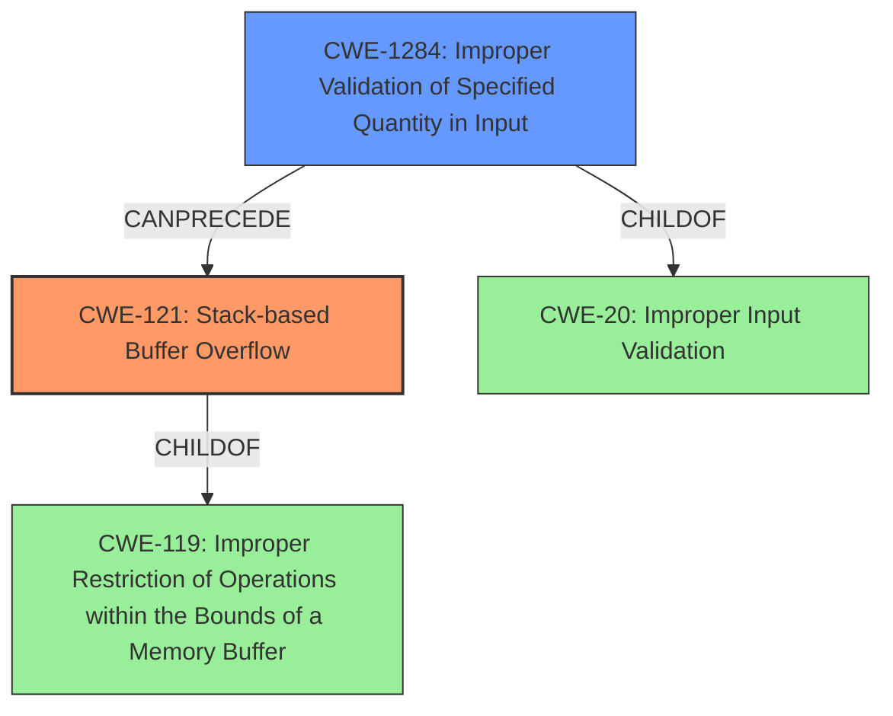

# Final Resolution for CVE-2022-35219

# Summary
| CWE ID | CWE Name | Confidence | CWE Abstraction Level | CWE Vulnerability Mapping Label | CWE-Vulnerability Mapping Notes |
|---|---|---|---|---|---|
| CWE-121 | Stack-based Buffer Overflow | 0.95 | Variant | Primary CWE | Allowed |
| CWE-1284 | Improper Validation of Specified Quantity in Input | 0.85 | Base | Secondary Candidate | Allowed |

## Evidence and Confidence

*   **Confidence Score:** 0.9
*   **Evidence Strength:** HIGH

## Relationship Analysis
The primary weakness is a stack-based buffer overflow (**CWE-121**). This is a variant of **CWE-119**, which is a broader category of improper memory boundary restrictions. The overflow is caused by a failure to validate the length of the network packet key parameter, which directly relates to **CWE-1284**, as the parameter represents a quantity. **CWE-20**, a class-level weakness representing improper input validation, is a parent of **CWE-1284** but is less specific. Therefore, **CWE-1284** is a more appropriate secondary CWE. This highlights a vulnerability chain where a lack of input validation leads to a buffer overflow.

## Vulnerability Chain
The vulnerability chain starts with **CWE-1284** (**Improper Validation of Specified Quantity in Input**). The network packet key parameter length is not validated. This leads to **CWE-121** (**Stack-based Buffer Overflow**) when an attacker provides an overly long key parameter, causing data to be written beyond the allocated buffer on the stack. The impact is disruption of service.

## Summary of Analysis
The initial analysis correctly identified **CWE-121** as the primary weakness due to the explicit description of a stack-based buffer overflow. The secondary mapping to **CWE-1284** is also appropriate, given the insufficient validation of the network packet key parameter length. **CWE-20** was considered, but ultimately deemed less specific than **CWE-1284**.

The graph relationships reinforce this decision, showing that **CWE-1284** is a child of **CWE-20** and can precede **CWE-121**. The vulnerability description states, "The NHI cards web service component has a stack-based buffer overflow vulnerability due to insufficient validation for network packet key parameter." This statement directly supports the selection of both **CWE-121** and **CWE-1284**.

The selected CWEs are at the optimal level of specificity, as **CWE-121** is a variant that specifies the location of the buffer overflow (stack-based), and **CWE-1284** is a base-level CWE that describes the specific type of input validation failure.