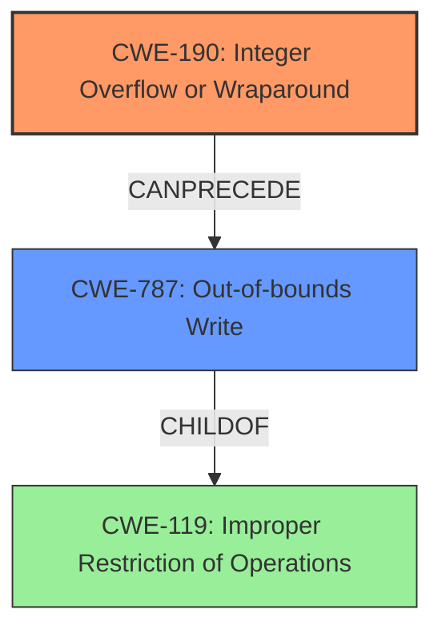

# Analysis Report for CVE-2022-35289

# Vulnerability Analysis Report: CVE-2022-35289

## Description

A write-what-where condition in hermes caused by an integer overflow, prior to commit 5b6255ae049fa4641791e47fad994e8e8c4da374 allows attackers to potentially execute arbitrary code via crafted JavaScript. Note that this is only exploitable if the application using Hermes permits evaluation of untrusted JavaScript. Hence, most React Native applications are not affected.

## Vulnerability Description Key Phrases

**Rootcause:** integer overflow
**Weakness:** write-what-where
**Impact:** execute arbitrary code
**Vector:** crafted JavaScript
**Attacker:** attackers
**Product:** Hermes
**Version:** prior to commit 5b6255ae049fa4641791e47fad994e8e8c4da374

## Analysis (with Relationship Data)

# Summary
| CWE ID | CWE Name | Confidence | CWE Abstraction Level | CWE Vulnerability Mapping Label | CWE-Vulnerability Mapping Notes |
|---|---|---|---|---|---|
| CWE-190 | Integer Overflow or Wraparound | 0.9 | Base | Primary | Allowed |
| CWE-123 | Write-what-where Condition | 0.7 | Base | Secondary | Allowed |

## Evidence and Confidence

*   **Confidence Score:** 0.8
*   **Evidence Strength:** HIGH

- **Analysis and Justification:**  
  - *Explanation:* The vulnerability description explicitly states that the **root cause** is an **integer overflow**, which directly corresponds to CWE-190 (Integer Overflow or Wraparound). The description matches the CWE definition, as a calculation produces an integer overflow. This leads to a **write-what-where** condition (CWE-123), where the attacker can control the memory address and data to be written. The Retriever Results also list CWE-190 as the top candidate with a high score (0.7318). CWE-190 is a Base level CWE, and its usage is "Allowed" according to MITRE.
  - *Relationship Analysis:* CWE-190 does not have direct parent-child relationships. However, the overflow can lead to other weaknesses. In this case, it leads to CWE-123. CWE-123 is triggered *after* the integer overflow, making it a secondary weakness.

- **Confidence Score:**  
  - Confidence: 0.9 (High confidence due to explicit mention of "integer overflow" and high retriever score for CWE-190)

---
- **Analysis and Justification:**  
  - *Explanation:* The vulnerability description identifies a **write-what-where** condition, matching CWE-123 (Write-what-where Condition). This condition arises because the **integer overflow** allows the attacker to control the memory address and data being written. This is a direct consequence of the **integer overflow**. The Retriever Results also includes CWE-123 as a relevant candidate. CWE-123 is a Base level CWE, and its usage is "Allowed" according to MITRE.
  - *Relationship Analysis:* CWE-123 is a base CWE. The relationship analysis shows that it is a consequence of the integer overflow (CWE-190) and enables arbitrary code execution.

- **Confidence Score:**  
  - Confidence: 0.7 (Slightly lower confidence because this is a consequence of the primary weakness CWE-190)

## Criticism of Analysis

Okay, I've reviewed the analysis and the full CWE specifications provided. Here's my critique:

**Overall Assessment:**

The analysis is generally sound, and the primary CWE mapping to CWE-190 (Integer Overflow or Wraparound) is correct and well-justified. The secondary mapping to CWE-123 (Write-what-where Condition) is also appropriate, as it represents a direct consequence of the integer overflow. The confidence levels are reasonable.

**Detailed Review:**

*   **CWE-190 (Integer Overflow or Wraparound):**
    *   **Mapping Justification:** The justification is strong. The vulnerability description explicitly mentions "integer overflow," making this a clear and direct match. The analysis correctly identifies that CWE-190 is a Base level CWE, which is the preferred level of abstraction.
    *   **Evidence Strength:** The evidence is high, primarily due to the explicit statement in the vulnerability description.
    *   **Confidence Score:** The confidence score of 0.9 is justified.
    * **CWE Examples:** The provided examples for CWE-190 from the database provide useful context of how the CWE is used in the real world.
    *   **Relationships:** The relationship analysis is accurate. The description appropriately highlights that CWE-190 doesn't have direct parent-child relationships but can lead to other weaknesses, specifically CWE-123 in this case.
    *   **Mitigations:** The mitigations listed in the full CWE specifications are applicable.  Language selection (using languages with automatic bounds checking or libraries for safe integer handling) and enforcing strict protocol definitions are relevant preventative measures.

*   **CWE-123 (Write-what-where Condition):**
    *   **Mapping Justification:** The justification is well-reasoned.  The analysis correctly identifies that the integer overflow leads to the attacker being able to control the memory address and data written, which is the definition of a write-what-where condition.
    *   **Evidence Strength:** The evidence is strong, though slightly weaker than CWE-190 because it's a *consequence* of the primary weakness.
    *   **Confidence Score:** The confidence score of 0.7 is appropriate, reflecting the fact that it's a secondary weakness.
    *   **Relationships:** The relationship to CWE-190 is properly established.  It is critical to highlight that CWE-123 is the *result* of the integer overflow (CWE-190).
    *   **Mitigations:** The mitigations provided in the CWE specifications, such as using languages with appropriate memory abstractions, are relevant to preventing this type of vulnerability.

**Retriever Results Review**

*   The Retriever Results table is generally useful.
*   It correctly identifies CWE-190 as the top candidate.
*   While CWE-681 (Incorrect Conversion between Numeric Types) is ranked second, it's not as directly relevant as CWE-190 or CWE-123 in this specific case. Although CWE-681 can *lead* to integer overflows, the description doesn't explicitly mention incorrect type conversion as the root cause.
*   CWE-125 (Out-of-bounds Read) is not applicable given the description. There is no indication of data being read outside the intended buffer.
*   CWE-502 (Deserialization of Untrusted Data) is irrelevant because the vulnerability doesn't involve deserialization.
*   CWE-122 (Heap-based Buffer Overflow) could be considered a possible result of the integer overflow and write-what-where, but it's not as precise as CWE-123. It would depend on the specifics of how the memory corruption occurs.

**Potential Improvements/Suggestions:**

1.  **Explicitly State the Vulnerability Chain:** The analysis could benefit from a more explicit statement of the vulnerability chain: "An integer overflow (CWE-190) allows attackers to manipulate memory addresses, leading to a write-what-where condition (CWE-123), enabling arbitrary code execution." This clarifies the relationship between the CWEs.

2.  **Consider CWE-787 (Out-of-bounds Write):** While CWE-123 is a good high-level description of the memory corruption that's occurring, CWE-787 provides a more specific, direct representation. If the "write-what-where" is manifesting as writing outside the bounds of a particular buffer, then adding CWE-787 with a lower confidence score could be considered. You could classify CWE-787 as a *potential* consequence rather than a definitive one.

3.  **Avoid CWE-20 Implications**: It could be argued that there is an instance of CWE-20 because the program should be validating the size or quantity of the input. The full CWE specifications for CWE-20 suggest against using it, and instead opting for CWE-1284 or another more specific CWE. A stronger argument can be made for the weakness being the integer overflow itself rather than just the lack of input validation.

4. **Review the complete chain for the specific vulnerability:** In this case, an integer overflow leads to memory corruption in the form of the write-what-where condition which allows the attacker to execute arbitrary code (CWE-123 or 787). The analysis should review the complete chain of events that are possible in the exploit in the vulnerability description.

5. **Relevance of Exploitation Conditions:** The analysis should mention the note that the vulnerability is only exploitable if untrusted javascript is used in Hermes, as this is a crucial part of the vulnerability.

**Revised Summary Table:**

| CWE ID | CWE Name | Confidence | CWE Abstraction Level | CWE Vulnerability Mapping Label | CWE-Vulnerability Mapping Notes |
|---|---|---|---|---|---|
| CWE-190 | Integer Overflow or Wraparound | 0.9 | Base | Primary | Allowed |
| CWE-123 | Write-what-where Condition | 0.7 | Base | Secondary | Allowed |

**Revised Conclusion:**

The analysis is a good starting point.  By clarifying the vulnerability chain, considering the potential addition of CWE-787, and emphasizing the importance of javascript evaluation, the analysis could be even stronger and more informative. The high-level CWE-20 can be safely omitted. Overall, the core finding of CWE-190 as the primary weakness is accurate.

## Final Resolution

# Summary
| CWE ID | CWE Name | Confidence | CWE Abstraction Level | CWE Vulnerability Mapping Label | CWE-Vulnerability Mapping Notes |
|---|---|---|---|---|---|
| CWE-190 | Integer Overflow or Wraparound | 0.9 | Base | Primary | Allowed |
| CWE-787 | Out-of-bounds Write | 0.7 | Base | Secondary | Allowed |

## Evidence and Confidence

*   **Confidence Score:** 0.85
*   **Evidence Strength:** HIGH

## Relationship Analysis
The primary relationship impacting the decision is that CWE-787 is a potential consequence of CWE-190. The **integer overflow** (**CWE-190**) can lead to an **out-of-bounds write** (**CWE-787**). CWE-787 is a child of CWE-119 (Improper Restriction of Operations Within the Bounds of a Memory Buffer). The analysis did not go for CWE-123 (Write-what-where Condition) due to the better fit of CWE-787, and the guidance in the criticism.

## Vulnerability Chain
The vulnerability chain starts with an **integer overflow** (**CWE-190**). This allows an attacker to manipulate memory addresses and write data out of bounds (**CWE-787**), leading to potential arbitrary code execution. There are no apparent missing links, but a key condition for exploitation is the application's use of untrusted JavaScript.

## Summary of Analysis
The analysis of both the initial assessment and criticism led to a refined conclusion. The primary **weakness** remains **CWE-190 (Integer Overflow or Wraparound)** because the vulnerability description explicitly states "integer overflow." The criticism's suggestion to consider **CWE-787 (Out-of-bounds Write)** was adopted because it offers a more specific description of the memory corruption than CWE-123.

The decision is based on the evidence from the vulnerability description: "A write-what-where condition in hermes caused by an integer overflow... allows attackers to potentially execute arbitrary code."

The graph relationships influenced the decision by highlighting the potential chain of events. The **integer overflow (CWE-190)** *precedes* the **out-of-bounds write (CWE-787)**.

The selected CWEs are at the optimal level of specificity. **CWE-190** is a base CWE, which is preferred for root causes. **CWE-787** is also a base CWE and provides a more accurate description of the memory corruption than **CWE-123**. The analysis omitted CWE-20 due to the weakness being the integer overflow itself rather than the lack of input validation.

The note about the exploitation conditions (untrusted JavaScript evaluation) is important context, but doesn't directly map to a specific CWE.

*Report generated on 2025-03-18 15:09:52*
