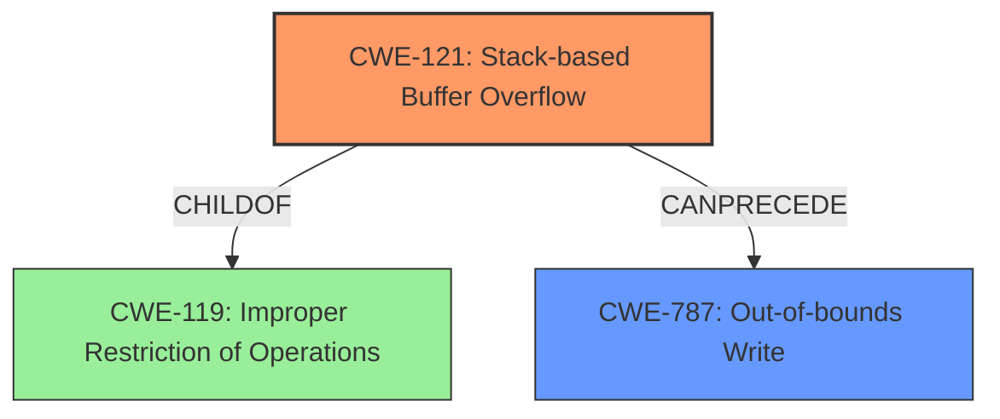

# Analysis Report for CVE-2022-35407

# Vulnerability Analysis Report: CVE-2022-35407

## Description

An issue was discovered in Insyde InsydeH2O with kernel 5.0 through 5.5. A stack buffer overflow leads to arbitrary code execution in the SetupUtility driver on Intel platforms. An attacker can change the values of certain UEFI variables. If the size of the second variable exceeds the size of the first, then the buffer will be overwritten. This issue affects the SetupUtility driver of InsydeH2O.

## Vulnerability Description Key Phrases

**Weakness:** stack buffer overflow
**Impact:** arbitrary code execution
**Product:** Insyde InsydeH2O
**Version:** kernel 5.0 through 5.5
**Component:** SetupUtility driver

## Analysis (with Relationship Data)

# Summary
| CWE ID | CWE Name | Confidence | CWE Abstraction Level | CWE Vulnerability Mapping Label | CWE-Vulnerability Mapping Notes |
|---|---|---|---|---|---|
| CWE-121 | Stack-based Buffer Overflow | 0.95 | Variant | Allowed | This is the Primary CWE |
| CWE-787 | Out-of-bounds Write | 0.75 | Base | Allowed | Secondary candidate. |
| CWE-119 | Improper Restriction of Operations within the Bounds of a Memory Buffer | 0.5 | Class | Discouraged | Secondary candidate. |

## Evidence and Confidence

*   **Confidence Score:** 0.9
*   **Evidence Strength:** HIGH

- **Analysis and Justification:**  
  - *Explanation:* The vulnerability description explicitly states "**stack buffer overflow**" which directly aligns with CWE-121 (Stack-based Buffer Overflow). The CVE reference also confirms the presence of a stack buffer overflow in the `SetupUtility` driver. This vulnerability allows an attacker to overwrite the stack, potentially leading to arbitrary code execution. CWE-121 is a Variant of CWE-119 (Improper Restriction of Operations within the Bounds of a Memory Buffer), providing a more specific classification. The MITRE mapping guidance designates CWE-121 as ALLOWED, making it an appropriate choice. CWE-787 (Out-of-bounds Write) is also applicable as it describes writing data past the end of the intended buffer, which is a key aspect of buffer overflows.

  - *Relationship Analysis:* "CWE-121 is a variant of CWE-119, making it a more specific classification for a stack-based buffer overflow. CWE-121 is directly related to CWE-787 (Out-of-bounds Write) since a stack buffer overflow is a type of out-of-bounds write. CWE-121 can potentially lead to CWE-269 (Privilege Management) if the attacker gains elevated privileges through arbitrary code execution."

- **Confidence Score:**  
  - *Example:* Confidence: 0.95 (High evidence from the explicit vulnerability description and CVE reference materials).

---

## Criticism of Analysis

Okay, here's a review of the provided CWE analysis, incorporating the full CWE specifications.

**Overall Assessment:**

The analysis is generally strong, particularly in identifying CWE-121 (Stack-based Buffer Overflow) as the primary weakness. The justification is clear and well-supported by the vulnerability description. The inclusion of CWE-787 (Out-of-bounds Write) as a secondary candidate is also appropriate, given its close relationship to buffer overflows. The rationale for *discouraging* the use of CWE-119 is sound, based on MITRE's guidance.

**Detailed Review:**

**1. CWE-121: Stack-based Buffer Overflow (Primary CWE)**

*   **Confidence:** 0.95 (High) - Justified.
*   **Abstraction Level:** Variant - Correct.  The analysis correctly identifies this as a Variant, which is preferred.
*   **CWE Vulnerability Mapping Label:** Allowed - Correct, as per MITRE.
*   **CWE-Vulnerability Mapping Notes:** "This is the Primary CWE" - Correct.
*   **Strengths:**
    *   The analysis accurately references the direct statement of "stack buffer overflow" in the vulnerability description.
    *   It correctly notes that CWE-121 is a variant of CWE-119 and thus more specific.
    *   The stated relationships to CWE-787 and CWE-269 are valid. A stack buffer overflow *is* a type of out-of-bounds write (CWE-787), and it *can* lead to privilege escalation (CWE-269) via arbitrary code execution.
*   **Suggested Improvements:**
    *   Could elaborate slightly on *how* arbitrary code execution is achieved. Briefly mentioning concepts like overwriting the return address on the stack would strengthen the explanation (though it may be too implementation-specific). The additional notes section of CWE-121 actually says "Stack-based buffer overflows can instantiate in return address overwrites, stack pointer overwrites or frame pointer overwrites. They can also be considered function pointer overwrites, array indexer overwrites or write-what-where condition, etc." This could be summarized as saying the stack overflow can overwrite critical data structures on the stack, such as the return address or function pointers, thus allowing the attacker to control code execution.

**2. CWE-787: Out-of-bounds Write (Secondary Candidate)**

*   **Confidence:** 0.75 - Reasonable.
*   **Abstraction Level:** Base - Correct.
*   **CWE Vulnerability Mapping Label:** Allowed - Correct, as per MITRE.
*   **Strengths:**
    *   The analysis correctly identifies that a stack buffer overflow necessarily *involves* writing outside the bounds of the allocated buffer.
*   **Suggested Improvements:**
    *   Since this is a *secondary* mapping, it would be beneficial to explicitly explain *why* CWE-121 is a *better* fit than CWE-787. The key is that CWE-121 provides the *context* of *where* the out-of-bounds write occurs (on the stack).  The distinction matters for mitigation strategies (e.g., stack canaries are specific to stack overflows).
    *   The analysis should make it clear that while CWE-787 is applicable, it's a *general* out-of-bounds write, while CWE-121 is specific to the *stack*.

**3. CWE-119: Improper Restriction of Operations within the Bounds of a Memory Buffer (Discouraged)**

*   **Abstraction Level:** Class - Correct.
*   **Usage:** Discouraged - Correct, as per MITRE.
*   **Strengths:**
    *   The analysis correctly acknowledges MITRE's discouraged usage.
    *   By choosing CWE-121 and CWE-787, the analysis demonstrates understanding of the recommendation to use more specific CWEs.
*   **Reason for Discouragement:**
     * CWE-119's mapping guidance states, "CWE-119 is commonly misused in low-information vulnerability reports when lower-level CWEs could be used instead, or when more details about the vulnerability are available." Since the vulnerability description provides that the buffer overflow happens on the *stack*, the analysis is correct in choosing the more specific CWE-121 rather than the more general CWE-119.

**General Suggestions:**

*   **Mitigation Considerations:** While not strictly required, it would be helpful to briefly mention some *relevant* mitigation strategies in the analysis, drawing directly from the "Potential Mitigations" sections of the chosen CWEs. For example, the following could be added.
    *   **CWE-121 Mitigations:** The analysis could mention using compiler-based buffer overflow detection mechanisms, like the Microsoft Visual Studio `/GS` flag or stack canaries, to help detect and prevent stack-based buffer overflows.
    *   **CWE-787 Mitigations:** When allocating a buffer for the purpose of transforming, converting, or encoding an input, allocate enough memory to handle the largest possible encoding.
*   **Retriever Results:** The analysis does not refer to the retriever results. While not always perfect, the retriever results can be used as a starting point for analysis.
    * The retriever results are ordered by score, and the top three results were: `CWE-190`, `CWE-1285`, and `CWE-787`.
    * Considering the CVE involved `arbitrary code execution`, it's unlikely that `CWE-190` or `CWE-1285` would be the root cause.
*   **CVSS Score:** The analysis mentions the CVSS score, but does not incorporate it into the confidence scores. It would be appropriate to increase the confidence score if the CVSS metric aligns with the selected CWE.

**Specific Edits/Additions:**

*   **CWE-121 Analysis:** "This vulnerability allows an attacker to overwrite the stack, potentially leading to arbitrary code execution *by overwriting critical data structures such as the return address or function pointers*."
*   **CWE-787 Analysis:** "CWE-787 is also applicable as it describes writing data past the end of the intended buffer, which is a key aspect of buffer overflows. *However, CWE-121 provides additional context, as the out-of-bounds write is occuring on the stack.*"
*   **Mitigations (Add to Conclusion):** "To mitigate this vulnerability, developers should employ techniques such as using compiler-based buffer overflow detection mechanisms (e.g., stack canaries) and implementing robust bounds checking on input to prevent out-of-bounds writes to the stack."

By incorporating these suggestions, the analysis becomes even more comprehensive and directly addresses the nuances of the CWE specifications.

## Final Resolution

# Summary
| CWE ID | CWE Name | Confidence | CWE Abstraction Level | CWE Vulnerability Mapping Label | CWE-Vulnerability Mapping Notes |
|---|---|---|---|---|---|
| **CWE-121** | **Stack-based Buffer Overflow** | 0.95 | Variant | Allowed | Primary CWE |
| **CWE-787** | **Out-of-bounds Write** | 0.75 | Base | Allowed | Secondary candidate. |

## Evidence and Confidence

*   **Confidence Score:** 0.95
*   **Evidence Strength:** HIGH

## Relationship Analysis
The primary relationship is that CWE-121 (**Stack-based Buffer Overflow**) is a variant of CWE-119 (**Improper Restriction of Operations within the Bounds of a Memory Buffer**), indicating a hierarchical parent-child relationship. Additionally, CWE-121 involves CWE-787 (**Out-of-bounds Write**) because a stack buffer overflow is a specific instance of writing outside the intended buffer boundaries. The analysis correctly favored CWE-121 due to its specificity over the more general CWE-119 and CWE-787. The Variant level of CWE-121 provides more targeted context than the Base level of CWE-787 or the Class level of CWE-119.

## Vulnerability Chain
The vulnerability chain starts with the **ROOTCAUSE** being a flaw in the `SetupUtility` driver of InsydeH2O. This leads to **CWE-121** (**Stack-based Buffer Overflow**) due to insufficient bounds checking when handling UEFI variables. An attacker can then overwrite the stack, resulting in **CWE-787** (**Out-of-bounds Write**), and ultimately gain arbitrary code execution. The chain highlights how a lack of input validation leads to memory corruption and control-flow hijacking.

## Summary of Analysis
The initial analysis correctly identified **CWE-121** (**Stack-based Buffer Overflow**) as the primary weakness due to the explicit mention of "stack buffer overflow" in the vulnerability description: "A stack buffer overflow leads to arbitrary code execution in the SetupUtility driver on Intel platforms." The criticism correctly notes the importance of elaborating on how arbitrary code execution is achieved by overwriting critical data structures on the stack, like the return address or function pointers. The selection of **CWE-121** is at the optimal level of specificity because it provides more context than **CWE-787** (**Out-of-bounds Write**), specifying that the overflow occurs on the stack. The analysis is based on strong evidence and aligned with MITRE's mapping guidance, which allows for Variant-level CWEs like **CWE-121**.

*Report generated on 2025-03-18 15:10:39*
